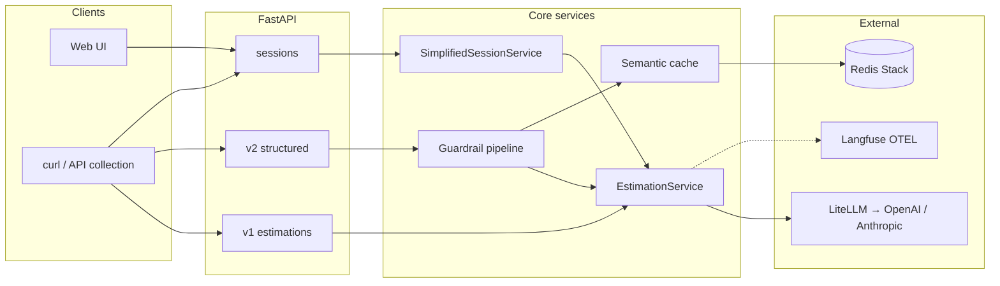

# Estimador CAG

**Context-Augmented Generation (CAG) API for software project estimation.**

A FastAPI service that turns structured project context — meeting transcripts, briefs, and attachments — into software estimates. Few-shot reference examples are sampled from a unified flat pool under `app/context/examples/` and injected into the system prompt; the composed project brief is sent as the user message to the configured LLM provider.

Built as an **AI Engineering learning baseline**: typed settings, provider abstraction, guardrails, optional semantic cache, session memory, and a React web UI — without production auth or persistent storage by default.

---

## Features

| Area | What you get |
|------|----------------|
| **CAG** | Few-shot examples from a flat `app/context/examples/*.txt` pool (2–4 samples per request); depth and layout come from guided-form fields (`detail_level`, `output_format`). |
| **API surfaces** | Text (v1), structured JSON (v2), SSE streaming (v1), and session-based simplified submit. |
| **Guardrails** | Domain filter, prompt-injection heuristics, PII checks, and output semantic validation on the v2 pipeline. |
| **Sessions** | In-memory multi-turn sessions with sliding-window history, derived metadata merge, and attachment ingestion. |
| **Providers** | OpenAI and Anthropic via [LiteLLM](https://github.com/BerriAI/litellm), with ordered fallback and optional static degraded mode. |
| **Semantic cache** | Optional Redis Stack / RediSearch vector cache for `POST /api/v2/estimate` (off by default). |
| **Observability** | Optional [Langfuse](https://langfuse.com) traces via OpenTelemetry (off by default). |
| **Web UI** | React + Vite + TypeScript workbench in `web/` with session sidebar, multipart uploads, and theme controls. |

---

## Table of contents

1. [Requirements](#requirements)
2. [Quick start](#quick-start)
3. [Running the application](#running-the-application)
4. [Architecture](#architecture)
5. [Web UI](#web-ui)
6. [API reference](#api-reference)
7. [Capabilities](#capabilities)
8. [Configuration](#configuration)
9. [Project structure](#project-structure)
10. [Tests](#tests)
11. [Documentation](#documentation)
12. [Troubleshooting](#troubleshooting)
13. [Security](#security)
14. [Exercise demo (web UI)](#exercise-demo-web-ui)

---

## Requirements

| Path | Requirements |
|------|-------------|
| **Docker (full stack)** | [Docker](https://docs.docker.com/get-docker/) with Compose v2 — no Python or Node needed on the host |
| **Local development** | Python **3.11.x** ([uv](https://docs.astral.sh/uv/)), Node.js **20+** with npm (for `web/`) |

> Python is pinned to `>=3.11,<3.12` in `pyproject.toml`.

---

## Quick start

1. Copy the environment template and add at least one provider key:

```bash
cp .env.example .env
# Set OPENAI_API_KEY and/or ANTHROPIC_API_KEY — never commit .env
```

2. Start the full stack with Docker:

```bash
docker compose up --build
```

3. Verify the API:

```bash
curl -s http://127.0.0.1:8000/health
```

| Service | URL |
|---------|-----|
| FastAPI API | `http://127.0.0.1:8000` |
| OpenAPI docs | `http://127.0.0.1:8000/docs` |
| Web UI (nginx) | `http://127.0.0.1:5175` |
| Redis Stack | `redis://127.0.0.1:6379` |
| Redis Insight | `http://127.0.0.1:5540` — add database: host `redis`, port `6379` |

For local development without Docker, see [Running the application](#running-the-application).

---

## Running the application

### Docker (recommended)

Runs the API, web UI, Redis Stack, and Redis Insight in containers.

**Production mode:**

```bash
docker compose up --build
```

If you only start `app`, Redis may not run. Either use `docker compose up` as above or start Redis explicitly: `docker compose up -d redis`. With the default compose file, `app` depends on `redis` so a normal `up` brings both up.

Set `SEMANTIC_CACHE_REDIS_URL` in `.env` when exercising the semantic cache: use `redis://redis:6379/0` for the `app` container, or `redis://127.0.0.1:6379/0` if the API runs on the host while Redis runs in Compose.

**Development mode** (API live-reload via Uvicorn `--reload`, bind-mounted source):

```bash
docker compose -f docker-compose.yml -f docker-compose.dev.yml up --build
```

The dev override bind-mounts the repo into the container and restarts the API on code changes. The `web` service remains the same static nginx container.

**Custom API URL for the web image:**

```bash
docker compose build --build-arg VITE_API_BASE_URL=http://192.168.1.10:8000 web
docker compose up
```

### Local development

**Terminal 1 — API:**

```bash
uv sync --group dev
uv run uvicorn app.main:app --reload
```

The API is available at `http://127.0.0.1:8000`.

**Terminal 2 — Web UI (optional, for Vite HMR):**

```bash
cd web
cp .env.example .env.local
# Optionally edit VITE_API_BASE_URL (default: http://127.0.0.1:8000)
npm install
npm run dev
```

Open the URL Vite prints (default `http://127.0.0.1:5173`). Ensure that origin is listed in `FRONTEND_ORIGINS` in your `.env` (defaults already include standard Vite dev URLs).

**Optional — Redis for semantic cache (host API):**

```bash
docker compose up -d redis
# In .env: SEMANTIC_CACHE_REDIS_URL=redis://127.0.0.1:6379/0
```

---

## Architecture

Layered FastAPI application: routers orchestrate HTTP; services own business logic; guardrails and provider access stay behind service boundaries.



| Layer | Location | Responsibility |
|-------|----------|----------------|
| HTTP | `app/routers/` | Validation, status codes, response assembly |
| Business | `app/services/` | CAG prompts, provider chain, sessions, attachments |
| Guardrails | `app/guardrails/` | Input/output policies, audit, rollout modes |
| Schemas | `app/schemas/` | Pydantic request/response models |
| Context | `app/context/` | Few-shot example pools and legacy mode prompts |
| Prompts | `app/prompts/estimation/` | Jinja2 templates (v1 retro, v2 default) |

For sequence diagrams, error mapping, and logging details, see [docs/technical/README.md](docs/technical/README.md).

---

## Web UI

The `web/` package is a **React + Vite + TypeScript** browser UI. On load it creates a session (`POST /api/v1/sessions`), lists recent sessions in a sidebar (`GET /api/v1/sessions`), and submits the simplified form to `POST /api/v1/sessions/{session_id}/estimate`. **Project metadata** and the structured **estimate** render in separate panels.

| Mode | How it runs |
|------|-------------|
| **Docker** | Static nginx container — assets built at image build time |
| **Local dev** | Vite dev server with HMR on port `5173` |

```bash
cd web
npm run dev      # development
npm run build    # production bundle
npm run preview  # serve dist/ locally
npm run test     # Vitest unit tests
npm run lint     # ESLint
```

See [web/README.md](web/README.md) for environment variables and appearance settings. For a guided walkthrough of the multi-turn session exercise, see [Exercise demo (web UI)](#exercise-demo-web-ui).

---

## API reference

Interactive schema: `http://127.0.0.1:8000/docs`.

### Endpoints

| Method | Path | Description |
|--------|------|-------------|
| `GET` | `/health` | Liveness probe |
| `GET` | `/` | Service index with route links |
| `POST` | `/api/v1/estimate` | Synchronous text estimation |
| `POST` | `/api/v1/estimate/stream` | Markdown estimation with SSE (`chunk` / `done` / `error`) |
| `POST` | `/api/v2/estimate` | Structured synchronous estimation (guardrails + semantic cache) |
| `POST` | `/api/v1/sessions` | Create in-memory session (`201` + `session_id`) |
| `GET` | `/api/v1/sessions` | List sessions for UI sidebar (last 30 days) |
| `GET` | `/api/v1/sessions/{session_id}` | Session detail for restore (payload, metadata, last estimate) |
| `POST` | `/api/v1/sessions/{session_id}/estimate` | Simplified transcript-centered submit |

### Stateless estimation (v1)

```bash
curl -s -X POST http://127.0.0.1:8000/api/v1/estimate \
  -H "Content-Type: application/json" \
  -d '{
    "project_summary": "B2B portal for partners to submit requests and track SLA status.",
    "project_type": "web_saas",
    "target_audience": "b2b_smb",
    "project_description": "Responsive web app for authenticated partners to submit structured tickets, follow approval workflows, and view status dashboards.",
    "detail_level": "medium",
    "output_format": "phases_table"
  }'
```

See `app/schemas/estimation_request.py` for the full request shape.

#### Notable request fields

| Field | Type | Default | Description |
|-------|------|---------|-------------|
| `evaluate` | `bool` | `true` | Include structural score and output validation |
| `preprocessing` | `none` \| `inline_cleaning` \| `two_phase` | `none` | Pre-processing strategy before the main estimate |

#### Response fields

| Field | When present | Description |
|-------|-------------|-------------|
| `estimation` | Always | The estimate text |
| `score` | When `evaluate=true` | Structural quality score in `[0, 1]` |
| `structure_evaluation` | When `evaluate=true` | Section-level structural checks |
| `output_validation` | When `evaluate=true` | Mode-specific section checks |
| `degraded` | When static fallback used | `true` if the response is not from a live model |
| `mode`, `model`, `provider`, `request_id`, `timestamp`, `latency_ms`, `prompt_version`, `examples_version`, `usage` | `DEV_MODE=true` only | Operational and debugging metadata |

### Simplified session estimation

Create a session, then submit a transcript-centered estimate. The API returns `project_metadata`, `warnings`, `input_payload`, and a structured `estimate` (same core shape as `POST /api/v2/estimate`).

**Transports**

| Content-Type | Use case |
|--------------|----------|
| `application/json` | SPA / API clients; optional inline `AttachmentRef.content_base64` |
| `multipart/form-data` | Direct file upload; repeat form field `attachments` per file |

Transcript minimum length is **80** characters after trim. On follow-up submits, `project_name`, `project_type`, and `target_audience` may be omitted when the session already has derived metadata.

**Attachment strategy (Path B)**

Files are read in-process and converted to text locally (`DocumentTextExtractor` for `text/plain`, `text/markdown`, `application/pdf`, `application/vnd.openxmlformats-officedocument.wordprocessingml.document`). Path B avoids external file stores or provider Files API keys for the exercise and keeps integration tests deterministic. Path A (provider-native `file_id`) is deferred.

**Metadata and memory**

- Each submit runs heuristic `derive_project_metadata()` from form fields, transcript, and extracted attachment text.
- `merge_derived_metadata()` combines the new snapshot with `session.last_derived_metadata`.
- The structured LLM call receives bounded `conversation_history` plus the full current user prompt (including attachment context).

```bash
curl -s -X POST http://127.0.0.1:8000/api/v1/sessions | jq

curl -s -X POST http://127.0.0.1:8000/api/v1/sessions/<session_id>/estimate \
  -H "Content-Type: application/json" \
  -d '{
    "project_name": "Partner portal",
    "project_type": "web_saas",
    "transcript": "Discovery notes: B2B partners need ticket intake, SSO, dashboards, CSV export. Timeline flexible.",
    "target_audience": "b2b_smb",
    "attachments": []
  }' | jq
```

### Estimation path

Every estimate request (v1 markdown, v2 structured, session submit) follows the same pipeline: domain guardrail → optional preprocessing → Jinja2 prompt render (with `detail_level` / `output_format` when the guided form is used) → provider chain. Completion output is capped by `ESTIMATION_OUTPUT_TOKENS_MAX` (default `2048`).

---

## Capabilities

### Domain guardrail

Requests outside the software estimation domain are rejected before reaching the LLM provider:

```json
{
  "detail": {
    "code": "out_of_domain",
    "message": "Only software/project estimation requests are supported."
  }
}
```

Disable with `LLM_DOMAIN_GUARDRAIL_ENABLED=false`.

### Structured API (v2) guardrails

`POST /api/v2/estimate` runs the guarded pipeline: deterministic input checks (prompt injection, basic PII, domain relevance, optional moderation placeholder), a structured LLM call via [Instructor](https://github.com/jxnl/instructor), then lightweight output semantic checks (confidence floor, leakage heuristics).

- Domain mismatches return HTTP `200` with `final_status="degraded"`, `reason_code`, `audit_id`, and `safe_to_cache=false`.
- Enforced unsafe-input policies return HTTP `422` with stable `code` / `audit_id`.
- Rollout overrides per guardrail: `GUARDRAIL_ROLLOUT_*` keys in `.env.example`.

### Semantic cache

Optional vector similarity cache for validated v2 responses. Disabled by default (`SEMANTIC_CACHE_ENABLED=false`).

| Setting | Purpose |
|---------|---------|
| `SEMANTIC_CACHE_REDIS_URL` | Redis Stack endpoint (RediSearch vectors) |
| `SEMANTIC_CACHE_USE_MEMORY_STORE` | Single-process in-memory store for local tests |
| `SEMANTIC_CACHE_SIMILARITY_THRESHOLD` | Minimum cosine similarity for a cache hit (default `0.92`) |
| `SEMANTIC_CACHE_LOG_ONLY` | Log would-be hits without serving cached responses |

See `.env.example` and [docs/technical/README.md](docs/technical/README.md) for the full variable set.

### Actor-Critic-Boss (ACB) orchestration

Optional **multi-LLM quality loop** for session estimates only (`POST /api/v1/sessions/{id}/estimate`). Default **off** (`ACB_ENABLED=false`).

Each active request runs **Actor → Critic → Boss** (up to `ACB_MAX_ITERATIONS` Actor passes). Semantic cache serve is bypassed when ACB is on.

| Setting | Default | Purpose |
|---------|---------|---------|
| `ACB_ENABLED` | `false` | Global kill switch |
| `ACB_ENABLED_ENDPOINTS` | `session_estimate` | Endpoint allowlist |
| `ACB_MAX_ITERATIONS` | `2` | Max Actor passes per request |
| `ACB_FORCE_ENABLED_IN_DEV` | `false` | Force on when `APP_ENV=local` and `DEV_MODE=true` |

Per-request override on session submit: `"orchestration": "acb" | "single_pass" | "default"`.

With `DEV_MODE=true`, the response includes `estimate.acb_trace` (iteration decisions and timings). See [docs/technical/actor-critic-boss-orchestration.md](docs/technical/actor-critic-boss-orchestration.md).

### Observability

Optional Langfuse export via OpenTelemetry. Off by default (`OTEL_EXPORT_ENABLED=false`).

```bash
# Minimal local setup (see .env.example for all keys)
OTEL_EXPORT_ENABLED=true
LANGFUSE_PUBLIC_KEY=pk-lf-...
LANGFUSE_SECRET_KEY=sk-lf-...
LANGFUSE_BASE_URL=https://cloud.langfuse.com
```

Traces cover v2 estimation requests with configurable input/output capture (`LANGFUSE_CAPTURE_INPUTS`, `LANGFUSE_CAPTURE_OUTPUTS`).

---

## Configuration

Copy `.env.example` for the full list. Key settings:

| Variable | Default | Description |
|----------|---------|-------------|
| `OPENAI_API_KEY` | — | Required for OpenAI provider |
| `ANTHROPIC_API_KEY` | — | Required for Anthropic provider |
| `OPENAI_MODEL` | `gpt-4o-mini` | OpenAI model id |
| `ANTHROPIC_MODEL` | `claude-haiku-4-5-20251001` | Anthropic model id |
| `DEFAULT_LLM_MODEL` | `openai/gpt-4o-mini` | LiteLLM-style canonical model reference |
| `LLM_PROVIDERS` | `openai,anthropic` | Ordered fallback chain |
| `LLM_AUTH_FALLBACK` | `false` | Treat auth failures as fallback instead of `503` |
| `STATIC_FALLBACK_ENABLED` | `true` | Append deterministic local fallback when all providers fail |
| `LLM_DOMAIN_GUARDRAIL_ENABLED` | `true` | Reject out-of-domain requests before provider calls |
| `ESTIMATION_OUTPUT_TOKENS_MAX` | `2048` | Max completion tokens for estimation calls |
| `DEV_MODE` | `false` | Include provider, timing, versions, and usage in responses |
| `FRONTEND_ORIGINS` | *(local defaults)* | Comma-separated allowed CORS origins |
| `ESTIMATION_OUTPUT_PERSIST_ENABLED` | `false` | Save successful outputs to `output-responses/` |
| `LLM_CALL_PERSIST_ENABLED` | `false` | Save each LLM call request/response as JSON in `output-responses/` |
| `ESTIMATION_STATS_LOG_ENABLED` | `false` | Append NDJSON usage metadata to `output-stats/` |
| `MAX_ATTACHMENT_SIZE_BYTES` | `10485760` | Decoded attachment size cap (session submit) |
| `ALLOWED_ATTACHMENT_MIME_TYPES` | see `.env.example` | Allowed MIME types for attachments |
| `GUARDRAIL_ROLLOUT_*` | *(empty)* | Per-guardrail rollout override (`disabled`, `log_only`, `enforce`) |
| `SEMANTIC_CACHE_*` | see `.env.example` | Semantic cache for v2 (defaults: off / log-only) |
| `ACB_*` | see `.env.example` | Actor-Critic-Boss session orchestration (default: off) |
| `OTEL_*` / `LANGFUSE_*` | see `.env.example` | Observability export (defaults: off) |

Chat completions go through **LiteLLM**. Use short model ids in `OPENAI_MODEL` / `ANTHROPIC_MODEL` (prefixes are added automatically), or set a fully qualified id in `DEFAULT_LLM_MODEL`.

---

## Project structure

```text
master-ia/
├── app/
│   ├── main.py                 # FastAPI entrypoint, lifespan, CORS
│   ├── config.py               # pydantic-settings
│   ├── routers/                # HTTP boundaries (v1, v2, sessions)
│   ├── services/               # CAG, LLM chain, sessions, cache, observability
│   ├── guardrails/             # Input/output policy pipeline
│   ├── schemas/                # Pydantic models
│   ├── context/                # Few-shot example pools
│   └── prompts/estimation/     # Jinja2 prompt bundles (v1, v2)
├── web/                        # React + Vite UI
├── tests/                      # pytest suite (mocked providers)
├── docs/
│   ├── technical/README.md     # Architecture, flows, troubleshooting (extended)
│   └── work-items/             # Feature specs and ADRs
├── api-collection/             # OpenCollection/Bruno manual requests
├── docker-compose.yml          # app + web + redis + redisinsight
├── scripts/                    # Dev utilities (prompt dump, doc sync)
├── dev-tools/                  # Provider ping scripts, stress harness
├── .env.example
├── pyproject.toml
└── uv.lock
```

---

## Tests

Run the full suite (no real API calls — provider clients are mocked):

```bash
uv run pytest
```

Run with verbose output:

```bash
uv run pytest -v
```

Run inside a Docker dev container:

```bash
docker compose -f docker-compose.yml -f docker-compose.dev.yml run --rm app uv run pytest
```

**Frontend unit tests:**

```bash
cd web && npm run test
```

### Integration tests (sessions)

Session memory, metadata re-injection, attachments, and sliding-window history use the real FastAPI app with `complete_structured` faked (no network):

```bash
uv run pytest tests/test_sessions_integration.py
uv run pytest tests/test_sessions_acb_integration.py -q
```

Ensure `SESSION_INTEGRATION_TEST_USE_REAL_LLM=false` (default) so ACB integration tests use the fake LLM harness.

| Variable | Default | Purpose |
|----------|---------|---------|
| `SESSION_INTEGRATION_TEST_LLM_MODEL` | _(empty → `OPENAI_MODEL`)_ | Model id recorded on fake calls |
| `SESSION_INTEGRATION_TEST_USE_REAL_LLM` | `false` | When `true`, calls real OpenAI (`OPENAI_API_KEY` required); only smoke test runs |

Example — live smoke against OpenAI (costs tokens; not for CI):

```bash
SESSION_INTEGRATION_TEST_USE_REAL_LLM=true \
SESSION_INTEGRATION_TEST_LLM_MODEL=gpt-4o-mini \
OPENAI_API_KEY=sk-... \
uv run pytest tests/test_sessions_integration.py::test_estimate_submit_live_llm_smoke -v
```

### Evaluation suite (session quality pyramid)

Maintainable evals for estimate **quality** and **context use** on the session endpoint. See [docs/evals/session-estimation-evals.md](docs/evals/session-estimation-evals.md).

```bash
# Hard deterministic layer — no API keys
uv run pytest tests/evals -m "evals and not slow"

# Judge layer — live estimator + judge (costs tokens)
EVAL_ESTIMATOR_USE_REAL_LLM=true EVAL_JUDGE_API_KEY=sk-... uv run pytest -m judge
```

| Variable | Default | Purpose |
|----------|---------|---------|
| `EVAL_ESTIMATOR_USE_REAL_LLM` | `false` | Real structured LLM for soft/judge evals |
| `EVAL_ESTIMATOR_MODEL` | _(empty → `OPENAI_MODEL`)_ | Estimator override |
| `EVAL_JUDGE_PROVIDER` | `openai` | Judge provider |
| `EVAL_JUDGE_MODEL` | `gpt-4o-mini` | Judge model |
| `EVAL_JUDGE_API_KEY` | _(empty)_ | Judge key (falls back to provider key) |
| `EVAL_JUDGE_THRESHOLD_MODE` | `warn` | `strict` fails sub-threshold judge scores |

**Coverage highlights:** prompt construction, adaptive routing, guardrails, semantic cache (mocked Redis), session multipart uploads, attachment text extraction (PDF/DOCX built in-process), session eval golden dataset.

### CAG stress testing

Instrumented stress runs for the session CAG baseline (multi-turn scenarios, attachment sizes, deterministic budgets). See [evals/stress/README.md](evals/stress/README.md).

```bash
# Unit tests (no API keys)
uv run pytest tests/test_stress_metrics.py tests/test_stress_scenarios.py

# Regenerate PDF fixtures
uv run python -m evals.stress.fixtures.build_pdfs

# End-to-end against local uvicorn (requires OPENAI_API_KEY)
uv run python -m evals.stress.run \
  --http http://localhost:8000 \
  --scenarios growing,pivot,contradiction \
  --attachment-sizes 0,5,20,50,100 \
  --repeats 3 \
  --output evals/stress/results.csv \
  --write-report
```

Deliverables: `evals/stress/results.csv` (one row per turn) and `evals/stress/REPORT.md` (summary tables + interpretation).

---

## Documentation

| Resource | Description |
|----------|-------------|
| [docs/evals/session-estimation-evals.md](docs/evals/session-estimation-evals.md) | Session eval pyramid: goldens, hard/soft/judge runs, calibration |
| [web/README.md](web/README.md) | Frontend setup, scripts, theming |
| [docs/work-items/](docs/work-items/) | Feature specs and implementation notes |
| [api-collection/](api-collection/) | Manual HTTP requests (OpenCollection/Bruno) |
| `.env.example` | Complete environment variable reference with inline comments |

For the v1 Markdown + SSE contract details, see [docs/technical/README.md §11](docs/technical/README.md#11-api-contract).

---

## Troubleshooting

| Symptom | Likely cause | Fix |
|---------|--------------|-----|
| Startup error: *No provider could be configured…* | No API keys and static fallback disabled | Add `OPENAI_API_KEY` or `ANTHROPIC_API_KEY` to `.env`, or set `STATIC_FALLBACK_ENABLED=true` |
| `503` with auth/configuration message | Invalid or missing API key | Verify keys and model names; or set `LLM_AUTH_FALLBACK=true` for auth fallback |
| `422` on v1 estimate | Missing or empty required fields | Check request body against `/docs` schema |
| CORS error from web UI | Origin not allowed | Add dev URL to `FRONTEND_ORIGINS` in `.env` |
| Semantic cache never hits | Cache disabled or log-only | Set `SEMANTIC_CACHE_ENABLED=true`, configure Redis URL, set `SEMANTIC_CACHE_LOG_ONLY=false` |
| `/favicon.ico` returns `404` | No favicon served by API | Expected — browsers request it automatically |

More detail: [docs/technical/README.md §20](docs/technical/README.md#20-troubleshooting).

---

## Security

- **Never commit `.env`** — it is gitignored; `.env.example` holds placeholders only.
- API keys are read from environment variables via `pydantic-settings`.
- Logs must not include credentials, tokens, or full user transcripts.
- The default test suite does not require real provider keys.
- Session state is **in-memory only** — not suitable for multi-instance production without external storage.
- Guardrails reduce risk but are not a substitute for production content moderation or auth.

---

## Exercise demo (web UI)

**Sesión 5: Funcionalidades avanzadas — 125 min**

Walkthrough for the multi-turn session exercise: session sidebar, three submits in one session, and the **Project metadata** panel updating between turns ([Vidyard — nav with sessions](https://share.vidyard.com/watch/vEXfFe5CQ8XWsSg52FEgjU)).

---

**Status:** Active development · **Version:** `0.1.0` (see `pyproject.toml`)
