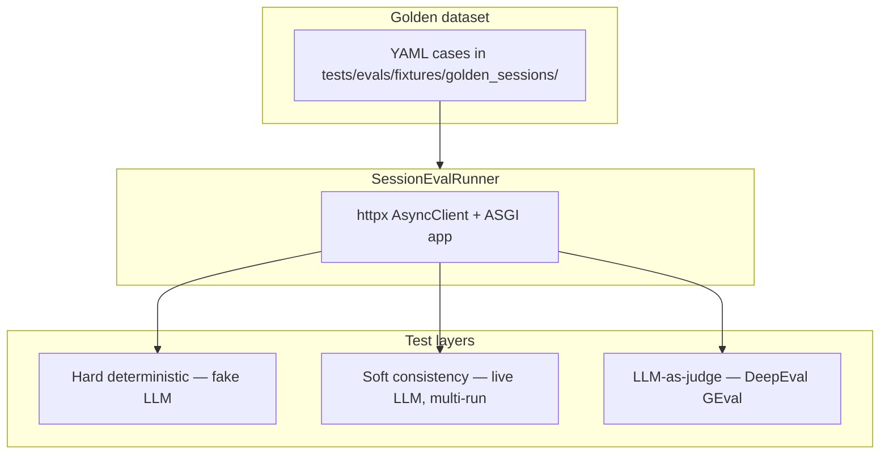

# Session estimation evaluation suite

Pyramid-shaped evaluation for **multi-turn session estimates** via the production surface:

`POST /api/v1/sessions/{session_id}/estimate`

Eval code lives entirely under `tests/evals/` — no imports in `app/`.

## Why sessions (not `/api/v2/estimate`)

The React workbench and real usage flow create a session, submit multiple turns, merge metadata, and return `SessionEstimateResponse` with structured `EstimationResult` JSON. Evaluating isolated v2 calls would miss context use, sliding-window history, and metadata merge behavior.

## Pyramid



| Layer | Module | Marks | Credentials |
|-------|--------|-------|-------------|
| Hard | `test_hard_deterministic.py` | `evals` | None (fake structured LLM) |
| Soft | `test_soft_consistency.py` | `evals`, `slow`, `soft` | `EVAL_ESTIMATOR_USE_REAL_LLM=true` + `OPENAI_API_KEY` |
| Judge | `judge/test_judge_session_quality.py` | `evals`, `slow`, `judge` | Live estimator + judge API key |

## Folder structure

```text
tests/evals/
├── fixtures/golden_sessions/   # 6 YAML cases (one per mandatory category)
├── models.py                   # Pydantic golden schema
├── loader.py                   # YAML load + validation
├── session_runner.py           # HTTP replay → SessionEvalOutcome
├── fakes.py                    # EvalStructuredLLM (golden-aligned fake)
├── assertions.py               # Property checks for hard layer
├── serialization.py            # Judge context blocks
├── thresholds.py               # Soft + GEval calibration constants
├── settings.py                 # EVAL_ESTIMATOR_* test settings
├── judge/
│   ├── config.py               # EVAL_JUDGE_* resolution
│   ├── metrics.py              # GEval metric definitions
│   └── runner.py               # measure() wrapper
├── test_hard_deterministic.py
├── test_soft_consistency.py
└── judge/test_judge_session_quality.py
```

## Run commands

```bash
# Default CI / local — hard evals only, no API keys
uv run pytest tests/evals -m "evals and not slow"

# All eval tests (slow/judge skipped without credentials)
uv run pytest tests/evals

# Full repo fast suite including hard evals
uv run pytest -m "not slow"

# Soft consistency (live estimator, 3 runs × 2 cases)
EVAL_ESTIMATOR_USE_REAL_LLM=true uv run pytest tests/evals/test_soft_consistency.py -m soft

# Judge suite (live estimator + judge model)
EVAL_ESTIMATOR_USE_REAL_LLM=true \
EVAL_JUDGE_API_KEY=$OPENAI_API_KEY \
uv run pytest -m judge

# Strict judge mode (fail on sub-threshold scores)
EVAL_JUDGE_THRESHOLD_MODE=strict \
EVAL_ESTIMATOR_USE_REAL_LLM=true \
EVAL_JUDGE_API_KEY=$OPENAI_API_KEY \
uv run pytest -m judge
```

## Environment variables

| Variable | Default | Purpose |
|----------|---------|---------|
| `EVAL_ESTIMATOR_USE_REAL_LLM` | `false` | Use real structured LLM for estimator in evals |
| `EVAL_ESTIMATOR_MODEL` | _(empty → `OPENAI_MODEL`)_ | Estimator model override |
| `EVAL_SOFT_CONSISTENCY_RUNS` | `3` | Runs per soft consistency case |
| `EVAL_JUDGE_PROVIDER` | `openai` | `openai` or `anthropic` |
| `EVAL_JUDGE_MODEL` | `gpt-4o-mini` | Judge model |
| `EVAL_JUDGE_API_KEY` | _(empty)_ | Falls back to provider default key |
| `EVAL_JUDGE_THRESHOLD_MODE` | `warn` | `warn` logs artifact; `strict` fails test |

Keep **`SESSION_INTEGRATION_TEST_*`** and **`EVAL_*`** separate to avoid accidental live LLM during routine `pytest`.

## Adding a golden case

1. Create `tests/evals/fixtures/golden_sessions/my-case.yaml` matching the schema in `models.py`.
2. Include `case_id`, `category`, multi-turn `turns`, `eval_turn_index`, `success_criteria`, and `notes_for_judge`.
3. Align `expected_metadata_signals` with **heuristic** metadata (`derive_project_metadata`) — project name, type, audience, constraint keywords — not LLM-perfect extraction.
4. Run `uv run pytest tests/evals/test_loader.py` and hard tests.

## Calibrating thresholds

Edit `tests/evals/thresholds.py`. Values are **placeholders** until calibrated on production-like models. On judge failure, JSON artifacts are written to `tests/evals/artifacts/` (gitignored) for human review.

## Judge input design

Each GEval metric receives:

- **input** — prior turn transcripts (eval turn excluded when multi-turn)
- **actual_output** — compact `EstimationResult` JSON
- **context** — merged metadata + success criteria + domain notes

Required metrics: `SessionContextUse`, `ScopeCoherence`, `JustificationQuality`.  
Additional: `ConfidenceCalibration`, `CrossTurnConsistency`, `CompletenessForScope`.

## Known limitations

- Judge variance and cost (~6 metrics × N cases × 1 LLM call each).
- Fake LLM hard tests validate property checks and harness — not real model quality.
- `mentioned_technologies` in session store is not populated by the simplified heuristic path; goldens use `DerivedProjectMetadata` signals instead.
- No CI gating on judge scores yet (`EVAL_JUDGE_THRESHOLD_MODE=strict` reserved for follow-up).

## Next steps

- Wire judge thresholds into CI with a small golden subset.
- Pairwise comparators using `SessionEvalOutcome`.
- Langfuse trace linking for eval runs.
