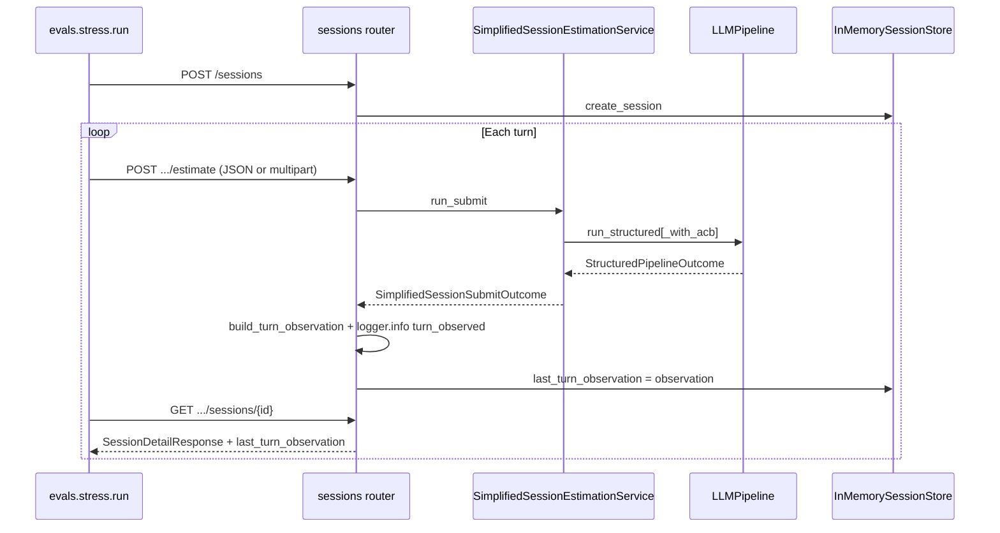

# CAG stress testing — technical reference

**Feature:** `feature-029-cag-stress-testing`  
**Work item:** `docs/work-items/feature-029-cag-stress-testing.md`  
**Branch:** `feature/029-cag-stress-testing`  
**Interactive guide:** `docs/arquitectura-estimador-cag.html` § Stress testing

This document describes **how** the CAG stress-testing capability was built, **what** each part does, and **why** key technical decisions were taken. It complements the work item (requirements) and the exercise deliverables (`results.csv`, `REPORT.md`).

---

## 1. Purpose and scope

### 1.1 Goal

Measure where the **current session-based CAG baseline** degrades under controlled load — without optimizing the system and without introducing RAG. Produce quantitative evidence:

| Artifact | Path | Role |
|----------|------|------|
| Per-turn measurements | `evals/stress/results.csv` | One row per conversational turn |
| Human-readable analysis | `evals/stress/REPORT.md` | Summary tables, three “curves” (as tables), two interpretation paragraphs |

### 1.2 What this is not

- Not RAG, vector DB, or retrieval.
- Not provider comparison (single model per run).
- Not CAG tuning (`max_turns`, prompt compression, etc.).
- Not LLM-as-judge for drift (deterministic substring match only).
- Not a UI dashboard or results database.

### 1.3 Learning objective

Distinguish **hard failures** (schema break, HTTP 4xx/5xx, red CI) from **silent degradation** (cost growth, latency drift, fact recall loss) — the latter is what stress testing exposes.

---

## 2. Implementation process (baby steps)

Work followed `/start-task` on `feature-029` in strict order:

| Step | Deliverable | Verification |
|------|-------------|--------------|
| 1 | Code map in work item Context § | Read-only analysis |
| 2 | `turn_observed` log event (13 fields) | `tests/test_turn_observation.py` |
| 3 | `last_turn_observation` on `GET /sessions/{id}` | `tests/test_simplified_session_router.py` |
| 4 | `evals/stress/scenarios.py` | `tests/test_stress_scenarios.py` |
| 5 | `evals/stress/fixtures/build_pdfs.py` | `uv run python -m evals.stress.fixtures.build_pdfs` |
| 6 | `evals/stress/metrics.py` | `tests/test_stress_metrics.py` |
| 7 | Metric unit tests | pytest (no network) |
| 8 | `evals/stress/run.py` CLI | Manual / HTTP E2E |
| 9 | `evals/stress/report.py` → `REPORT.md` | `tests/test_stress_report.py` |
| 10 | README + `evals/stress/README.md` | Docs sync |

**TDD:** Steps 2–3 and 6–7 used RED → GREEN with narrow pytest invocations before wiring the runner.

---

## 3. Production surface (authoritative path)

The exercise text references `EstimationService.estimate_conversational()`. That module exists but is **not wired to HTTP**. All instrumentation targets the **simplified session path**:

```text
POST /api/v1/sessions                          → create_session
POST /api/v1/sessions/{session_id}/estimate    → estimate_in_session
GET  /api/v1/sessions/{session_id}             → get_session (+ last_turn_observation)
```



---

## 4. Repository layout

```text
app/
├── routers/sessions.py              # HTTP boundary; emits turn_observed
├── services/
│   ├── turn_observation.py          # Pure builder for 13-field payload
│   ├── simplified_session_estimation_service.py  # enriched_transcript_chars, attachment chars
│   └── sessions.py                  # Session.last_turn_observation
└── schemas/simplified_session.py    # SessionDetailResponse.last_turn_observation

evals/                               # Top-level package (not tests/evals/)
└── stress/
    ├── scenarios.py                 # growing | pivot | contradiction
    ├── metrics.py                   # LatencyBudget, CostBudget, MemoryDrift
    ├── run.py                       # CLI runner → results.csv
    ├── report.py                    # CSV → REPORT.md
    ├── README.md
    └── fixtures/
        ├── build_pdfs.py            # Regenerate attach_*kb.pdf
        └── attach_{5,20,50,100}kb.pdf

tests/
├── test_turn_observation.py
├── test_stress_metrics.py
├── test_stress_scenarios.py
├── test_stress_report.py
└── test_simplified_session_router.py  # last_turn_observation integration
```

**Package note:** `pyproject.toml` includes `evals` in hatch wheel packages. Pytest uses `--import-mode=importlib` because `tests/evals/` shadows top-level `evals` when `tests/` is on `sys.path`.

---

## 5. Instrumentation layer

### 5.1 `turn_observed` event

**When:** After each successful `POST /api/v1/sessions/{id}/estimate`, immediately before returning `SessionEstimateResponse`.

**How:** `logger.info("turn_observed", extra={...})` in `app/routers/sessions.py` (same pattern as `estimation_stats_logger` — stdlib `logging`, not structlog).

### 5.2 `build_turn_observation()` — `app/services/turn_observation.py`

Pure function; no I/O. Signature:

```python
def build_turn_observation(
    *,
    session: Session,
    pipeline: StructuredPipelineOutcome,
    enriched_transcript_chars: int,
    attachments_total_chars: int,
    latency_ms: int,
    usage_model: str | None = None,
    usage: UsageInfo | None = None,
) -> dict[str, Any]
```

| Field | Source |
|-------|--------|
| `turn_index` | `session.submit_count` (1-based, after increment in `run_submit`) |
| `session_id` | `session.session_id` |
| `enriched_transcript_chars` | `len(user_prompt)` from `_compose_user_prompt()` |
| `attachments_total_chars` | Sum `len(item.text)` over extracted attachments |
| `messages_in_window` | Non-system messages in `conversation_history.to_messages_list()` |
| `anchors_count` | **Fixed `0`** — no anchor layer in session path today |
| `summary_chars` | `len(agreed_scope)` or `len(derived.summary)` |
| `tokens_in` / `tokens_out` | `bundle.usage` when present |
| `cost_usd` | `estimate_cost_usd(model, UsageView(...))` |
| `latency_ms` | Router wall-clock (`perf_counter`) |
| `cache_hit_kind` | `"semantic"` if `pipeline.cached` else `"none"` |
| `last_resolved_tier` | **Fixed `"default"`** — no dynamic tiering on session path |

Constants: `TURN_OBSERVED_FIELDS` tuple documents the stable schema.

### 5.3 Retrievable observation — FR-02

| Type | Change |
|------|--------|
| `Session` dataclass | `last_turn_observation: dict[str, Any] \| None = None` |
| `SessionDetailResponse` | Optional `last_turn_observation` field |
| Router | Persists observation on session after each successful estimate |

**Why not log parsing?** Deterministic runner consumption; works in-process tests and CI without scraping stdout.

### 5.4 `SimplifiedSessionSubmitOutcome` extension

Added fields computed in `run_submit`:

- `enriched_transcript_chars: int`
- `attachments_total_chars: int`

Keeps the router thin — no duplicate prompt/attachment logic in the HTTP layer.

---

## 6. Stress package (`evals/stress/`)

### 6.1 Scenarios — `scenarios.py`

**Dataclasses:**

```python
@dataclass(frozen=True)
class TurnSpec:
    turn_index: int
    transcript: str
    fact_to_remember: str

@dataclass(frozen=True)
class StressScenario:
    scenario_name: str
    turns: list[TurnSpec]
```

**Factory:** `build_scenario(name: str, n_turns: int) -> StressScenario`

| Name | Intent | Example fact |
|------|--------|--------------|
| `growing` | Incremental scope; cost + recall vs depth | `"project name: Nimbus"` |
| `pivot` | Mid-conversation stack change | `"stack includes Flutter"` |
| `contradiction` | Conflicting budget facts | `"budget locked: 30000 EUR"` vs `"80000 EUR"` |

**Supported N:** `{1, 3, 6, 10, 20}` via `list_supported_turn_counts()`.

Transcripts padded to ≥80 chars (`SessionEstimateRequest` minimum).

### 6.2 Metrics — `metrics.py`

**Shared result type:**

```python
@dataclass(frozen=True)
class MetricResult:
    name: str
    score: float      # 1.0 or 0.0
    passed: bool
    details: dict[str, Any]
```

| Class | Rule | Input |
|-------|------|-------|
| `LatencyBudgetMetric(budget_ms)` | `score=1.0` if `latency_ms <= budget` | `turn_observation` dict |
| `CostBudgetMetric(budget_usd)` | `score=1.0` if `cost_usd <= budget` | `turn_observation` dict |
| `MemoryDriftMetric(fact, where=[...])` | Case-insensitive substring in snapshot locations | Session snapshot dict |

**MemoryDrift locations (default `where`):**

| Location | Fields searched |
|----------|-----------------|
| `summary` | `project_metadata.agreed_scope`, `last_derived_metadata.summary` |
| `anchors` | `explicit_constraints`, `detected_constraints` |
| `metadata` | JSON of `project_name`, `mentioned_technologies`, `detected_constraints` |

**Drift timing:** Runner evaluates turn `k` fact against the **final** session snapshot (`drift_evaluated_against_turn` = last turn index).

**Separate from `tests/evals/judge/`:** Judge metrics use LLM GEval; stress metrics are strictly deterministic.

### 6.3 PDF fixtures — `fixtures/build_pdfs.py`

Generates minimal deterministic PDFs (stdlib byte padding, no fpdf dependency):

- `attach_5kb.pdf`, `attach_20kb.pdf`, `attach_50kb.pdf`, `attach_100kb.pdf`
- Embedded fact string: `attachment fact: redis caching required`
- Target ±15% of nominal KB; `0 KB` = no attachment in runner

```bash
uv run python -m evals.stress.fixtures.build_pdfs
```

### 6.4 Runner — `run.py`

**Entry:** `uv run python -m evals.stress.run`

| Flag | Default | Purpose |
|------|---------|---------|
| `--http URL` | — | Live uvicorn (mutually exclusive with `--in-process`) |
| `--in-process` | — | ASGITransport against `app.main:app` |
| `--scenarios` | `growing,pivot,contradiction` | Comma-separated |
| `--attachment-sizes` | `0,5,20,50,100` | KB buckets |
| `--repeats` | `3` | Repeat index per scenario × attachment |
| `--turn-counts` | `1,3,6,10,20` | Turns per scenario session |
| `--latency-budget-ms` | `4000` | LatencyBudgetMetric |
| `--cost-budget-usd` | `0.05` | CostBudgetMetric |
| `--output` | `evals/stress/results.csv` | CSV path |
| `--write-report` | off | Also write `REPORT.md` |
| `--report-output` | `evals/stress/REPORT.md` | Report path |

**Loop (conceptual):**

```text
for scenario in scenarios:
  for attachment_size_kb in sizes:
    for repeat in 1..repeats:
      for n_turns in turn_counts:
        create session
        for turn in build_scenario(name, n_turns).turns:
          POST estimate (multipart if attachment > 0)
          GET session → observation + snapshot
        for each turn record:
          evaluate 3 metrics (drift vs final snapshot)
          append CSV row
```

**Default row count:** 3 × 5 × 3 × (1+3+6+10+20) = **1800 rows** (well above ≥50 requirement).

### 6.5 Report — `report.py`

`write_report(csv_path, output_path)` generates Markdown only (no matplotlib):

1. **Summary table** — per scenario × attachment: P50/P95 latency, total cost, cache hit rates, mean drift
2. **Curve 1** — `latency_ms` vs `tokens_in`
3. **Curve 2** — cumulative `cost_usd` vs `turn_index`
4. **Curve 3** — mean `MemoryDriftMetric` vs `scenario_turn_count`
5. **Two interpretation paragraphs** — quantitative break point, dominant dimension, RAG boundary hypothesis

Helper: `percentile(values, pct)` — stdlib only, no numpy.

---

## 7. Tests

| Module | Covers |
|--------|--------|
| `tests/test_turn_observation.py` | All 13 fields, cache kind, missing usage |
| `tests/test_simplified_session_router.py` | `last_turn_observation` on GET after POST |
| `tests/test_stress_metrics.py` | Pass/fail + case-insensitive drift |
| `tests/test_stress_scenarios.py` | 3×5 parametrized scenario shapes |
| `tests/test_stress_report.py` | REPORT sections generated from sample CSV |

**Pytest import fix:** Each stress test module prepends repo root to `sys.path` and evicts shadowed `evals` from `tests/evals/`. Root `conftest.py` also calls `_prefer_root_evals_package()`. `pyproject.toml` sets `addopts = "--import-mode=importlib"`.

```bash
uv run pytest tests/test_stress_metrics.py tests/test_stress_scenarios.py tests/test_turn_observation.py -q
```

---

## 8. Relationship to existing eval pyramid

```text
tests/evals/          → Quality of estimation (golden YAML, judge, schema)
evals/stress/         → Degradation under load (cost, latency, memory drift)
```

| Concern | `tests/evals/` | `evals/stress/` |
|---------|----------------|-----------------|
| Input shape | `EstimationResult`, golden criteria | `turn_observation`, session snapshot |
| LLM judge | Yes (DeepEval) | No |
| Network default | Fake LLM | Optional HTTP with real key |
| Deliverable | Pass/fail tests | CSV + REPORT for session 6 baseline |

---

## 9. Technical decisions log

| Decision | Choice | Rationale |
|----------|--------|-----------|
| Entrypoint | Session router, not conversational service | Matches real HTTP traffic |
| Observation retrieval | `GET /sessions/{id}` field | Testable; no log scraping |
| Missing anchors/tier | `0` / `"default"` | Honest baseline; no fake subsystems |
| Metrics location | `evals/stress/metrics.py` | Stress-specific inputs; decoupled from pytest eval package |
| Cache kind | `semantic` \| `none` only | Session path has no exact-match cache |
| PDF generation | Minimal PDF + byte padding | Deterministic; no heavy PDF lib |
| `max_turns` | Unchanged (10) | Stress measures current baseline |
| Package name `evals` | Top-level `evals/stress/` | Exercise contract; pytest shadowing documented |

---

## 10. Gaps vs exercise narrative (documented, not invented)

| Exercise assumes | Repo reality | Stress approach |
|------------------|--------------|-----------------|
| Anchors + summarizer | Sliding window + derived metadata only | Drift uses `summary` / `detected_constraints`; `anchors_count=0` |
| `GET /sessions` debug richness | Partial snapshot | Extended with `last_turn_observation` |
| `evals/metrics.py` at root | Only under `tests/evals/` | Local `MetricResult` in `evals/stress/metrics.py` |
| Exact + semantic cache rates | Semantic only on session path | Exact rate stays 0 in REPORT unless wired later |

---

## 11. Commands quick reference

```bash
# Unit tests (no API keys)
uv run pytest tests/test_stress_metrics.py tests/test_stress_scenarios.py tests/test_turn_observation.py

# Regenerate PDF fixtures
uv run python -m evals.stress.fixtures.build_pdfs

# Small smoke (requires OPENAI_API_KEY + uvicorn)
uv run uvicorn app.main:app --reload
uv run python -m evals.stress.run \
  --http http://localhost:8000 \
  --scenarios growing \
  --attachment-sizes 0 \
  --repeats 1 \
  --turn-counts 3 \
  --output evals/stress/results.csv \
  --write-report

# Full exercise configuration
uv run python -m evals.stress.run \
  --http http://localhost:8000 \
  --scenarios growing,pivot,contradiction \
  --attachment-sizes 0,5,20,50,100 \
  --repeats 3 \
  --output evals/stress/results.csv \
  --write-report
```

---

## 12. Related documents

- Work item: `docs/work-items/feature-029-cag-stress-testing.md`
- Stress README: `evals/stress/README.md`
- Session evals: `docs/evals/session-estimation-evals.md`
- Interactive architecture (Spanish): `docs/arquitectura-estimador-cag.html` § CAG stress testing
- Root README: § CAG stress testing

---

**Last updated:** 2026-06-07  
**Status:** Implemented on `feature/029-cag-stress-testing`; E2E HTTP run with real LLM is manual verification.
