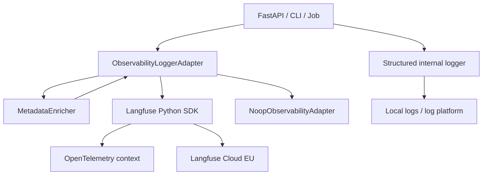

# Technical specification: Estimator observability with Langfuse Cloud, OpenTelemetry, and internal logging

## 1. Executive summary

The Python `estimator` application will be integrated with Langfuse Cloud EU (`https://cloud.langfuse.com`) to capture technical observability, LLM observability, and analytics-ready data for later reporting.

The primary approach is the current Langfuse Python SDK, which is OpenTelemetry-based. It supports traces and observations with an active OTEL context, LLM observations of types `generation` and `embedding`, and native `usage_details` and `cost_details` on those observations. Direct OTLP HTTP export to `/api/public/otel` remains a secondary path for environments with an existing corporate OTEL stack or collector. gRPC toward Langfuse is out of scope: current documentation supports OTLP over HTTP (JSON and protobuf), not gRPC.

Integration happens through an internal decoupled layer, `ObservabilityLoggerAdapter`, wired to the existing structured logger. The layer separates:

- Structured logging: discrete operational events for console, files, or a log platform.
- OTEL tracing: duration spans for requests, pipelines, caches, external calls, and errors.
- Langfuse LLM observations: `generation` for chat/completions and `embedding` for embeddings, including usage and cost.
- Metadata enrichment: user, session, release, version, feature, prompt version, examples version, mode, provider, model, and tags.

Technical tracing covers HTTP requests, jobs, business spans, external calls, caches, and errors. LLM observability covers generations, embeddings, models, providers, prompt/context versioning, tokens, costs, finish reasons, and evaluation scores. This aligns with Langfuse Cloud and Python because the Python SDK offers context managers (`start_as_current_observation`) interoperable with OpenTelemetry, asynchronous export, observation nesting, and helpers to propagate `user_id`, `session_id`, `version`, `metadata`, and `tags`.

## 2. Goals and non-goals

Technical observability goals:

- Create one trace per relevant business unit, typically an estimation request or batch job.
- Measure end-to-end latency, internal-step latency, errors, and external calls.
- Correlate structured logs with traces/spans via `trace_id`, `span_id`, `request_id`, `user_id`, and `session_id`.
- Allow disabling export without breaking consumer code.
- Safe degradation: if Langfuse fails, estimation must continue.

LLM and cost observability goals:

- Record every meaningful LLM call as a `generation` observation.
- Record embeddings as `embedding` observations when applicable.
- Send explicit `usage_details` whenever the app has real token counts.
- Send explicit `cost_details` when cost is trustworthy; otherwise allow Langfuse inference from `model`.
- Propagate dimensions for reporting: `user_id`, `session_id`, `provider`, `model`, `prompt_version`, `examples_version`, `mode`, `feature`, `version`, `release`, and `tags`.
- Enable analytics by cost, latency, volume, cache hit ratio, provider, model, version, and feature.

Non-goals:

- Replace the internal logger with Langfuse.
- Use Langfuse as the sole technical logging platform.
- Migrate prompts to Langfuse Prompt Management in the first phase.
- Implement end-user billing in this specification.
- Build final dashboards before naming and dimensions are stable.
- Export full prompts/responses in production without approved privacy policy.
- Use direct OTLP as the primary path when no corporate collector exists.

## 3. Proposed architecture

The architecture adds an internal adapter, e.g. `app/services/observability/adapter.py`, exposing a stable domain API. The rest of the application must not import `langfuse` directly except bootstrap/adapter modules.



Responsibilities:

| Layer | Responsibility | Example |
| --- | --- | --- |
| Structured logging | Discrete, auditable events without depending on Langfuse | `llm_request_started`, `semantic_cache_miss` |
| OTEL tracing | Duration and hierarchy of operations | `estimation.request`, `semantic_cache.lookup`, `external_api.call` |
| Langfuse generation | Generative model calls with optional input/output, usage, and cost | `llm.estimation.generate` |
| Langfuse embedding | Embedding calls with usage and cost | `embedding.semantic_cache.bucket` |
| Enrichment | Consistent propagation of dimensions | `user_id`, `session_id`, `release`, `feature` |

End-to-end flow:

1. An HTTP request arrives or a job starts.
2. The router or entrypoint creates or receives `request_id`, `user_id`, `session_id`, `feature`, `release`, and `version`.
3. `ObservabilityLoggerAdapter.start_trace(...)` creates the root observation, usually `as_type="span"`, and activates OTEL context.
4. `MetadataEnricher` propagates shared attributes via `propagate_attributes(...)` and stable metadata.
5. Each internal step opens child spans: validation, guardrails, prompt rendering, cache lookup, external calls.
6. Each LLM call opens a child `generation` with `model`, optional `input`/`output`, `usage_details`, `cost_details`, metadata, and tags.
7. The structured logger emits events with the same ids and dimensions.
8. On completion, update output/summary, status, errors if any, and flush on shutdown or in short-lived processes.

Relationship among traces, spans, and generations:

- **Trace**: observable business unit. In Langfuse, a trace groups observations under the same OTEL context.
- **Span**: a timed operation—for requests, pipeline steps, cache, tool calls, external APIs, and jobs.
- **Generation**: specialized observation for generative LLM calls; parent should be the business-step span.
- **Embedding**: specialized observation for embedding calls; parent should be cache/retrieval or preprocessing span.

Correlating logs, spans, and LLM calls:

- The adapter should read `trace_id` and `span_id` from the active context when the SDK/OTEL exposes them.
- Every structured log within a trace should include `request_id`, `trace_id`, `span_id`, `user_id` if present, `session_id`, `feature`, `mode`, `provider`, `model`, `prompt_version`, `examples_version`, `version`, and `release` where applicable.
- Each `generation` should repeat important analytic dimensions even if already on the trace, to enable robust filtering and aggregation.

## 4. Technical decisions

Primary decision: use the Langfuse Python SDK.

Rationale:

- Recommended path for custom observations, traces, nesting, and Langfuse-specific features.
- OpenTelemetry-based: active context and coexistence with other OTEL instrumentation.
- `start_as_current_observation(...)` as a context manager avoids unclosed observations.
- `as_type="generation"` and `as_type="embedding"` carry `usage_details` and `cost_details`.
- Synchronous timestamps and background export reduce hot-path impact.

Relationship to OpenTelemetry:

- Langfuse’s Python SDK builds on OpenTelemetry for tracing.
- `start_as_current_observation(...)` sets the active OTEL context for the block.
- Child observations created inside the block inherit parents automatically.
- Existing OTEL instrumentation can coexist when configured consistently; avoid multiple incompatible global `TracerProvider` instances.

When to use `start_as_current_observation(as_type="generation")`:

- Any LLM call that produces text, JSON, tool calls, visible reasoning output, or a business response.
- Streaming: open the generation at start; update output/usage at end of stream.
- Retries: log each payable attempt as its own generation or under a retry span with a nested generation—for cost reporting each billable call should have a generation.

When to use normal spans:

- Request validation.
- Guardrails.
- Prompt rendering.
- Cache read/write.
- Estimation pipeline orchestration.
- Non-LLM external API calls.
- Serialization, persistence, post-processing, HTTP response handling.

When to use `generation`:

- Chat completions.
- LLM-produced structured output.
- Tool calling where the model selects tools.
- Payable provider retries.

When to use `embedding`:

- Embedding generation for semantic cache, retrieval, or clustering.

Only `generation` and `embedding` support usage/cost natively in Langfuse. Do not expect native `usage_details`/`cost_details` on generic spans.

Coexistence with other OTEL instrumentation:

- If FastAPI, HTTPX, Redis, or DB are instrumented with OTEL, spans should nest under the active context.
- The adapter must avoid opening a second root trace when upstream instrumentation already owns one.
- With a corporate collector, OTLP HTTP to Langfuse can be an extra sink or alternate route.

Global `TracerProvider` risks:

- OpenTelemetry Python typically assumes one global `TracerProvider` per process; double initialization can warn, duplicate, or lose spans.
- Recommended: central bootstrap in `observability/bootstrap.py`, imported once at startup.
- If a corporate provider exists, do not replace it blindly; integrate via compatible SDK wiring or collector/exporter.
- Tests should isolate global state and prefer fake adapters.

Avoiding duplication and noise:

- Do not combine LLM auto-instrumentation with manual wrapping of the same call without explicit rules.
- Instrument business boundaries first: request, cache, generation, external API.
- Skip spans for sub-millisecond trivia unless they explain failures or cost.
- Define sampling by environment and feature.
- Avoid high-cardinality junk: full prompts, huge payloads, ephemeral ids unused in reporting.

## 5. Configuration

Recommended or required variables:

| Variable | Purpose | Local default | Dev default | Staging default | Prod default |
| --- | --- | --- | --- | --- | --- |
| `LANGFUSE_PUBLIC_KEY` | Langfuse project public key | empty | dev secret | staging secret | prod secret |
| `LANGFUSE_SECRET_KEY` | Langfuse project secret key | empty | dev secret | staging secret | prod secret |
| `LANGFUSE_BASE_URL` | Langfuse region | `https://cloud.langfuse.com` | `https://cloud.langfuse.com` | `https://cloud.langfuse.com` | `https://cloud.langfuse.com` |
| `OTEL_SERVICE_NAME` | OTEL service name | `estimator-local` | `estimator-dev` | `estimator-staging` | `estimator` |
| `APP_ENV` | Functional environment | `local` | `dev` | `staging` | `prod` |
| `APP_VERSION` | Application/build version | `0.0.0-local` | build id | semver/build | semver/build |
| `APP_RELEASE` | Deployed release | `local` | branch/sha | release candidate | release id |
| `OTEL_EXPORT_ENABLED` | Enable OTEL/Langfuse export | `false` | `true` optional | `true` | `true` |
| `LANGFUSE_DEBUG` | SDK diagnostics | `false` | `false` | `false` | `false` |
| `LANGFUSE_SAMPLE_RATE` | App-side sampling 0.0–1.0 | `0.0` | `1.0` | `1.0` | `0.1`–`1.0` by volume |
| `LANGFUSE_CAPTURE_INPUTS` | Capture full/sanitized inputs | `false` | `true` sanitized | `false` by default | `false` by default |
| `LANGFUSE_CAPTURE_OUTPUTS` | Capture full/sanitized outputs | `false` | `true` sanitized | `false` by default | `false` by default |
| `LANGFUSE_CAPTURE_USAGE` | Send token usage when known | `true` | `true` | `true` | `true` |
| `LANGFUSE_CAPTURE_COST` | Send explicit cost when known | `true` | `true` | `true` | `true` |

Secondary OTLP HTTP variables when a collector or OTEL platform already exists:

| Variable | Langfuse Cloud EU value |
| --- | --- |
| `OTEL_EXPORTER_OTLP_ENDPOINT` | `https://cloud.langfuse.com/api/public/otel` |
| `OTEL_EXPORTER_OTLP_TRACES_ENDPOINT` | `https://cloud.langfuse.com/api/public/otel/v1/traces` |
| `OTEL_EXPORTER_OTLP_HEADERS` | `Authorization=Basic <base64(public:secret)>,x-langfuse-ingestion-version=4` |

Secrets policy:

- Langfuse keys live only in environment variables or a secret manager.
- Local `.env` is never committed.
- `.env.example` contains empty placeholders only.
- Never log `Authorization` headers, provider API keys, cookies, user tokens, or prompts containing secrets.
- Use separate projects/keys per environment to avoid mixing prod and staging.

Privacy toggles:

- `LANGFUSE_CAPTURE_INPUTS=false` in production unless explicitly approved.
- `LANGFUSE_CAPTURE_OUTPUTS=false` in production unless explicitly approved.
- Even with I/O capture off, still record safe metadata, usage, and cost when known.
- Redact PII before metadata. Treat metadata and baggage as non-secret but still privacy-sensitive.

## 6. Internal logger API design

Proposed classes and interfaces:

```python
from __future__ import annotations

from collections.abc import Iterator
from contextlib import AbstractContextManager
from dataclasses import dataclass, field
from typing import Any, Protocol


@dataclass(frozen=True)
class ObservabilitySettings:
    export_enabled: bool
    sample_rate: float
    capture_inputs: bool
    capture_outputs: bool
    capture_usage: bool
    capture_cost: bool
    app_env: str
    app_version: str
    app_release: str


@dataclass
class TelemetryContext:
    request_id: str
    feature: str
    user_id: str | None = None
    session_id: str | None = None
    tags: list[str] = field(default_factory=list)
    metadata: dict[str, Any] = field(default_factory=dict)


class ObservabilityAdapter(Protocol):
    def start_trace(self, name: str, *, context: TelemetryContext, input: Any | None = None) -> AbstractContextManager[Any]: ...
    def start_span(self, name: str, *, attributes: dict[str, Any] | None = None) -> AbstractContextManager[Any]: ...
    def start_generation(self, name: str, *, model: str, input: Any | None = None, metadata: dict[str, Any] | None = None) -> AbstractContextManager[Any]: ...
    def update_generation_usage(self, usage_details: dict[str, int]) -> None: ...
    def update_generation_cost(self, cost_details: dict[str, float]) -> None: ...
    def update_generation_output(self, output: Any) -> None: ...
    def record_error(self, error: BaseException, *, attributes: dict[str, Any] | None = None) -> None: ...
    def set_user_context(self, user_id: str | None) -> None: ...
    def set_session_context(self, session_id: str | None) -> None: ...
    def set_prompt_context(self, *, prompt_version: str, examples_version: str | None = None) -> None: ...
    def add_tags(self, *tags: str) -> None: ...
    def flush(self) -> None: ...
```

Implementations:

- `LangfuseObservabilityAdapter`: uses `langfuse.get_client()`, `propagate_attributes(...)`, `start_as_current_observation(...)`, `update_current_generation(...)`, and `flush()`.
- `NoopObservabilityAdapter`: same API, no network calls, null context managers.
- `MetadataEnricher`: normalizes metadata, tags, attributes, and privacy policy.
- `StructuredLogBridge`: copies `trace_id`, `span_id`, and dimensions into the internal logger.

The API should be Pythonic:

- Context managers for safe lifecycle.
- Idempotent methods when export is disabled.
- Explicit typing and simple structures (`dict`, dataclasses, `Protocol`).
- No Langfuse imports in domain services.

Desired consumer example:

```python
with observability.start_trace("estimator.request", context=ctx, input=safe_input):
    observability.set_prompt_context(
        prompt_version="estimation/v1",
        examples_version="file-mode-v4-estimator-layout",
    )
    with observability.start_span("estimator.prompt.render"):
        prompt = render_prompt(...)

    with observability.start_generation(
        "estimator.llm.generate",
        model="openai/gpt-4o-mini",
        input=messages,
        metadata={"provider": "openai", "mode": "standard"},
    ):
        response = await llm_client(...)
        observability.update_generation_usage({
            "prompt_tokens": response.usage.prompt_tokens,
            "completion_tokens": response.usage.completion_tokens,
            "total_tokens": response.usage.total_tokens,
        })
        observability.update_generation_output(response.content)
```

Configuration-based shutdown:

- If `OTEL_EXPORT_ENABLED=false`, inject `NoopObservabilityAdapter`.
- Consumer code must not branch on flags.
- The structured logger may keep emitting events when Langfuse is off.

## 7. LLM telemetry model

Incoming LLM event shape:

```json
{
  "prompt_version": "estimation/v1",
  "examples_version": "file-mode-v4-estimator-layout",
  "mode": "standard",
  "provider": "openai",
  "model": "openai/gpt-4o-mini",
  "cached": false,
  "cache_bucket": "semantic:estimation:ef582e040625f9fd",
  "cache_miss_reason": "bucket_empty",
  "usage": {
    "prompt_tokens": 2886,
    "completion_tokens": 330,
    "total_tokens": 3216,
    "preprocessing_input_tokens": 0,
    "preprocessing_output_tokens": 0,
    "estimated_cost_usd": null
  },
  "finish_reason": "tool_calls"
}
```

Recommended mapping:

| Field | Langfuse / OTEL destination | Rationale |
| --- | --- | --- |
| `provider` | metadata, tags, `estimator.llm.provider` | Reporting dimension |
| `model` | generation `model`, metadata, tags, `estimator.llm.model` | Required for inferred cost and filters |
| `prompt_version` | metadata, tags, `estimator.prompt.version` | Prompt-version analysis |
| `examples_version` | metadata, tags, `estimator.prompt.examples_version` | Context / examples analysis |
| `mode` | trace metadata, generation metadata, tags, `estimator.feature.mode` | Functional segmentation |
| `cached` | span/generation metadata, `estimator.cache.hit` | Cache hit ratio and avoided cost |
| `cache_bucket` | safe opaque metadata, `estimator.cache.bucket` | Diagnostics; watch cardinality |
| `cache_miss_reason` | metadata, `estimator.cache.miss_reason` | Operations analysis |
| `finish_reason` | generation metadata, `estimator.llm.finish_reason` | Quality / outcome |
| `usage.prompt_tokens` | `usage_details.prompt_tokens` or `usage_details.input` | OpenAI / Langfuse compatibility |
| `usage.completion_tokens` | `usage_details.completion_tokens` or `usage_details.output` | OpenAI / Langfuse compatibility |
| `usage.total_tokens` | `usage_details.total_tokens` or `usage_details.total` | Explicit total |
| `usage.preprocessing_input_tokens` | `usage_details.preprocessing_input_tokens` | Stable custom usage type |
| `usage.preprocessing_output_tokens` | `usage_details.preprocessing_output_tokens` | Stable custom usage type |
| `usage.estimated_cost_usd` | `cost_details.total` when trustworthy | Prioritized explicit cost |

Trace attributes:

- `service.name`
- `deployment.environment`
- `estimator.request.id`
- `estimator.feature.name`
- `estimator.feature.mode`
- `estimator.app.version`
- `estimator.app.release`
- `estimator.user.id` when present and allowed
- `estimator.session.id` when present

Span attributes:

- Step executed, status, implicit latency, error type.
- Cache: `estimator.cache.hit`, `estimator.cache.miss_reason`, `estimator.cache.bucket`, `estimator.cache.store`.
- External API: `estimator.external.provider`, `estimator.external.operation`, `http.status_code`.

Generation input:

- Sanitized or summarized LLM messages if `LANGFUSE_CAPTURE_INPUTS=true`.
- If off: hashes/fingerprints, lengths, message counts and roles—no sensitive content.

Generation output:

- Sanitized/truncated reply if `LANGFUSE_CAPTURE_OUTPUTS=true`.
- If off: schema status, output length, validation result, and finish reason.

Metadata:

- `provider`, `model`, `prompt_version`, `examples_version`, `mode`, `cached`, `cache_miss_reason`, `finish_reason`, `feature`, `request_id`, `release`, `version`.

Usage details:

- Prefer the OpenAI schema when the source is OpenAI/LiteLLM: `prompt_tokens`, `completion_tokens`, `total_tokens`.
- Langfuse maps `prompt_tokens -> input`, `completion_tokens -> output`, `total_tokens -> total`.
- Stable custom fields for preprocessing: `preprocessing_input_tokens`, `preprocessing_output_tokens`.

Cost details:

- If `estimated_cost_usd` is trustworthy: `{"total": estimated_cost_usd}`.
- If a reliable breakdown exists: `{"input": ..., "output": ..., "total": ...}`.
- If cost is not trustworthy: omit `cost_details` and allow inference from `model` and model definitions.

Tags:

- `env:<APP_ENV>`
- `feature:estimation`
- `mode:<mode>`
- `provider:<provider>`
- `model:<model>`
- `prompt:<prompt_version>`
- `examples:<examples_version>`
- `release:<APP_RELEASE>`
- `cached:true|false`

## 8. Data conventions and naming

Trace names:

| Case | Trace name |
| --- | --- |
| Primary request | `estimator.request` |
| Estimation API v2 | `estimator.api.v2.estimate` |
| CLI batch | `estimator.cli.batch` |
| Async job | `estimator.job.<job_name>` |

Span names:

| Step | Span name |
| --- | --- |
| Input validation | `estimator.request.validate` |
| Input guardrails | `estimator.guardrail.input` |
| Prompt render | `estimator.prompt.render` |
| Semantic cache lookup | `estimator.cache.semantic.lookup` |
| Semantic cache write | `estimator.cache.semantic.write` |
| External call | `estimator.external.<provider>.<operation>` |
| Post-processing | `estimator.output.validate` |

Generation names:

| Case | Generation name |
| --- | --- |
| Primary generation | `estimator.llm.generate` |
| Expert review | `estimator.llm.expert_review` |
| Retry/fallback | `estimator.llm.generate.retry` |
| Structured output | `estimator.llm.structured_output` |

Attribute namespaces:

| Namespace | Fields |
| --- | --- |
| `estimator.llm.*` | `provider`, `model`, `finish_reason`, `attempt`, `fallback_used` |
| `estimator.usage.*` | `prompt_tokens`, `completion_tokens`, `total_tokens`, `preprocessing_input_tokens`, `preprocessing_output_tokens` |
| `estimator.cache.*` | `hit`, `bucket`, `miss_reason`, `top_score`, `store`, `ttl_seconds` |
| `estimator.prompt.*` | `version`, `examples_version`, `template`, `renderer` |
| `estimator.request.*` | `id`, `endpoint`, `method`, `status_code`, `tenant_id` |
| `estimator.feature.*` | `name`, `mode`, `variant`, `rollout` |
| `estimator.app.*` | `env`, `version`, `release` |
| `estimator.external.*` | `provider`, `operation`, `status_code`, `error_type` |

Reporting dimensions:

- Low or medium cardinality: `provider`, `model`, `prompt_version`, `examples_version`, `mode`, `feature`, `release`, `version`, `cached`, `finish_reason`, `error_type`.
- High but useful cardinality: `user_id`, `session_id`, `request_id`. Use for drill-down, not as indiscriminate tags if external-tool cost explodes.

Auxiliary metadata:

- Hashes, fingerprints, opaque bucket ids, lengths, counts, policy applied, retry attempts.
- Must not include full sensitive text, secrets, cookies, or complete external payloads.

Fields to repeat on traces, relevant spans, and generations:

- `estimator.app.env`
- `estimator.app.version`
- `estimator.app.release`
- `estimator.feature.name`
- `estimator.feature.mode`
- `estimator.request.id`
- `estimator.prompt.version`
- `estimator.prompt.examples_version`
- `estimator.llm.provider`
- `estimator.llm.model`
- `user_id` and `session_id` when present and allowed
- core tags: environment, feature, mode, provider, model, prompt version, examples version, release

## 9. Cost and tokens

Langfuse supports usage and cost on `generation` and `embedding` observations. `usage_details` captures units consumed per usage type; `cost_details` captures USD cost per type. Both can be ingested explicitly or inferred from `model` and model definitions.

Ground rule:

- If the app has real token counts, always send them in `usage_details`.
- If the app has trustworthy real cost, send it in `cost_details`.
- If cost is unknown, let Langfuse infer using the correct `model` and up-to-date model definitions.

OpenAI compatibility:

| OpenAI field | Langfuse mapping |
| --- | --- |
| `prompt_tokens` | `input` |
| `completion_tokens` | `output` |
| `total_tokens` | `total` |
| `prompt_tokens_details.cached_tokens` | `input_cached_tokens` or SDK-equivalent flattened keys |
| `completion_tokens_details.reasoning_tokens` | `output_reasoning_tokens` or SDK-equivalent flattened keys |

Send the native OpenAI-style usage object when sourced from OpenAI/LiteLLM because Langfuse documents compatibility: `prompt_tokens` maps to input, `completion_tokens` to output, `total_tokens` to total.

Explicit vs inferred cost:

| Situation | Decision |
| --- | --- |
| LiteLLM/gateway returns real cost | Send `cost_details.total` |
| Provider returns real usage but not cost | Send `usage_details`; infer cost |
| Custom model not defined in Langfuse | Add a custom model definition or send explicit cost |
| Non-standard provider | Normalize `model` and define prices per usage type |
| Reasoning model without real tokens | Do not trust inference; send real usage for correct cost |

Model definitions:

- For custom, fine-tuned, OpenRouter, LiteLLM aliases, or internal providers, add model definitions in Langfuse.
- Definitions must match the generation `model` attribute.
- `usage_details` keys must align with pricing usage types for correct inference.

Reasoning-model limitations:

- Without real token counts, Langfuse cannot infer cost for reasoning models that bill hidden internal tokens.
- For reasoning-style models, capture `reasoning_tokens` when the provider exposes them and send them in usage details.

Analytic strategy:

- Cost per request: sum `cost_details.total` or inferred cost across all generations/embeddings in the trace.
- Cost per session: group traces by `session_id`.
- Cost per user: group by `user_id` under privacy policy.
- Cost per feature: group by `feature`, `mode`, `prompt_version`, `examples_version`, and `release`.
- Cache-avoided cost: count `cached=true`, estimated avoided tokens, and theoretical avoided cost as auxiliary metadata—not billed cost.

## 10. Instrumentation scenarios

| Case | Trace name | Spans | Generation / embedding | Attributes | Tags | Usage/cost |
| --- | --- | --- | --- | --- | --- | --- |
| Incoming HTTP request | `estimator.api.v2.estimate` | `estimator.request.validate`, `estimator.pipeline.run` | None directly | endpoint, method, status_code, request_id, feature, mode | env, feature, mode, release | No |
| Primary estimation flow | `estimator.request` | `estimator.prompt.render`, `estimator.output.validate`, guardrails | Per LLM call | prompt_version, examples_version, mode | prompt, examples, mode | Aggregate from children |
| LLM call | Inherits trace | Optional parent `estimator.llm.call` | `estimator.llm.generate` as `generation` | provider, model, finish_reason, attempt | provider, model, prompt, examples | Yes when available |
| Tool calls | Inherits trace | `estimator.tool.<tool_name>` as `tool` or span | Generation when LLM invokes tools | tool_name, provider, finish_reason | tool, provider | Usage on model generation |
| Cache hit | Inherits trace | `estimator.cache.semantic.lookup` | No LLM if call skipped | cached=true, bucket, top_score | cached:true | Optional avoided-cost metadata |
| Cache miss | Inherits trace | `estimator.cache.semantic.lookup` | Subsequent LLM | cached=false, miss_reason, bucket | cached:false, miss_reason | Usage/cost on subsequent LLM |
| External APIs | Inherits trace | `estimator.external.<provider>.<operation>` | No | provider, operation, status_code, error_type | external, provider | No unless bespoke external billing |
| Exceptions | Active trace | Span where thrown | Generation if LLM path | error_type, safe message, retryable | error, provider if applicable | Partial usage when provider returns it |
| Async jobs | `estimator.job.<job_name>` | `job.load`, `job.process_item`, `job.persist` | Per calls | job_id, batch_id, item_count | job, env, release | Per item or aggregate |
| CLI / batch | `estimator.cli.batch` | `cli.parse`, `batch.run`, `batch.item` | Per calls | command, batch_id, item_id | cli, batch | `flush()` required at end |

Per-case notes:

- Incoming HTTP: open root trace in router/middleware with `request_id`, endpoint, and `session_id` from header/cookie if present. Omit full bodies unless sanitized.
- Primary flow: spans for guardrails, prompt rendering, output validation. Repeat `prompt_version`, `examples_version`, `mode`.
- LLM call: open `generation` immediately before calling the provider and close after response/error. Refresh usage/cost before exiting the context manager.
- Tool calls: keep `finish_reason=tool_calls` on the generation and log each tool as a `tool` observation or child span with sanitized IO.
- Cache hit/miss: lookup is a span. Hits that skip LLM must not synthesize fake generations. Miss metadata attaches to the following generation.
- External APIs: standard spans with HTTP status, provider, operation.
- Exceptions: `record_error` annotates active observation plus structured log with a safe message.
- Jobs/CLI: no HTTP ingress—supply `request_id`/`batch_id` and always `flush()` on exit.

## 11. Reporting and analytics

Design telemetry for later aggregation—not only single-trace debugging. Important dimensions must propagate consistently to traces and observations, especially generations and embeddings, because cost and usage attach natively there.

Key dimensions:

| Dimension | Source | Purpose |
| --- | --- | --- |
| Model | `model`, `estimator.llm.model`, tag `model:*` | Cost, errors, latency |
| Provider | `provider`, `estimator.llm.provider` | Vendor comparison |
| Prompt version | `prompt_version` | Regressions, cost per prompt |
| Examples version | `examples_version` | Context/CAG impact |
| Mode | `mode` | Cost by basic/standard/etc. |
| Release | `APP_RELEASE` | Deployment comparison |
| Version | `APP_VERSION` | Build traceability |
| User | `user_id` | Cost/usage per user |
| Session | `session_id` | Cost per session |
| Feature | `feature` | Cost & volume per capability |
| Cache | `cached`, `cache_miss_reason` | Hit ratio & avoided spend |

Core metrics:

- Total requests.
- Latency p50/p95/p99 per trace and per generation.
- Prompt tokens.
- Completion tokens.
- Total tokens.
- Total cost.
- Average cost per request.
- Cost per user.
- Cost per session.
- Cost per feature.
- Cache hit ratio.
- Errors by model/provider.
- Distribution of `finish_reason`.
- Fallback/retry rates.
- Invalid outputs / human-review percentages.

Langfuse dashboards / Metrics API:

- Dashboards for daily ops, spend by model/provider, tokens per prompt version, errors, latency, problematic traces.
- Metrics API exports aggregates for BI, finance reporting, recurring reviews, internal chargeback, historical comparisons, executive dashboards.
- External BI blends users, tenants, plans, revenue, cohorts, releases, and non-Langfuse product data.

Reliable-reporting rules:

- Do not rename tags/dimension families without versioning.
- Do not mix inconsistent model aliases (`gpt-4o-mini` vs `openai/gpt-4o-mini`) without normalization.
- Do not rely solely on trace metadata for dimensional cost splits—mirror dimensions onto generations.
- Do not promote raw text payloads into dimensions.

## 12. Scores and evaluation integration

Programmatic scores help whenever objective or semi-automatic quality signals exist. Langfuse attaches scores to traces or observations—when scoring a specific observation also supply the owning trace identifier.

Suggested scores:

| Score | Type | Attached to | Description |
| --- | --- | --- | --- |
| `estimation_success` | BOOLEAN | Trace | Estimation produced usable output |
| `response_valid` | BOOLEAN | Generation or trace | Passed schema validation |
| `requires_human_review` | BOOLEAN | Trace | Needs human QA |
| `user_feedback` | NUMERIC or CATEGORICAL | Trace | Explicit user feedback |
| `output_confidence` | NUMERIC | Trace | Pipeline confidence |
| `guardrail_blocked` | BOOLEAN | Guardrail/span | Policy blocked execution |

Strategy:

- Immediate technical signals: `response_valid`, `estimation_success`, `guardrail_blocked`.
- Product signals: `user_feedback`, `requires_human_review`.
- Offline evaluations: enqueue later via `trace_id` / `observation_id`.

Scores inherit contextual dimensions via trace/generation metadata (model, provider, prompt version, examples version, mode, release, user/session) so analyses can correlate quality versus cost/version.

## 13. Security and privacy

Inputs/outputs you may persist:

- Local/dev only when free of secrets and sensitive PII.
- Staging/prod default to metadata, usage, cost hashes, lengths, schema status, and sanitized snippets when policy-approved.
- System prompts disclose internal strategy—treat as sensitive even absent PII.
- LLM answers may mirror user-supplied secrets—always assume sensitive unless proven otherwise.

Masking/redaction principles:

- Strip API keys, bearer tokens, cookies, passwords, emails (unless mandated), phones, IDs, addresses, etc.
- Replace with sentinel tokens (`[REDACTED_EMAIL]`, `[REDACTED_SECRET]`) prior to ingest.
- Truncate sanitized payloads aggressively.
- Prefer metadata allowlists over arbitrary dict dumping.

Never store:

- Provider secrets.
- Auth tokens / refresh tokens.
- Cookies.
- Raw headers (especially `Authorization`).
- `.env` contents or equivalent.
- Contracts/financial/PII-heavy prompts/responses unless explicitly approved.

Prompt/answer-specific risks:

- Prompt bundles may expose examples, playbook text, retrieved customer context.
- Responses can embed reflected PII, provider errors, or operator-visible payloads.
- Keep `LANGFUSE_CAPTURE_INPUTS` / `LANGFUSE_CAPTURE_OUTPUTS` off in prod until DPAs/retention/roles are squared away.

Metadata and baggage guardrails:

- Only safe analytics-required fields propagate.
- Do not serialize entire FastAPI/request objects verbatim.
- Avoid dangerous high cardinality: unstructured free-text, untouched prompts, textual cache keys, URLs with secrets in querystrings.
- Use opaque ids/hashes wherever traceability suffices.

Compliance & audit:

- Separate Langfuse projects per environment.
- Document retention posture.
- Govern Langfuse IAM.
- Maintain field dictionaries for reviewers.
- Keep secret-detection tests green.
- Re-audit sampling + capture switches before widening prod ingestion.

## 14. Reliability and operations

Timeouts & retries:

- Never block HTTP responses solely because Langfuse is slow/unavailable (SDK already soft-fails—adapter should still isolate calls).
- Avoid per-request `flush()` in FastAPI except debugging paths; rely on background export plus shutdown hooks.
- Short CLI/jobs must call `flush()` before exit.

When Langfuse is down:

- Keep critical user flows progressing.
- Emit structured log `observability_export_failed` with safe error taxonomy + backoff/ratelimit guards.
- No aggressive retries on the inference hot-path.
- Hard-disable ingestion via `OTEL_EXPORT_ENABLED=false` if outages persist.

Batching considerations:

- Use SDK batch processors.
- Ramp sampling whenever traffic climbs.
- Cap payload sizes — huge IO capture tanks bandwidth & CPU.

Expected latency footprint:

- Low when ingestion is asynchronous and flush is seldom.
- IO capture/redaction inflate CPU/mem/network proportional to captured bytes.

Self-diagnostics instrumentation:

- `observability.enabled`
- `observability.sampled`
- `observability.export_error_count`
- `observability.flush_duration_ms` (shutdown/job paths)
- `observability.dropped_event_count` if you add buffering

Startup validation:

- If `OTEL_EXPORT_ENABLED=true`, require `LANGFUSE_PUBLIC_KEY`, `LANGFUSE_SECRET_KEY`, `LANGFUSE_BASE_URL`.
- Never print credential material.
- Enforce numeric `LANGFUSE_SAMPLE_RATE` within `[0,1]`.
- In staging/prod, choose between loud misconfiguration warnings vs shutting down ingestion only—normally keep the API alive unless compliance mandates failing closed.

## 15. Testing

Unit tests:

- `NoopObservabilityAdapter` makes no outbound calls and keeps context managers ergonomic.
- `LangfuseObservabilityAdapter` hits a fake SDK for `span` / `generation` / `embedding` paths.
- `MetadataEnricher` normalizes tags, release/version, provider/model, prompt/examples versions.
- `usage_details` builders cover `UsageInfo`, LiteLLM, and native OpenAI objects.
- `cost_details.total` only ships when trustworthy and `LANGFUSE_CAPTURE_COST=true`.
- `record_error` never leaks secrets yet captures taxonomy.

Integration tests:

- Fake HTTP/SDK harness—avoid live Langfuse in CI by default.
- Assert nesting: root trace → pipeline span → generation.
- Confirm `OTEL_EXPORT_ENABLED=false` exercises noop adapters.
- Prove SDK faults never propagate to estimation responses.

Smoke tests:

- Staging credentials: run controlled estimation.
- Visible Langfuse trace with ≥1 generation.
- Validate dimensions (`model`, `provider`, prompt/examples, mode, release, version`, tags), usage payload, inferred vs explicit cost wiring.
- With capture toggles off, UI must not show sensitive prompts/responses.

`usage_details` validation:

- `prompt_tokens`, `completion_tokens`, `total_tokens` follow OpenAI-style schema.
- Preprocessing counters only emitted when nonzero / known-good.
- Totals remain internally consistent versus provider responses.

`cost_details` validation:

- `total` is float USD—not `None`.
- Omit entire block when unreliable to allow inference fallback.
- Custom models require companion Langfuse definitions if inference is mandatory.

Naming & tag regression guardrails:

- Snapshot trace/span/generation names.
- Enforce baseline tag cardinality per generation.
- Ensure repeated analytic attributes stay synchronized.

Secret regression fixtures:

- Feed API keys / bearer cookies / synthetic email through pipeline.
- Assert redaction gates before ingest + logging paths.
- Adapter error stubs must sanitize stack traces lacking secrets.

Other regression motifs:

- Partial usage payloads from providers.
- LLM crashes before streamed completion.
- Streaming usage emitted only after final chunk.
- Cache-only paths without generations.
- Miss → downstream generation combos.
- Sampling drops entire ingestion for specific requests.

## 16. Phased implementation plan

| Phase | Deliverables | Acceptance |
| --- | --- | --- |
| Phase 1: Langfuse + OTEL bootstrap | `langfuse` dependency, typed settings, `.env.example`, single bootstrap site, noop adapter | Application boots with ingestion on/off, no leaked secrets, manual staging smoke trace |
| Phase 2: Logger glue | `ObservabilityLoggerAdapter`, `MetadataEnricher`, structured-log bridge | Correlation IDs present everywhere, context managers verifiable via fake Langfuse doubles |
| Phase 3: LLM flow instrumentation | Estimation traces, pipeline spans, generation inside LLM gateway | Billable completions always emit generations w/ normalized model IDs |
| Phase 4: Tokens, cost & advanced metadata | `usage_details` / `cost_details`, prompt/example propagation, semantic-cache metadata | OpenAI-compat usage surfaced, inferred vs explicit cost understood, tagging complete |
| Phase 5: Dashboard/report readiness | Canonical dimensions, Metrics API probes, starter dashboards | Reliable slices by model/provider/prompt/mode/release/cache behave |
| Phase 6: Harden + progressive rollout | Sampling, redaction, SDK failure budgets, staged prod enable | Outages never degrade core API, privacy questionnaire signed |

Phase detail:

1. `uv add langfuse`, tighten settings typings, lazily instantiate client guarded by toggles—no sweeping instrumentation yet.
2. Deliver dual adapters + correlation plumbing + offline tests.
3. Focus on hottest route + synchronous chat + streaming equivalents + cache lookups.
4. Wire usage/cost mappers plus prompt/examples/release propagation + model normalization table.
5. Validate BI queries / Langfuse dashboards, document metric recipes.
6. Gradually widen sampling knobs, rerun privacy drills, operationalize dashboards/runbooks.

## 17. Recommended initial implementation slice

Pragmatic first cut for this codebase:

- Add `app/services/observability/{adapter,langfuse_adapter,noop,metadata,bootstrap}.py`.
- Resolve `ObservabilityAdapter` from a tiny factory wired into estimation boundaries (not routers).
- Instrument exactly one estimation route + centralized LLM client first pass.
- Keep prod IO capture OFF until governance approves payloads.
- Day-one payload fields: `provider`, `model`, `prompt_version`, `examples_version`, `mode`, `cached`, `cache_miss_reason`, `finish_reason`, `usage_details`, optional `cost_details.total`, identifiers (`user`, `session`, `release`, `version`, tagging scheme).

Iteration two backlog:

- Programmatic scoring.
- Stable executive dashboards / BI exports via Metrics API.
- Automated custom model ingestion.
- Per-feature/per-user adaptive sampling tiers.
- Heavier semantic redactors.
- Corporate OT collector path if mandated.

Comfortable shortcuts for fast value:

- Manual boundary instrumentation before wholesale auto instrumentation.
- Rich metadata even without IO payloads.
- Temporary inference reliance when bills lack explicit USD—provided `model` strings stable.
- Skip micro-spans beneath meaningful latency thresholds.

## 18. Code examples

Langfuse client initialization:

```python
from __future__ import annotations

import logging
from dataclasses import dataclass

from langfuse import get_client

logger = logging.getLogger(__name__)


@dataclass(frozen=True)
class LangfuseRuntimeConfig:
    export_enabled: bool
    base_url: str
    app_env: str
    app_version: str
    app_release: str
    sample_rate: float


def get_langfuse_client(config: LangfuseRuntimeConfig):
    if not config.export_enabled:
        return None

    # get_client() reads LANGFUSE_PUBLIC_KEY, LANGFUSE_SECRET_KEY and
    # LANGFUSE_BASE_URL from the environment.
    client = get_client()
    logger.info(
        "langfuse_client_initialized",
        extra={
            "event": "langfuse_client_initialized",
            "app_env": config.app_env,
            "app_version": config.app_version,
            "app_release": config.app_release,
            "langfuse_base_url": config.base_url,
        },
    )
    return client
```

Logger-facing adapter scaffold:

```python
from __future__ import annotations

import logging
from collections.abc import Iterator
from contextlib import contextmanager, nullcontext
from typing import Any

from langfuse import propagate_attributes

logger = logging.getLogger(__name__)


class ObservabilityLoggerAdapter:
    def __init__(
        self,
        *,
        langfuse_client: Any | None,
        export_enabled: bool,
        app_env: str,
        app_version: str,
        app_release: str,
    ) -> None:
        self._langfuse = langfuse_client
        self._export_enabled = export_enabled and langfuse_client is not None
        self._app_env = app_env
        self._app_version = app_version
        self._app_release = app_release

    @contextmanager
    def start_trace(
        self,
        name: str,
        *,
        request_id: str,
        feature: str,
        user_id: str | None = None,
        session_id: str | None = None,
        tags: list[str] | None = None,
        metadata: dict[str, Any] | None = None,
        input: Any | None = None,
    ) -> Iterator[Any]:
        if not self._export_enabled:
            with nullcontext():
                yield None
            return

        merged_metadata = {
            "request_id": request_id,
            "feature": feature,
            "app_env": self._app_env,
            "version": self._app_version,
            "release": self._app_release,
            **(metadata or {}),
        }
        merged_tags = [
            f"env:{self._app_env}",
            f"feature:{feature}",
            f"release:{self._app_release}",
            *(tags or []),
        ]

        with propagate_attributes(
            user_id=user_id,
            session_id=session_id,
            version=self._app_version,
            metadata=merged_metadata,
            tags=merged_tags,
        ):
            with self._langfuse.start_as_current_observation(
                as_type="span",
                name=name,
                input=input,
                metadata=merged_metadata,
            ) as span:
                yield span
```

`start_generation(...)` context manager skeleton:

```python
from collections.abc import Iterator
from contextlib import contextmanager, nullcontext
from typing import Any


class ObservabilityLoggerAdapter:
    # ... __init__ and start_trace omitted for brevity ...

    @contextmanager
    def start_generation(
        self,
        name: str,
        *,
        provider: str,
        model: str,
        prompt_version: str,
        examples_version: str,
        mode: str,
        input: Any | None = None,
        metadata: dict[str, Any] | None = None,
    ) -> Iterator[Any]:
        if not self._export_enabled:
            with nullcontext():
                yield None
            return

        generation_metadata = {
            "provider": provider,
            "model": model,
            "prompt_version": prompt_version,
            "examples_version": examples_version,
            "mode": mode,
            **(metadata or {}),
        }

        with self._langfuse.start_as_current_observation(
            as_type="generation",
            name=name,
            model=model,
            input=input,
            metadata=generation_metadata,
        ) as generation:
            yield generation
```

Patching `usage_details` via OpenAI-style schema:

```python
def openai_usage_details(usage: dict[str, int | None]) -> dict[str, int]:
    details: dict[str, int] = {}
    for source, target in {
        "prompt_tokens": "prompt_tokens",
        "completion_tokens": "completion_tokens",
        "total_tokens": "total_tokens",
        "preprocessing_input_tokens": "preprocessing_input_tokens",
        "preprocessing_output_tokens": "preprocessing_output_tokens",
    }.items():
        value = usage.get(source)
        if value is not None:
            details[target] = int(value)
    return details


with observability.start_generation(
    "estimator.llm.generate",
    provider="openai",
    model="openai/gpt-4o-mini",
    prompt_version="estimation/v1",
    examples_version="file-mode-v4-estimator-layout",
    mode="standard",
    input=messages if capture_inputs else None,
) as generation:
    response = await llm_call()
    if generation is not None:
        generation.update(
            usage_details=openai_usage_details(
                {
                    "prompt_tokens": response.usage.prompt_tokens,
                    "completion_tokens": response.usage.completion_tokens,
                    "total_tokens": response.usage.total_tokens,
                    "preprocessing_input_tokens": 0,
                    "preprocessing_output_tokens": 0,
                }
            )
        )
```

Emitting explicit `cost_details`:

```python
def cost_details_from_estimate(estimated_cost_usd: float | None) -> dict[str, float] | None:
    if estimated_cost_usd is None:
        return None
    if estimated_cost_usd < 0:
        raise ValueError("estimated_cost_usd cannot be negative")
    return {"total": float(estimated_cost_usd)}


cost_details = cost_details_from_estimate(response.usage.estimated_cost_usd)
if generation is not None and cost_details is not None:
    generation.update(cost_details=cost_details)
```

Recording tags plus `userId`, `sessionId`, release & version hints:

```python
with observability.start_trace(
    "estimator.api.v2.estimate",
    request_id=request_id,
    feature="estimation",
    user_id=current_user_id,
    session_id=session_id,
    tags=[
        "feature:estimation",
        "mode:standard",
        "provider:openai",
        "model:openai/gpt-4o-mini",
        "prompt:estimation/v1",
        "examples:file-mode-v4-estimator-layout",
    ],
    metadata={
        "release": settings.app_release,
        "version": settings.app_version,
        "prompt_version": "estimation/v1",
        "examples_version": "file-mode-v4-estimator-layout",
    },
):
    result = await run_estimation()
```

Error instrumentation helper:

```python
def record_error(observation: Any | None, error: BaseException) -> None:
    safe_error = {
        "error_type": type(error).__name__,
        "error_message": str(error)[:500],
    }
    logger.warning(
        "estimator_operation_failed",
        extra={"event": "estimator_operation_failed", **safe_error},
    )
    if observation is not None:
        observation.update(metadata={"error": safe_error})


try:
    with observability.start_generation(...) as generation:
        response = await llm_call()
except Exception as exc:
    record_error(generation if "generation" in locals() else None, exc)
    raise
```

Final flush hook:

```python
class ObservabilityLoggerAdapter:
    # ... other methods omitted ...

    def flush(self) -> None:
        if not self._export_enabled:
            return
        try:
            self._langfuse.flush()
        except Exception as exc:  # defensive boundary: observability must not break app shutdown
            logger.warning(
                "langfuse_flush_failed",
                extra={
                    "event": "langfuse_flush_failed",
                    "error_type": type(exc).__name__,
                },
            )


def run_batch() -> None:
    try:
        process_items()
    finally:
        observability.flush()
```

Uncertainty note: Langfuse occasionally tweaks SDK signatures—pin `langfuse` in `pyproject.toml`, skim the upstream reference immediately before merging, and back the adapter with contract tests.

## 19. Final checklist

Implementation checklist:

- [ ] Add `langfuse` via `uv add langfuse`.
- [ ] Type settings covering Langfuse/OTEL/application version knobs.
- [ ] Extend `.env.example` with placeholder-only values.
- [ ] Ship real + noop `ObservabilityLoggerAdapter` bundles.
- [ ] Central singleton bootstrap executes exactly once per process.
- [ ] Root trace spans every HTTP/job entry point.
- [ ] Each billable completion logs a Langfuse generation.
- [ ] Embeddings mirrored when semantic cache/embed pipeline runs.
- [ ] Usage + cost payloads normalized + validated.
- [ ] Shutdown/`flush()` hooks cover workers + CLI tooling.

Privacy checklist:

- [ ] Inputs off-by-default for prod ingestion.
- [ ] Outputs off-by-default for prod ingestion.
- [ ] Unified redactor precedes ingest + logging adapters.
- [ ] Automated secret regression suite stays green post-change.
- [ ] Approved metadata taxonomy documented.
- [ ] Langfuse project isolation + IAM reviewed quarterly.

Environment validation checklist:

- [ ] Export toggle off → zero Langfuse regressions locally.
- [ ] Export toggle on + staging creds yields visible EU-hosted traces.
- [ ] Trace payloads include canonical release/feature/tags/dimensions.
- [ ] Generations replicate provider/model/version metadata.
- [ ] Dashboards/charts reconcile `usage_details` vs billed expectations.
- [ ] Chaos tests prove SDK outage never surfaces secrets.

Reporting readiness checklist:

- [ ] Repeated dimensions synced across traces/generations/embeddings.
- [ ] Canonical tag prefixes frozen + documented.
- [ ] Stable model normalization table published.
- [ ] Prompt/example versions immutable per deploy artifact.
- [ ] Cache-hit semantics stable for BI joins.
- [ ] Finish reason histograms reproducible nightly.
- [ ] Foundational programmatic scores enumerated.
- [ ] Minimum viable Langfuse dashboards or Metrics exports validated nightly.

## 20. Open questions

- Canonical `user_id` source-of-truth once auth evolves (human user vs tenant slug vs hashed API principal vs omitted entirely MVP stage)?
- `session_id` minting/pass-through contract across browser clients, REST API, CLI, background jobs?
- Official policy approving prompt/answer capture fidelity per environment tier?
- Definitive build inputs for `APP_VERSION`/`APP_RELEASE` (semver tag, Docker label, CI build id)?
- Mandatory model-ID normalization catalogue from day-one LiteLLM usage?
- Do LiteLLM or upstream gateways expose trustworthy USD payloads today?
- When do we programmatically reconcile Langfuse **custom model definitions** with infra-as-code?
- Lowest-risk initial quality score bridging schema validation vs human judgement vs offline eval backlog?
- Throughput envelopes dictating phased sampling ramps in prod?
- Will infra mandate corporate OTEL collectors (forcing OTLP HTTP secondary path readiness)?
- Which metadata shards are BI-contractual versus engineering-only breadcrumbs?
- Retention SLA for prompts/metadata once IO capture expands?
- Who owns Langfuse prod RBAC rotations & incident response narratives?
- How do we keep this SPEC synchronized with MVP doc `feature-009-langfuse-telemetry.md`? **Resolved:** feature-009 marked superseded; 014 is canonical.

## Implementation decisions (2026-05-17)

| Topic | Decision | Rationale |
| --- | --- | --- |
| Export toggle | **`OTEL_EXPORT_ENABLED`** (canonical) | Matches feature-014 and the Langfuse Python SDK’s OTEL-based tracing model; one switch for “send spans/generations to Langfuse”. Do not add `LANGFUSE_TRACING_ENABLED` unless a migration alias is needed later. |
| Primary API surface | **`/api/v2` only** for first instrumentation | v1 estimations route is deprecated; avoids duplicate trace logic. |
| `user_id` | **Omit** until real auth | No fabricated identities; aligns with privacy and feature-009 MVP. |
| `session_id` | **First-class** | Prefer client-provided session (header/query when defined); else generate a stable UUID per estimation request and reuse for all observations in that request. Distinct from `request_id` (correlation for logs). |
| Manual validation | Staging Langfuse EU project + keys in local `.env` | Smoke trace after Step 8. |
| Prior spec | **feature-009 superseded** | See banner on feature-009. |

## Implementation delivered (slice 1 — steps 1–8)

**Status:** Merged into application code on branch `feature/014-langfuse-observability-analytics` (2026-05-17). Phases 4–6 of this spec (embeddings, dashboards, hardening) remain follow-up.

### Functional behavior

When `OTEL_EXPORT_ENABLED=true` and Langfuse keys are set:

1. **Process startup** initializes a single observability adapter and logs `observability_initialized` (no secrets).
2. **`POST /api/v2/estimate`** opens a business trace `estimator.api.v2.estimate` with `request_id`, `session_id` (header `X-Session-Id` / `X-Session-ID`, else `sess_<uuid>`), prompt/examples versions, and baseline tags (`env`, `feature`, `release`).
3. A child span `estimator.pipeline.structured` wraps the guarded LLM pipeline.
4. Each LiteLLM chat completion/stream in `ai_model_service` emits a nested **`generation`** `estimator.llm.generate` with provider/vendor/model metadata and token usage (OpenAI-shaped `usage_details`).
5. On response, the API records **HTTP status** on the active span (`http.status_code`, `http.status_class`, tag `http_status:2xx|4xx|…`).
6. **Shutdown** calls `flush()` so short-lived processes export pending spans.

When export is off or keys are missing, a **noop adapter** runs the same code paths without network I/O. Validation requires keys if export is explicitly enabled.

**Out of scope in this slice:** v1 routes, embedding observations for semantic cache, automatic LiteLLM SDK instrumentation, full prompt/response capture in prod (defaults off), corporate OTLP collector path.

**Follow-up (2026-05-17):** v2 structured completions use `complete_structured` (Instructor), not `acomplete_chat`. Generations are recorded as `estimator.llm.structured_output` with `usage_details` and optional `cost_details` (model id normalized for `estimate_cost_usd`, e.g. `openai/gpt-4o-mini` → `gpt-4o-mini`).

### Technical layout

| Module | Role |
| --- | --- |
| `app/config.py` | `OTEL_EXPORT_ENABLED`, Langfuse keys/URL, `APP_VERSION` / `APP_RELEASE`, capture flags, `observability_export_active()` |
| `app/services/observability/types.py` | `ObservabilityAdapter` protocol, `TelemetryContext` |
| `app/services/observability/noop.py` | No-op implementation |
| `app/services/observability/langfuse_adapter.py` | Langfuse SDK: `propagate_attributes`, `start_as_current_observation`, updates, `set_http_status` |
| `app/services/observability/factory.py` | `Langfuse(...)` vs noop from settings |
| `app/services/observability/bootstrap.py` | Singleton `init_observability` / `get_observability` / `shutdown_observability` |
| `app/services/observability/usage_cost.py` | `openai_usage_details`, `cost_details_from_estimate` |
| `app/services/observability/llm_instrumentation.py` | Close generation with usage/cost (lazy import of `estimate_cost_usd` to avoid cycles) |
| `app/services/observability/session.py` | `resolve_session_id(Request)` |
| `app/services/ai_model_service.py` | Generation wrapper around `acompletion` / `astream_chat` |
| `app/routers/estimations_v2.py` | Root trace + pipeline span + HTTP status |
| `app/main.py` | Lifespan: init + flush |

**Dependency:** `langfuse==4.6.1` (OTEL-based Python SDK).

**Tests (228 total, CI-safe):** `tests/test_observability_*.py`, `tests/test_ai_model_service_observability.py`, `tests/test_estimations_v2_observability.py`; conftest forces noop observability unless a test patches the adapter.

### Manual verification

```bash
# .env: OTEL_EXPORT_ENABLED=true, LANGFUSE_PUBLIC_KEY, LANGFUSE_SECRET_KEY, LANGFUSE_BASE_URL=https://cloud.langfuse.com
uv run uvicorn app.main:app --reload
```

Send `POST /api/v2/estimate` with `X-Session-Id: <your-session>`. In Langfuse EU, confirm trace name `estimator.api.v2.estimate`, nested `estimator.pipeline.structured` and `estimator.llm.generate`, session id, and `http.status_code` 200. Generations should show `provider`, `model`, and usage; I/O only if `LANGFUSE_CAPTURE_INPUTS/OUTPUTS=true`.

## Learnings (implementation slice 1)

| # | Learning | Implication |
| --- | --- | --- |
| L1 | Langfuse Python SDK 4.x uses `start_as_current_observation` + `update_current_generation`, not legacy `trace()`/`generation()` APIs from older docs. | Pin SDK version; contract-test adapter against fakes. |
| L2 | Instrument at **`ai_model_service`** (LiteLLM gateway), not per router — all providers (`openai/…`, `anthropic/…`) share one generation path. | v1 may still emit orphan generations if called; business traces only on v2. |
| L3 | `openai_usage_details` is a **Langfuse field naming** convention; LiteLLM normalizes token fields across many chat providers. | Anthropic/OpenAI both work; explicit USD cost only when `estimate_cost_usd` knows the model (today mainly `gpt-4o-mini`). |
| L4 | `complete_llm_generation` must **lazy-import** `estimate_response_builder` to avoid `ai_model_service` ↔ `llm_service` import cycle. | Keep observability helpers free of heavy service imports at module level. |
| L5 | Generations need an **active parent trace** (OTEL context) to nest cleanly in the Langfuse UI — hence Step 8 before smoke looks “complete”. | Order: gateway generation first, then HTTP root trace. |
| L6 | Tests need **`observability_noop_by_default`** in `conftest.py` so CI never calls Langfuse with a developer `.env`. | Patch `get_observability` only in observability-focused tests. |
| L7 | `/start-task` baby-step commits vs user rule “commit only when asked” — align command text with explicit “commit each step” when using `start-task`. | See `docs/learnings/LEARNINGS.md` entry `LRN-20260517-001`. |

## Implementation progress

- [x] Step 1: Branch + living doc (this section)
- [x] Step 2: `langfuse` dependency + typed settings + `.env.example`
- [x] Step 3: `NoopObservabilityAdapter` + factory
- [x] Step 4: `LangfuseObservabilityAdapter` + unit tests (fake SDK)
- [x] Step 5: Bootstrap singleton + lifespan `flush`
- [x] Step 6: `usage_details` / `cost_details` mappers
- [x] Step 7: Generation in `ai_model_service`
- [x] Step 8: Root trace on `/api/v2` estimation (+ HTTP status on span)

### Repository commits (master-ia)

| Commit | Summary |
| --- | --- |
| `c2465b5` | Slice 1 (steps 1–8): Langfuse adapter, settings, bootstrap, LLM generations, v2 HTTP trace; feature-014 spec + learnings log. |
| `cbe07c7` | Structured v2 path: `estimator.llm.structured_output` with usage/cost; model id normalization for cost estimate. |
