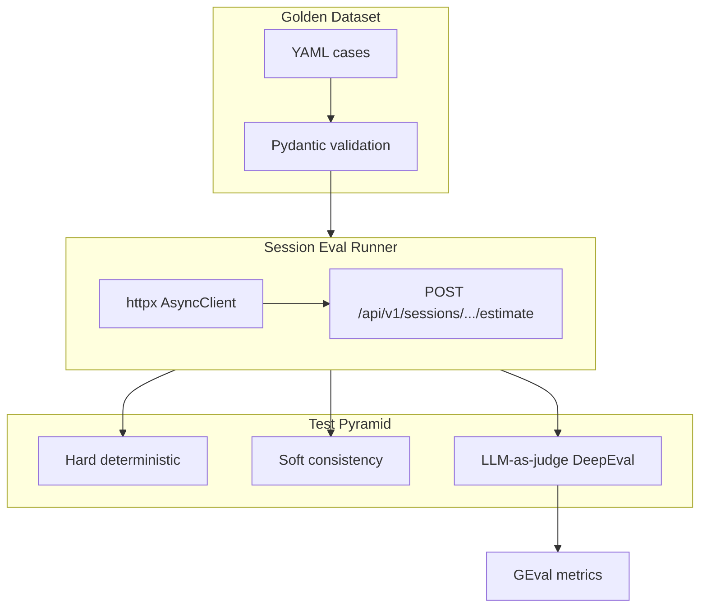

# Feature: LLM-as-Judge Evaluation Suite for Session-Based Estimation

## Objective

Add a **maintainable, pyramid-shaped evaluation suite** for the Estimador CAG that measures estimate quality through the **real production surface**: `POST /api/v1/sessions/{session_id}/estimate`.

The suite must:

- Exercise **multi-turn conversational sessions** (not isolated `/api/v2/estimate` calls).
- Reuse one **curated golden dataset** across hard deterministic, soft consistency, and LLM-as-judge layers.
- Keep evaluation code **fully separated** from production request paths.
- Run fast by default (no API keys), with expensive judge tests opt-in via pytest marks.
- Integrate **DeepEval** for domain-specific GEval-style metrics on genuinely subjective properties.

## Context

### Production surface (authoritative)

The UI and real usage flow go through session routes in `app/routers/sessions.py`:

| Route | Role |
| --- | --- |
| `POST /api/v1/sessions` | Create in-memory session |
| `POST /api/v1/sessions/{session_id}/estimate` | Multi-turn submit; merges metadata, sliding window, structured output |
| `GET /api/v1/sessions/{session_id}` | Restore session state |

The estimate endpoint orchestrates `SimplifiedSessionEstimationService` → `LLMPipeline` → `assemble_estimation_v2_response`, returning `SessionEstimateResponse` with `project_metadata`, `estimate` (structured `EstimationResult` JSON), and `warnings`.

### Existing test infrastructure to reuse (not duplicate)

| Artifact | Location | Reuse |
| --- | --- | --- |
| ASGI + httpx harness | `tests/support/app_factory.py` | Patch store, fake/real `complete_structured` |
| Session fixtures | `tests/fixtures/conftest_sessions.py` | `async_client`, `session_store`, `fake_structured_llm` |
| Integration markers | `tests/support/session_integration_markers.py` | Pattern for skip-if-no-credentials |
| Integration settings | `tests/support/integration_settings.py` | Disable guardrails/cache for eval runs |
| Transcript builders | `tests/fixtures/transcripts.py` | Extend for golden payloads |
| Session state helpers | `tests/fixtures/session_store.py` | Inspect metadata and history |
| Structured output schema | `app/schemas/estimation_result.py` | Hard deterministic validation |
| Deterministic structure checks | `app/services/evaluation.py` | Optional reuse for markdown paths; primary checks target `EstimationResult` |

**feature-022** already validates session memory, metadata merge, attachments, and sliding window with `FakeStructuredLLM`. This feature **does not replace** that suite; it adds a parallel **evals pyramid** focused on estimate *quality* and *context use*, sharing harness patterns.

### Constraints

- Layered architecture: no eval logic in routers or `SimplifiedSessionEstimationService`.
- DeepEval is a **dev dependency only**; production `pyproject.toml` dependencies unchanged except optional `dev` group.
- No exact text equality assertions on LLM output.
- Judge tests call a **real judge model** (not mocked), but skip cleanly without credentials.
- Default `uv run pytest` must stay green without API keys.

## Scope

### Includes

1. **Conversational golden dataset** (6–10 cases) under `tests/evals/fixtures/`.
2. **Pydantic models** for golden validation and pytest parametrization.
3. **Session eval runner** adapter (create session → replay turns → capture final response + session state).
4. **Hard deterministic tests** (schema, fields, metadata signals, input constraints).
5. **Soft consistency tests** (multi-run stability on a small golden subset; marked `@pytest.mark.slow`).
6. **LLM-as-judge tests** via DeepEval GEval metrics (marked `@pytest.mark.slow` + `@pytest.mark.judge`).
7. **Pytest marks and run recipes** in `pyproject.toml` and README.
8. **Judge configuration** via dedicated env vars, isolated from estimator model.
9. **Technical documentation** at `docs/evals/session-estimation-evals.md`.

### Excludes

- CI gating on judge scores (prepare thresholds; wire in follow-up).
- Pairwise / rank-based evals (design for extensibility only).
- Browser/E2E tests.
- Evaluating `/api/v2/estimate` as primary surface (may add smoke later).
- Replacing `tests/test_sessions_integration.py` or existing unit tests.
- Real attachment Files API or persistence across restarts.
- Shipping DeepEval types into `app/` production packages.

## Functional Requirements

### FR-01: Conversational golden dataset

Create **6–10 YAML cases** in `tests/evals/fixtures/golden_sessions/` (one file per case or one manifest + per-case files). Each case models a **full session**, not a single prompt.

**Required case fields:**

| Field | Type | Purpose |
| --- | --- | --- |
| `case_id` | string | Stable identifier (e.g. `small-single-turn-web`) |
| `category` | enum string | `small`, `medium`, `large`, `ambiguous`, `contradiction`, `multilingual` |
| `description` | string | Human-readable intent |
| `turns` | list | Ordered submits to `POST .../estimate` |
| `eval_turn_index` | int | Which turn is scored (usually last) |
| `expected_metadata_signals` | object | Partial `DerivedProjectMetadata` / `ProjectMetadata` signals after merge |
| `success_criteria` | object | Property-based expectations (ranges, components, risks) |
| `notes_for_judge` | string | Domain hints for GEval criteria |

**Per-turn submit shape** (matches `SessionEstimateRequest` JSON):

```yaml
turns:
  - label: "discovery"
    submit:
      project_name: "Portal Acme"
      project_type: web_saas
      target_audience: b2b_smb
      transcript: "..."  # min 80 chars
    expect_status: 200
    skip_estimate: false   # true for warm-up turns that only build context
```

**Success criteria shape (property-based, not exact text):**

```yaml
success_criteria:
  expected_hours_range: [40, 120]      # inclusive bounds on estimate.result.totals.hours
  expected_components:                   # substring or normalized token match in line item names
    - authentication
    - dashboard
  expected_risks:                        # at least one risk mentioning integration uncertainty
    - external_api
  expected_metadata_signals:
    project_name: "Portal Acme"
    mentioned_technologies_contains: [redis]
  expected_confidence_band: [0.3, 0.8]  # optional
  hard_constraints:                      # deterministic checks
    must_not_mention: [wordpress]
    min_line_items: 3
```

**Mandatory coverage (at least one case each):**

| Category | Scenario sketch |
| --- | --- |
| `small` | Well-scoped web MVP, single turn |
| `medium` | Scope clarified in turn 2 (e.g. add Redis caching) |
| `large` | External integrations (payments, CRM, webhooks) |
| `ambiguous` | Vague turn 1; constraints added in turn 2–3 |
| `contradiction` | Turn 2 rejects option from turn 1; estimate must not reintroduce it |
| `multilingual` | Spanish transcript with Spanish UI metadata expectations |

### FR-02: Dataset infrastructure

- `tests/evals/models.py` — Pydantic models: `GoldenSessionCase`, `GoldenTurn`, `SuccessCriteria`, `ExpectedMetadataSignals`.
- `tests/evals/loader.py` — Load all YAML files, validate schema, expose `list_cases()` / `get_case(id)`.
- `tests/evals/conftest.py` — Pytest fixtures: `golden_cases`, `golden_case_ids`, parametrization helpers.
- Invalid fixtures must fail at collection time with actionable validation errors.

### FR-03: Session eval runner

`tests/evals/session_runner.py` — Adapter that:

1. Creates session via `POST /api/v1/sessions` (or direct store + service call for unit-level speed; **prefer HTTP** for fidelity).
2. Replays `turns` sequentially against `POST /api/v1/sessions/{session_id}/estimate`.
3. Returns `SessionEvalOutcome` dataclass:

```python
@dataclass(frozen=True)
class SessionEvalOutcome:
    case_id: str
    session_id: str
    final_response: SessionEstimateResponse  # parsed
    final_estimate: EstimationResult
    project_metadata: DerivedProjectMetadata
    session_metadata: ProjectMetadata | None  # from store if inspectable
    conversation_snippet: list[dict[str, str]]  # bounded prior turns for judge
    turn_responses: list[dict[str, Any]]        # per-turn JSON for audit
    warnings: list[str]
```

Reuse `integration_async_client` with two modes:

| Mode | Estimator LLM | Use |
| --- | --- | --- |
| `fake` | `FakeStructuredLLM` | Hard + soft tests (default) |
| `live` | Real `complete_structured` | Judge + soft consistency (opt-in) |

For fake mode, configure `FakeStructuredLLM` to return **realistic structured payloads** derived from golden `success_criteria` (deterministic factory), so hard tests have stable data without network.

### FR-04: Hard deterministic tests

`tests/evals/test_hard_deterministic.py` — Parametrized over all goldens (fake mode):

- Final response HTTP 200 on eval turn.
- `estimate` parses as `EstimationResult` (or nested `result` key per `EstimationResponse` envelope).
- Required fields present: `title`, `summary`, `totals`, `duration_weeks`, `confidence` in `[0,1]`.
- At least one phase or line item; `totals.hours > 0`.
- `expected_hours_range` respected when defined.
- `expected_components`: normalized substring match on line item / phase item names (case-insensitive, accent-tolerant optional).
- `expected_metadata_signals`: deterministic checks on `project_metadata` in final response.
- `hard_constraints.must_not_mention`: absent from summary, assumptions, risks, line item names.
- No contradiction with `explicit_constraints` from golden input (e.g. if transcript says "no mobile app", no mobile line item).

Mark: `@pytest.mark.evals` (fast).

### FR-05: Soft consistency tests

`tests/evals/test_soft_consistency.py` — Subset of 2–3 goldens (medium + ambiguous), **live estimator only**:

- Run final eval turn **N times** (default N=3, configurable).
- Assert:
  - `totals.hours` within ±15% of median across runs (threshold constant in `tests/evals/thresholds.py`).
  - Core `expected_components` appear in ≥ 2/3 runs.
  - `confidence` stable within ±0.15.

Mark: `@pytest.mark.evals`, `@pytest.mark.slow`, `@pytest.mark.soft`.

Skip when `EVAL_ESTIMATOR_USE_REAL_LLM != true` or missing `OPENAI_API_KEY`.

### FR-06: LLM-as-judge tests (DeepEval)

`tests/evals/judge/` package:

| Module | Responsibility |
| --- | --- |
| `metrics.py` | GEval metric definitions with domain criteria |
| `serialization.py` | Build judge `input` / `actual_output` / `context` strings |
| `config.py` | Judge model/provider from env |
| `test_judge_session_quality.py` | Pointwise tests per golden (live estimator + live judge) |

**Required metrics** (each a `GEval` with explicit `name`, `criteria`, `evaluation_params`, `threshold`):

| Metric name | What it judges |
| --- | --- |
| `SessionContextUse` | Final estimate incorporates facts from prior turns (technologies, scope additions, rejected options). |
| `ScopeCoherence` | Line items and hours align with merged session scope and project type. |
| `JustificationQuality` | Summary, assumptions, and risks are clear, actionable, and tied to scope. |

**Recommended additional metrics:**

| Metric name | What it judges |
| --- | --- |
| `ConfidenceCalibration` | Stated confidence matches ambiguity and risk level. |
| `CrossTurnConsistency` | No contradiction with accumulated metadata (e.g. reintroduces rejected tech). |
| `CompletenessForScope` | Reasonable coverage for project category (small vs large). |

**Judge input design (concrete decision):**

The judge receives a **single structured context block**, not raw API dumps:

```text
## Session context (prior turns)
[Turn 1 user transcript excerpt]
[Turn 2 user transcript excerpt]
...

## Accumulated project metadata
{merged DerivedProjectMetadata + ProjectMetadata JSON}

## Final structured estimate
{EstimationResult JSON — title, summary, phases, totals, confidence, assumptions, risks}

## Golden success criteria (for calibration)
{expected_hours_range, expected_components, notes_for_judge}
```

Use DeepEval `LLMTestCase` / `SingleTurnTestCase` with:

- `input` = concatenated prior turn transcripts (eval turn excluded or marked).
- `actual_output` = serialized final `EstimationResult`.
- `context` = metadata + `notes_for_judge` + `success_criteria` summary.

**Thresholds** live in `tests/evals/thresholds.py` as named constants (e.g. `SESSION_CONTEXT_USE_THRESHOLD = 0.7`) with comment that they are **calibration placeholders**.

Mark: `@pytest.mark.evals`, `@pytest.mark.slow`, `@pytest.mark.judge`.

Skip when judge credentials missing (`EVAL_JUDGE_API_KEY` or provider-specific).

### FR-07: Pytest configuration

Add to `pyproject.toml`:

```toml
[tool.pytest.ini_options]
markers = [
    "evals: session estimation evaluation suite (golden dataset)",
    "judge: LLM-as-judge tests requiring judge model credentials",
    "slow: expensive or multi-run tests",
    "soft: soft consistency multi-run tests",
]
```

Document run recipes:

| Command | Intent |
| --- | --- |
| `uv run pytest -m "not slow"` | Default fast CI |
| `uv run pytest tests/evals -m "evals and not slow"` | Hard deterministic evals only |
| `uv run pytest -m evals` | All evals except those filtered |
| `uv run pytest -m judge` | Judge tests only |
| `uv run pytest tests/evals` | Full eval folder |

Register `tests/evals/conftest.py` via `pytest_plugins` in eval test modules or root `conftest.py`.

### FR-08: Judge model configuration

New environment variables (document in `.env.example` and `docs/evals/session-estimation-evals.md`):

| Variable | Default | Purpose |
| --- | --- | --- |
| `EVAL_ESTIMATOR_USE_REAL_LLM` | `false` | Use real structured LLM for estimator in evals |
| `EVAL_ESTIMATOR_MODEL` | _(empty → `OPENAI_MODEL`)_ | Estimator model override |
| `EVAL_JUDGE_PROVIDER` | `openai` | `openai` or `anthropic` (extensible) |
| `EVAL_JUDGE_MODEL` | `gpt-4o-mini` | Judge model (cheap default) |
| `EVAL_JUDGE_API_KEY` | _(empty)_ | Falls back to `OPENAI_API_KEY` / `ANTHROPIC_API_KEY` by provider |
| `EVAL_JUDGE_THRESHOLD_MODE` | `warn` | `warn` logs sub-threshold; `strict` fails (future CI) |

`tests/evals/judge/config.py` builds DeepEval / LiteLLM model string without touching `app/config.py` production settings.

### FR-09: Fake structured LLM extension for evals

Extend `FakeStructuredLLM` (or add `EvalStructuredLLM` subclass in `tests/evals/fakes.py`) to:

- Accept per-case **response templates** from golden `success_criteria`.
- Return valid `EstimationResult`-shaped dicts with components matching `expected_components`.
- Still record calls for optional debugging.

This keeps hard tests deterministic while judge tests use `EVAL_ESTIMATOR_USE_REAL_LLM=true`.

### FR-10: Auditability and extensibility

- On judge failure, write optional JSON artifact to `tests/evals/artifacts/` (gitignored): case_id, scores per metric, serialized context, timestamp.
- `tests/evals/README.md` pointer to main doc.
- Design `SessionEvalOutcome` so future **pairwise** comparators can diff two runs without schema change.

### FR-11: Technical documentation

Create `docs/evals/session-estimation-evals.md` covering:

- Why sessions endpoint is the evaluated surface.
- Pyramid diagram (hard → soft → judge).
- Folder structure.
- Adding a new multi-turn golden.
- Calibrating thresholds.
- Run commands and credential requirements.
- Known limitations (judge variance, cost, fake vs live estimator).
- Next steps (CI gating, pairwise, Langfuse trace linking).

## Technical Approach

### Folder structure

```text
tests/evals/
├── README.md
├── conftest.py
├── models.py
├── loader.py
├── thresholds.py
├── session_runner.py
├── serialization.py          # shared judge + debug helpers
├── fakes.py                  # eval-aware fake responses
├── fixtures/
│   └── golden_sessions/
│       ├── small-single-turn-web.yaml
│       ├── medium-redis-second-turn.yaml
│       ├── large-external-integrations.yaml
│       ├── ambiguous-clarified.yaml
│       ├── contradiction-rejected-tech.yaml
│       ├── spanish-b2b-portal.yaml
│       └── ... (6–10 total)
├── judge/
│   ├── __init__.py
│   ├── config.py
│   ├── metrics.py
│   └── test_judge_session_quality.py
├── test_hard_deterministic.py
└── test_soft_consistency.py

docs/evals/
└── session-estimation-evals.md
```

### Architecture diagram



### Key design decisions

| Decision | Choice | Rationale |
| --- | --- | --- |
| Golden format | YAML per case | Readable, diff-friendly, supports long transcripts |
| Session representation | HTTP replay via existing ASGI harness | Matches production path including validation and merge |
| Estimator for hard tests | `FakeStructuredLLM` + golden-driven templates | No API keys; stable properties |
| Estimator for judge tests | Real `complete_structured` | Judge must evaluate real model behavior |
| Judge visibility | Prior turns + merged metadata + final JSON | Tests context use; avoids dumping full system prompt noise |
| Serialization | Compact `EstimationResult` JSON + metadata block | Stable, schema-aligned, token-efficient |
| Thresholds | Central `thresholds.py` constants | Single calibration point; future CI gate |
| DeepEval placement | `tests/evals/judge/` only | Zero production import of deepeval |
| Dependency | `uv add --dev deepeval` | Dev group only |

### Dependency

```bash
uv add --dev deepeval
```

Pin compatible version; verify GEval API matches installed deepeval (use `GEval` + `LLMTestCase` from `deepeval.test_case` and `deepeval.metrics`).

### Integration with existing settings

Mirror `tests/support/integration_settings.py` pattern:

- `tests/evals/settings.py` — `eval_test_settings()` disables semantic cache and domain guardrails.
- Do **not** add eval fields to `app/config.py` unless necessary; prefer test-side env parsing in `tests/evals/judge/config.py` and `tests/evals/settings.py`.

### Sample GEval criteria (SessionContextUse — implement verbatim in code)

```text
You are evaluating a software estimation assistant that runs in multi-turn sessions.

The model received prior user turns and accumulated project metadata before producing
the final structured estimate.

Score HIGH when the final estimate clearly reflects prior turns: added scope (e.g. Redis),
technology choices, team size, integrations, and explicit rejections from earlier turns.

Score LOW when the estimate ignores prior turns, contradicts accumulated metadata,
or reads as a generic one-shot estimate unrelated to session history.

Penalize reintroduction of technologies or scope items listed under rejected_options
or explicit_constraints in the metadata.
```

## Acceptance Criteria

- [x] **AC-01:** `docs/work-items/feature-024-llm-as-judge-session-evals.md` is the canonical spec (this document).
- [x] **AC-02:** 6–10 golden YAML cases exist under `tests/evals/fixtures/golden_sessions/` covering all six mandatory categories.
- [x] **AC-03:** Pydantic loader validates goldens at import/collection; invalid YAML fails fast.
- [x] **AC-04:** `SessionEvalRunner` replays multi-turn cases via `POST /api/v1/sessions/{id}/estimate` and returns `SessionEvalOutcome`.
- [x] **AC-05:** Hard deterministic tests pass with fake LLM and no API keys (`uv run pytest tests/evals -m "evals and not slow"`).
- [x] **AC-06:** Hard tests check schema, required fields, hours range, components, metadata signals, and hard constraints — no exact text equality.
- [x] **AC-07:** Soft consistency tests exist for 2–3 goldens, marked `slow` + `soft`, skipped without live estimator credentials.
- [x] **AC-08:** At least three GEval metrics implemented: `SessionContextUse`, `ScopeCoherence`, `JustificationQuality`.
- [x] **AC-09:** Judge tests marked `judge` + `slow`; skip cleanly when judge credentials absent.
- [x] **AC-10:** Judge metrics use domain-specific criteria and configurable thresholds in `thresholds.py`.
- [x] **AC-11:** Pytest marks registered in `pyproject.toml`; README documents run commands.
- [x] **AC-12:** `.env.example` documents all `EVAL_*` variables without secrets.
- [x] **AC-13:** `docs/evals/session-estimation-evals.md` explains architecture, usage, calibration, limitations.
- [x] **AC-14:** No eval imports in `app/` production modules; existing suite still passes (`uv run pytest -m "not slow"`).
- [x] **AC-15:** Optional judge artifacts written to gitignored `tests/evals/artifacts/` on failure.
- [x] **AC-16:** `FakeStructuredLLM` or eval fake can emit golden-aligned structured responses for hard tests.

## Test Plan

### Unit tests

- `tests/evals/test_loader.py` — valid/invalid YAML, required fields, case discovery.
- `tests/evals/test_serialization.py` — judge context block shape, no secret leakage.
- `tests/evals/test_thresholds.py` — constants imported by metrics.
- `tests/evals/test_session_runner_fake.py` — runner with fake LLM returns expected outcome shape.

### Integration tests

- `tests/evals/test_hard_deterministic.py` — full HTTP path, all goldens, fake mode.
- `tests/evals/test_soft_consistency.py` — live estimator, marked slow (manual/CI opt-in).
- `tests/evals/judge/test_judge_session_quality.py` — live estimator + live judge (manual/CI opt-in).

### Manual checks

1. `uv run pytest -m "not slow"` — full existing + hard evals green, no keys.
2. `uv run pytest tests/evals -m "evals and not slow"` — hard evals only.
3. With keys: `EVAL_ESTIMATOR_USE_REAL_LLM=true EVAL_JUDGE_API_KEY=... uv run pytest -m judge` — judge suite runs and produces scores.
4. Introduce deliberate bad golden constraint → hard test fails with clear message.
5. Sub-threshold judge score → artifact file created (when enabled).

## Verification

### Automated

- `uv run pytest tests/evals/test_loader.py tests/evals/test_serialization.py` — unit layer.
- `uv run pytest tests/evals -m "evals and not slow"` — hard pyramid base.
- `uv run pytest -m "not slow"` — no regression in full fast suite.

### Manual

- Run judge suite with real credentials on 1–2 goldens; inspect artifact JSON and DeepEval verbose output.
- Confirm README run commands match actual pytest behavior.

### Verified (2026-06-07, finish-task re-run)

- `uv run pytest tests/evals/test_loader.py tests/evals/test_serialization.py` — **7 passed** (loader + serialization unit layer).
- `uv run pytest tests/evals -m "evals and not slow"` — **7 passed** (hard deterministic parametrized cases + runner).
- `uv run pytest -m "not slow"` — **308 passed**, 9 skipped (no regression in fast suite).
- Judge and soft suites **skip cleanly** without `EVAL_*` credentials.
- No secrets in staged/committed files; `.env.example` documents all `EVAL_*` variables.

### Not verified (requires live keys)

- Judge threshold calibration on production-like model versions.
- Cost/latency budget for full judge run.
- Cross-provider judge (`anthropic`) end-to-end.

## Documentation Plan

| Document | Action |
| --- | --- |
| `docs/evals/session-estimation-evals.md` | Create — primary team guide |
| `tests/evals/README.md` | Create — short pointer + quick commands |
| `README.md` | Add "Evaluation suite" section with run recipes |
| `.env.example` | Add `EVAL_*` variables |
| Second Brain | Session note on eval pyramid and calibration workflow |

## Implementation Plan

### Step 1: Scaffold and dependencies

- Add `deepeval` to dev dependencies.
- Create `tests/evals/` package skeleton, `thresholds.py`, pytest marks in `pyproject.toml`.
- Add `.gitignore` entry for `tests/evals/artifacts/`.

### Step 2: Golden dataset and models

- Implement Pydantic models and YAML loader.
- Author 6–10 golden cases (start with 6 mandatory categories).
- Unit tests for loader validation.

### Step 3: Session runner and eval fake

- Implement `SessionEvalRunner` reusing `integration_async_client`.
- Add eval-aware fake structured responses.
- Unit test runner with one golden case.

### Step 4: Hard deterministic tests

- Implement property checks helpers in `tests/evals/assertions.py`.
- Parametrize `test_hard_deterministic.py` over all cases.
- Verify green without API keys.

### Step 5: Judge infrastructure

- `judge/config.py`, `serialization.py`, `metrics.py` with three required GEval metrics.
- Optional: add `ConfidenceCalibration`, `CrossTurnConsistency`, `CompletenessForScope`.

### Step 6: Judge and soft tests

- `test_judge_session_quality.py` with skip markers.
- `test_soft_consistency.py` for 2–3 goldens.
- Artifact writer on failure.

### Step 7: Documentation and README

- Write `docs/evals/session-estimation-evals.md`.
- Update `README.md` and `.env.example`.
- Run full verification matrix; record results below during `/start-task`.

## Learnings

- **feature-022** established that simplified submits use **heuristic** `derive_project_metadata()`, not LLM extraction — goldens must align metadata signals with what heuristics can detect (project_name, technologies in transcript), not LLM-perfect memory.
- `FakeStructuredLLM` captures `user_prompt` / `system_prompt` but simplified path may use `user_prompt_override` — judge evals should rely on **response + merged metadata**, not prompt capture assertions.
- Existing `evaluate_estimation_structure()` targets **markdown** estimates; structured session output uses `EstimationResult` — hard tests must target the structured schema.
- Judge variance is expected: thresholds are placeholders; store artifacts for human review before CI gating.
- Keep **`SESSION_INTEGRATION_TEST_*`** and **`EVAL_*`** env vars separate to avoid accidental live LLM during routine `pytest`.

## Estimation

- Size: **M**
- Estimated time: ~1.75 days (spec)
- Planned steps: 7
- Actual: 7 steps completed in one session

## Implementation progress

- [x] Step 1: Scaffold and dependencies (`deepeval`, pytest marks, artifacts gitignore)
- [x] Step 2: Golden dataset and models (6 YAML cases, loader unit tests)
- [x] Step 3: Session runner and `EvalStructuredLLM` fake
- [x] Step 4: Hard deterministic tests (`assertions.py`, parametrized over goldens)
- [x] Step 5: Judge infrastructure (config, serialization, 6 GEval metrics)
- [x] Step 6: Soft + judge tests with skip markers and failure artifacts
- [x] Step 7: Documentation (`docs/evals/`, README, `.env.example`)

## Pull Request

- **PR:** https://github.com/povedica/master-ia-lidr/pull/22 (merged 2026-06-07)
- **Branch:** `feature/024-llm-as-judge-session-evals` (deleted after merge)

## Follow-up

- Second Brain session note on eval pyramid calibration (optional).
- CI gating on judge thresholds (out of scope for this feature).

## Repository commits (master-ia)

| Commit | Summary |
|--------|---------|
| `chore(evals): scaffold session eval suite with deps and pytest marks` | deepeval/pyyaml dev deps, markers, thresholds, gitignore |
| `feat(evals): add golden session models, loader, and six YAML cases` | Pydantic models, YAML loader, 6 mandatory category goldens |
| `feat(evals): add session runner and golden-aligned eval fake LLM` | HTTP replay runner, eval settings harness, EvalStructuredLLM |
| `feat(evals): add hard deterministic property tests for all goldens` | Property assertions, parametrized hard tests |
| `feat(evals): add judge config, GEval metrics, and serialization` | DeepEval metrics, judge config, context serialization |
| `feat(evals): add soft consistency and LLM-as-judge test suites` | Soft multi-run tests, judge runner, failure artifacts |
| `docs(evals): add session eval guide and EVAL_* env documentation` | Team guide, README section, `.env.example` |
| `docs(evals): add eval pyramid to architecture HTML and close work-item` | §15 evals in `arquitectura-estimador-cag.html`, finish-task verification |
