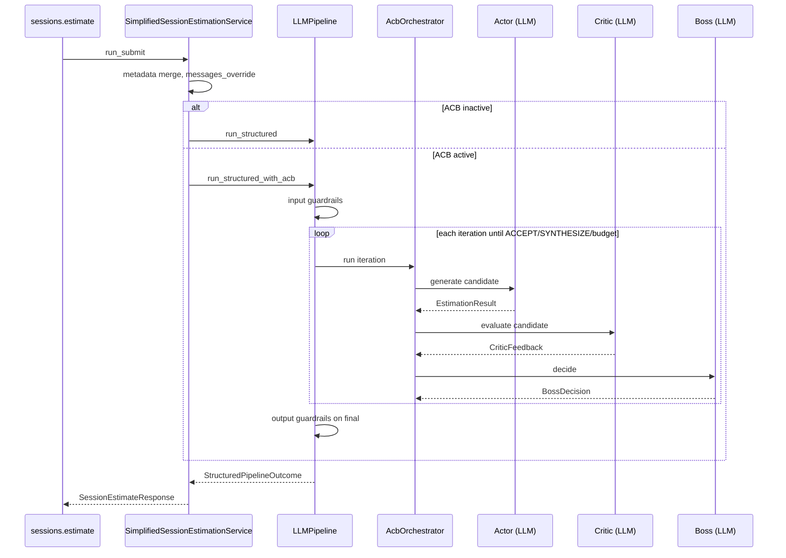

# Feature: Actor-Critic-Boss Orchestration for Session Estimation

## Objective

Add an **Actor-Critic-Boss (ACB)** orchestration layer to improve the quality of final software estimates on the **real production critical path**:

`POST /api/v1/sessions/{session_id}/estimate`

The pattern separates three concerns that a single prompt cannot reliably cover:

1. **Actor** — generate the best candidate structured estimate.
2. **Critic** — detect material defects in the candidate (structured feedback only; no rewrite).
3. **Boss** — govern the process: accept, request one targeted revision, or synthesize a final answer.

This feature embodies the product thesis that **generation, evaluation, and process governance are different functions**, and that prompt refinement alone does not solve verification problems.

ACB must **not** be applied to every LLM call (metadata extraction, guardrails, preprocessing, `/api/v2/estimate`, etc.). It applies only where quality matters most and extra latency/cost is acceptable.

## How it works

ACB is an **optional quality loop** on the session estimate critical path. A single monolithic prompt cannot reliably combine generation, defect detection, and process governance; ACB splits those into three typed LLM roles with a hard iteration budget.

### End-to-end flow

1. **Session submit** (`SimplifiedSessionEstimationService.run_submit`) builds transcript context, merged metadata, and `messages_override` as today.
2. **Activation gate** — `Settings.acb_requested(request.orchestration, endpoint="session_estimate")` decides between legacy single-pass and ACB. Default is off globally.
3. **Guarded pipeline (ACB path)** — `LLMPipeline.run_structured_with_acb`:
   - Runs existing **input semantic guardrails** (unchanged).
   - **Skips semantic cache serve** when ACB is active (`acb_cache_bypassed` log).
   - Delegates to **`ActorCriticBossOrchestrator`**.
4. **Orchestration loop** (max `ACB_MAX_ITERATIONS` Actor passes):
   - **Actor** — `EstimationService.estimate_structured` with ACB actor prompt; on revision iterations, appends Boss `revision_instructions` via `actor_revision.j2`.
   - **Critic** — `complete_structured(CriticFeedback)`; structured issues only, never a replacement estimate.
   - **Boss** — `complete_structured(BossDecision)` with action `accept | revise | synthesize`.
   - **Policy** — `normalize_boss_decision()` clamps LLM output to budget and severity rules in `policy.py`.
5. **Finalization** — output semantic guardrails run on the **final** `EstimationResult` only (not intermediate Actor candidates).
6. **Response** — `SessionEstimateResponse.estimate` shape unchanged; with `DEV_MODE=true`, nested `acb_trace` exposes iteration summaries.

### What changes for operators

| ACB off (default) | ACB on |
| --- | --- |
| One structured LLM call via `run_structured` | 3+ LLM calls per iteration (Actor + Critic + Boss) |
| Semantic cache may serve hits on session path when enabled | Cache serve bypassed |
| No `acb_trace` in response | `estimate.acb_trace` when `DEV_MODE=true` |
| Same `EstimationResult` contract | Same contract |

See also: [docs/technical/actor-critic-boss-orchestration.md](../technical/actor-critic-boss-orchestration.md) and [docs/arquitectura-estimador-cag.html](../arquitectura-estimador-cag.html#acb).

## Context

### Production surface (authoritative)

| Route | Role |
| --- | --- |
| `POST /api/v1/sessions/{session_id}/estimate` | Multi-turn submit; merges metadata, sliding window, structured output |
| `SimplifiedSessionEstimationService.run_submit` | Validates input, derives/merges metadata, builds session messages, invokes pipeline |
| `LLMPipeline.run_structured` | Input guardrails → optional semantic cache → `EstimationService.estimate_structured` → output guardrails |
| `assemble_estimation_v2_response` | Builds HTTP envelope; exposes extended diagnostics only when `dev_mode=true` |

Current session flow (simplified):

```text
sessions.estimate_in_session
  → SimplifiedSessionEstimationService.run_submit
      → derive/merge metadata, build messages_override
      → LLMPipeline.run_structured
          → EstimationService.estimate_structured (Instructor + EstimationResult)
  → assemble_estimation_v2_response → SessionEstimateResponse
```

### Relevant existing artifacts

| Artifact | Location | Reuse |
| --- | --- | --- |
| Structured output client | `app/services/structured_llm_client.py` (`complete_structured`) | All three roles |
| Estimation domain schema | `app/schemas/estimation_result.py` (`EstimationResult`) | Actor candidate + Boss synthesize output |
| Guarded pipeline | `app/guardrails/llm_pipeline.py` | Pre/post guardrails; integration hook |
| Session service | `app/services/simplified_session_estimation_service.py` | Activation gate + session context |
| Prompt versioning | `app/prompts/estimation/v2/`, `app/services/prompt_versions.py` | Pattern for ACB prompts |
| Observability | `app/services/observability/` (`TelemetryContext`, spans, generations) | Per-role traces |
| Test harness | `tests/fixtures/conftest_sessions.py`, `tests/fakes/fake_llm_provider.py` | Integration + orchestration mocks |
| Eval suite (separate) | `docs/work-items/feature-024-llm-as-judge-session-evals.md` | Post-hoc quality measurement; **not** production orchestration |

### Related in-flight work

- **feature-025** removes adaptive estimation modes (`basic` / `standard` / `professional` / `expert_review`). ACB prompts and schemas must **not** depend on `EstimationMode`. Implement after feature-025 lands, or in the same branch only if mode fields are already gone.
- **feature-024** adds offline LLM-as-judge evals. ACB is **online production orchestration**; evals validate outcomes but do not replace Critic/Boss roles.

### Architectural constraints (non-negotiable)

- Routers stay thin (`app/routers/sessions.py` orchestrates HTTP only).
- Orchestration lives in `app/guardrails/` or `app/services/`, not route handlers.
- Critic returns **typed structured feedback**, never a replacement estimate.
- Boss governs process; it does not duplicate detailed criticism.
- Hard iteration budget (default **2** Actor passes; configurable max **3**).
- Rollout-safe: disabled by default; no all-or-nothing hardcoded switch.
- Preserve `SessionEstimateResponse` contract (`estimate` remains structured `EstimationResult` JSON).
- Do **not** apply ACB to metadata extraction (`app/services/metadata_extractor.py`) or other helper LLM flows.

## Scope

### Includes

1. Reusable ACB orchestrator module with iteration state, decision enums, and budget enforcement.
2. Typed Pydantic schemas for Critic feedback, Boss decisions, revision instructions, and orchestration trace metadata.
3. Versioned Jinja2 prompt bundle under `app/prompts/acb/v1/` (Actor, Critic, Boss — structurally distinct).
4. Integration into session estimate path via `SimplifiedSessionEstimationService` + extended `LLMPipeline` hook (not router bloat).
5. Settings-based activation with optional per-request override.
6. Iteration policy (accept / revise / synthesize) with conservative cost/latency defaults.
7. Structured observability (logs + optional Langfuse spans/generations per role).
8. Dev-only optional debug trace in response diagnostics (via existing `dev_mode` pattern).
9. Unit + integration tests with mocked providers.
10. Technical documentation at `docs/technical/actor-critic-boss-orchestration.md`.
11. `.env.example` and README updates for new settings.

### Excludes

- Applying ACB to `/api/v1/estimate`, `/api/v2/estimate`, or metadata extraction.
- Replacing existing input/output semantic guardrails (ACB runs **after** input guardrails pass, **before or alongside** output guardrails on final candidate).
- Unlimited iteration loops or self-modifying prompts.
- Shipping DeepEval or judge metrics into production request path.
- Frontend UI for orchestration traces (dev diagnostics only).
- Real provider calls in default unit test suite.
- Caching intermediate Actor iterations in semantic cache.
- New LLM providers or changes to provider fallback chain.

## Functional Requirements

### FR-01: Orchestrator module

Introduce `ActorCriticBossOrchestrator` (exact name flexible) under `app/guardrails/acb/` with:

- `async def run(...) -> AcbOrchestrationOutcome` accepting pre-built session context (messages, metadata, rendered prompts, `EstimationRequest`, assessment surface).
- Explicit iteration loop: **Actor → Critic → Boss** per iteration.
- `AcbOrchestrationOutcome` containing:
  - final `EstimationResult`
  - `StructuredEstimateBundle`-compatible metadata for downstream response assembly
  - `AcbTrace` (iterations, decisions, issue aggregates, timings, token totals)
  - `final_path`: `accept` | `revise_exhausted_synthesize` | `synthesize` | `accept_on_budget_exhausted`
- Hard stop when iteration count reaches `settings.acb_max_iterations` (inclusive of initial Actor pass).

The orchestrator must **not** import FastAPI.

### FR-02: Actor role

- Input: transcript/context (`messages_override`), attachments context, merged `project_metadata`, `EstimationRequest`, optional Boss revision instructions from prior iteration.
- Output: `EstimationResult` candidate (same schema as today).
- Implementation: wrap existing `EstimationService.estimate_structured` **or** call `complete_structured` with Actor-specific system prompt while reusing prelude (preprocessing, domain guardrail already done upstream).
- Actor prompt optimizes for **best candidate generation**, not self-verification prose.
- On revision iterations, inject Boss `revision_instructions` as an additional system or user appendix (deterministic template, not free-form Boss output pasted raw).

### FR-03: Critic role

- Input: Actor candidate (`EstimationResult` JSON), original context summary (transcript excerpt, `project_metadata`, assessment surface — bounded size).
- Output: `CriticFeedback` schema (see FR-05). **Must not** include a replacement estimate.
- Critic prompt optimizes for **defect detection** across at least:
  - completeness
  - arithmetic consistency (where inferable from breakdown)
  - coherence between components, risks, and scope
  - consistency with `project_metadata`
  - missing items mentioned in transcript/context
  - justification/breakdown mismatches
- Empty issues list means “no material defects detected” (Boss may still ACCEPT).

### FR-04: Boss role

- Input: Actor candidate, `CriticFeedback`, iteration number, remaining budget, optional prior Boss decision.
- Output: `BossDecision` schema with action enum:
  - `ACCEPT` — return Actor candidate as final
  - `REVISE` — include focused `revision_instructions` for next Actor pass
  - `SYNTHESIZE` — Boss produces final `EstimationResult` integrating Actor + Critic feedback
- Boss prompt optimizes for **process governance**:
  - Is the issue material?
  - Fixable in one targeted iteration?
  - Budget exhausted?
  - Is “good enough” preferable to more cost/latency?
- Boss must **not** re-run full Critic analysis inline; it consumes Critic output.

### FR-05: Schemas

Add under `app/schemas/acb/`:

**`CriticIssueCategory`** (enum):  
`missing_component`, `arithmetic_inconsistency`, `metadata_inconsistency`, `risk_gap`, `scope_mismatch`, `justification_breakdown_mismatch`, `confidence_mismatch`, `other`

**`CriticIssueSeverity`** (enum):  
`critical`, `major`, `minor`

**`CriticIssue`**:  
`category`, `severity`, `message`, `affected_area`, `suggested_fix`, `evidence: str | None`

**`CriticFeedback`**:  
`schema_version`, `overall_assessment: Literal["pass","fail"]`, `issues: list[CriticIssue]`, `summary: str` (short, ≤500 chars)

**`BossAction`** (enum):  
`accept`, `revise`, `synthesize`

**`BossDecision`**:  
`action`, `reasoning: str` (≤800 chars), `revision_instructions: str | None`, `confidence_in_decision: float` (0–1)

**`AcbIterationRecord`**:  
`iteration`, `boss_action`, `critic_issue_counts: dict[str, int]`, `actor_model`, `critic_model`, `boss_model`, `timings_ms: dict[str, int]`, `usage: UsageInfo | None`

**`AcbTrace`**:  
`enabled: bool`, `iterations: list[AcbIterationRecord]`, `final_path`, `total_usage`, `prompt_version_acb`

**`ActorCandidate`** (optional wrapper if useful for logging):  
`result: EstimationResult`, `iteration: int`

All schemas: `extra="forbid"`, validated via Instructor/`complete_structured`.

### FR-06: Prompt layer

Create `app/prompts/acb/v1/` with:

| File | Purpose |
| --- | --- |
| `manifest.toml` | Version, role descriptions |
| `actor_system.j2` | Generation-focused instructions |
| `actor_revision.j2` | Template for Boss revision injection |
| `critic_system.j2` | Defect-detection rubric; forbids rewriting estimate |
| `critic_user.j2` | Candidate + context payload layout |
| `boss_system.j2` | Governance rubric; decision criteria |
| `boss_user.j2` | Candidate + critic feedback + budget state |

Requirements:

- Prompts must be **structurally different** (not copy-paste with role name swapped).
- Register prompt version constant e.g. `ACB_PROMPT_VERSION = "acb/v1"`.
- Render via existing Jinja2 loader pattern (`app/services/prompt_loader.py` or dedicated `acb_prompt_rendering.py`).

### FR-07: Session endpoint integration

Integration point (preferred):

1. `SimplifiedSessionEstimationService.run_submit` checks activation policy.
2. If ACB active: call `LLMPipeline.run_structured_with_acb(...)` (new method) instead of `run_structured`.
3. `run_structured_with_acb`:
   - Runs existing input guardrails and **skips semantic cache serve** (cache incompatible with multi-call orchestration; may write final result if existing cache write hooks apply).
   - Delegates generation loop to `ActorCriticBossOrchestrator`.
   - Runs existing **output semantic guardrails** on the **final** `EstimationResult` only.
   - Returns `StructuredPipelineOutcome` with extended provider metadata carrying `AcbTrace` summary.

Router changes: **none beyond** passing through any optional request override already parsed in `SessionEstimateRequest` (see FR-08). No orchestration logic in `sessions.py`.

Session mechanics preserved:

- `messages_override` and sliding window unchanged.
- Metadata derive/merge unchanged (runs before ACB).
- Conversation history append after successful final estimate unchanged.
- `SessionEstimateResponse.estimate` shape unchanged.

### FR-08: Activation strategy

Use a **layered rollout** (same philosophy as semantic cache guardrails):

| Layer | Mechanism | Default |
| --- | --- | --- |
| Global kill switch | `ACB_ENABLED=false` | Off |
| Endpoint allowlist | `ACB_ENABLED_ENDPOINTS=session_estimate` | Session path only |
| Per-request override | Optional `SessionEstimateRequest.orchestration: Literal["default","acb","single_pass"] | None` | `None` → follow settings |
| Dev force | `ACB_FORCE_ENABLED_IN_DEV=true` when `APP_ENV=local` and `DEV_MODE=true` | Off |

**Justification:** Global default-off protects cost/latency. Endpoint allowlist prevents accidental activation on legacy routes. Per-request override enables A/B testing and exercise demos without redeploy. This is strictly safer than a single hardcoded boolean.

When `orchestration="single_pass"`, force legacy single-call path even if globally enabled (escape hatch for debugging).

When semantic cache would hit: **do not serve cache** if ACB is active for the request (log `acb_cache_bypassed`).

### FR-09: Iteration policy

Default settings:

- `ACB_MAX_ITERATIONS=2` (initial Actor + at most 1 revision cycle before Boss must ACCEPT or SYNTHESIZE)
- `ACB_ALLOW_SYNTHESIZE=true`
- `ACB_BLOCKING_SEVERITIES=critical,major` (Boss treats open blocking issues as revision-worthy if budget remains)

Decision rules (deterministic post-processing may augment Boss LLM output):

| Condition | Boss should |
| --- | --- |
| No issues OR only `minor` | ACCEPT |
| `critical`/`major` issues, iteration budget remaining, fix appears localized | REVISE with ≤5 bullet instructions |
| Blocking issues remain, budget exhausted | SYNTHESIZE (if allowed) else ACCEPT best candidate with warning flag in trace |
| Critic `overall_assessment=pass` | Strong ACCEPT bias |
| Actor structured completion fails | Fail pipeline (existing error path); no ACB retry beyond structured client retries |

Implement `app/guardrails/acb/policy.py` with pure functions for budget checks and severity aggregation so behavior is unit-testable without LLM mocks.

### FR-10: Observability

Minimum structured log events (stable keys):

- `acb_orchestration_started`
- `acb_actor_completed` (`iteration`, `latency_ms`, `usage`)
- `acb_critic_completed` (`issue_count`, `by_severity`, `by_category`)
- `acb_boss_decided` (`action`, `iteration`, `budget_remaining`)
- `acb_orchestration_finished` (`final_path`, `iterations`, `total_tokens`)

Langfuse (when export active):

- Parent span: `acb_orchestration`
- Child generations: `acb_actor`, `acb_critic`, `acb_boss` via existing `complete_structured` instrumentation
- Tags: `feature:session_estimate`, `orchestration:acb`

Attach sanitized `AcbTrace` summary to `PipelineContext.provider_metadata` (counts and decisions only; no full prompts).

### FR-11: Response contract and debug traces

- Production response (`dev_mode=false`): **no change** to `SessionEstimateResponse` top-level fields.
- Dev diagnostics (`dev_mode=true`): extend `EstimationResponse` nested inside `estimate` with optional `acb_trace: AcbTrace` (or compact dict) — mirror existing pattern where usage/model fields are dev-only.
- Do not expose Critic/Boss prompts or raw transcript in API responses.

### FR-12: Failure modes

| Failure | Behavior |
| --- | --- |
| Critic structured parse fails | Log warning; Boss receives empty issues + flag; bias ACCEPT if Actor otherwise valid |
| Boss structured parse fails | Log error; fall back to ACCEPT Actor candidate; set `final_path=accept_fallback` |
| Synthesize produces invalid schema | One structured retry; then ACCEPT last Actor candidate |
| Output guardrails fail on final result | Existing `LLMPipeline` degraded/error path (unchanged) |
| ACB disabled | Identical behavior to today |

## Technical Approach

### Proposed file layout

```text
app/
├── guardrails/
│   ├── acb/
│   │   ├── __init__.py
│   │   ├── orchestrator.py      # ActorCriticBossOrchestrator
│   │   ├── policy.py            # iteration budget, severity rules
│   │   ├── context.py             # AcbRunContext dataclass
│   │   └── types.py               # AcbOrchestrationOutcome
│   └── llm_pipeline.py            # + run_structured_with_acb()
├── schemas/
│   └── acb/
│       ├── __init__.py
│       ├── critic.py
│       ├── boss.py
│       └── trace.py
├── services/
│   ├── acb_prompt_rendering.py
│   └── simplified_session_estimation_service.py  # activation gate
├── prompts/
│   └── acb/
│       └── v1/
│           ├── manifest.toml
│           ├── actor_system.j2
│           ├── actor_revision.j2
│           ├── critic_system.j2
│           ├── critic_user.j2
│           ├── boss_system.j2
│           └── boss_user.j2
docs/
└── technical/
    └── actor-critic-boss-orchestration.md
tests/
├── test_acb_schemas.py
├── test_acb_policy.py
├── test_acb_orchestrator.py
└── test_sessions_acb_integration.py
```

### Data flow



### Key design decisions

| Decision | Choice | Rationale |
| --- | --- | --- |
| Orchestrator location | `app/guardrails/acb/` | Keeps multi-call LLM governance adjacent to `LLMPipeline`; routers stay thin |
| Actor implementation | Reuse `EstimationService.estimate_structured` with prompt overrides on revision | Minimizes duplication of preprocessing/mode/token logic |
| Critic/Boss implementation | Direct `complete_structured` with role schemas | Smaller surface; distinct prompts/models |
| Integration hook | New `LLMPipeline.run_structured_with_acb` | Single switch point; session service chooses method |
| Activation | Settings + endpoint allowlist + per-request override | Rollout-safe; not all-or-nothing |
| Cache | Bypass serve when ACB on | Intermediate candidates must not cache-hit |
| Trace exposure | Dev-only via `dev_mode` | Avoids API contract break for production UI |
| Model selection | Reuse `OPENAI_MODEL` default; optional `ACB_CRITIC_MODEL`, `ACB_BOSS_MODEL` | Cost control: cheaper model for Critic acceptable |

### New settings (`.env.example`)

```text
# Actor-Critic-Boss orchestration (feature-026)
ACB_ENABLED=false
ACB_ENABLED_ENDPOINTS=session_estimate
ACB_MAX_ITERATIONS=2
ACB_ALLOW_SYNTHESIZE=true
ACB_BLOCKING_SEVERITIES=critical,major
ACB_FORCE_ENABLED_IN_DEV=false
ACB_CRITIC_MODEL=
ACB_BOSS_MODEL=
ACB_PROMPT_VERSION=v1
```

Add typed fields + helpers on `Settings`:

- `acb_active_for_endpoint(endpoint: str) -> bool`
- `acb_requested(orchestration_override: str | None, endpoint: str) -> bool`

## Acceptance Criteria

- [ ] **AC-01:** With `ACB_ENABLED=false`, `POST /api/v1/sessions/{id}/estimate` behavior is byte-for-byte equivalent to pre-feature paths (same response schema, no extra LLM calls).
- [ ] **AC-02:** With ACB enabled, session estimate path runs Actor → Critic → Boss at least once and returns valid `EstimationResult` JSON in `SessionEstimateResponse.estimate`.
- [ ] **AC-03:** Critic output is validated against `CriticFeedback` schema; tests fail if Critic returns free-form only.
- [ ] **AC-04:** Critic never returns a full replacement estimate (schema enforces this).
- [ ] **AC-05:** Boss decisions are validated against `BossDecision` schema with `accept|revise|synthesize` actions.
- [ ] **AC-06:** Orchestration never exceeds `ACB_MAX_ITERATIONS` Actor passes; tests assert loop termination with mocked always-REVISE Boss.
- [ ] **AC-07:** On budget exhaustion with blocking issues, Boss SYNTHESIZE path runs (when allowed) and returns schema-valid final estimate.
- [ ] **AC-08:** ACCEPT path returns Actor candidate unchanged (modulo existing server-side totals alignment on `EstimationResult`).
- [ ] **AC-09:** REVISE path re-invokes Actor with Boss `revision_instructions` visible in Actor prompt artifacts (unit test on rendered prompt).
- [ ] **AC-10:** ACB is not invoked for metadata extraction or non-session endpoints.
- [ ] **AC-11:** Semantic cache serve is bypassed when ACB is active; log/metric `acb_cache_bypassed` emitted.
- [ ] **AC-12:** Structured logs include iteration count, final path, and critic issue aggregates.
- [ ] **AC-13:** `dev_mode=true` exposes compact `acb_trace` in estimate diagnostics; `dev_mode=false` does not.
- [ ] **AC-14:** Per-request `orchestration="single_pass"` disables ACB even when globally enabled.
- [ ] **AC-15:** All new tests pass via `uv run pytest` without real API keys.
- [ ] **AC-16:** README and `docs/technical/actor-critic-boss-orchestration.md` document activation, policy, and local testing.

## Test Plan

### Unit tests

| File | Focus |
| --- | --- |
| `tests/test_acb_schemas.py` | Pydantic validation, enum coverage, forbid extra fields |
| `tests/test_acb_policy.py` | Budget exhaustion, severity blocking, decision hints |
| `tests/test_acb_orchestrator.py` | Mocked `complete_structured` sequences: ACCEPT, REVISE→ACCEPT, REVISE→SYNTHESIZE, budget exhausted |

### Integration tests

| File | Focus |
| --- | --- |
| `tests/test_sessions_acb_integration.py` | httpx session client with ACB enabled via settings fixture; fake LLM returns scripted Actor/Critic/Boss payloads |

Scenarios:

1. **Happy ACCEPT** — Critic empty issues, Boss ACCEPT, one iteration.
2. **REVISE then ACCEPT** — Boss REVISE iteration 1, ACCEPT iteration 2.
3. **Budget exhausted** — Boss always REVISE; assert max iterations then SYNTHESIZE or fallback ACCEPT.
4. **Structured Critic** — assert parsed issues populate trace counts.
5. **single_pass override** — ACB enabled globally but request disables; single LLM call path.
6. **Session memory** — multi-turn session still merges metadata and appends history after ACB estimate.

### Manual checks

1. Set `ACB_ENABLED=true`, `ACB_FORCE_ENABLED_IN_DEV=true`, run `uv run uvicorn app.main:app --reload`.
2. Submit session estimate via UI or curl; confirm latency increase (~3+ LLM calls).
3. With `DEV_MODE=true`, inspect `estimate.acb_trace` in JSON response.
4. With Langfuse keys, confirm nested spans for actor/critic/boss.

## Verification

### Automated

- `uv run pytest tests/test_acb_schemas.py tests/test_acb_policy.py tests/test_acb_orchestrator.py tests/test_sessions_acb_integration.py`
- Full suite: `uv run pytest` — **Verified** (336 passed, 19 skipped)

### Manual

- Local session estimate with ACB on/off comparison — **Not verified** in this session (requires operator run)
- Log inspection for `acb_*` events — **Not verified**
- Langfuse nested spans (`acb_orchestration`, `acb_actor`, …) — **Not verified** (requires `OTEL_EXPORT_ENABLED=true`)

### Not verified yet

- Production cost/latency benchmarks
- Real-model quality uplift (use feature-024 eval suite post-merge)

## Documentation Plan

| Document | Update |
| --- | --- |
| `docs/technical/actor-critic-boss-orchestration.md` | **New** — architecture, roles, policy, rollout, anti-patterns, local testing |
| `README.md` | Short section + env vars |
| `.env.example` | All `ACB_*` variables |
| `docs/arquitectura-estimador-cag.html` | **Done** — ACB section (#acb), session flow, architecture nodes |
| Second Brain session note | Learning summary after implementation |

## Implementation Plan

- [ ] **Step 1:** Add `app/schemas/acb/*` + schema unit tests (no LLM).
- [ ] **Step 2:** Add `app/guardrails/acb/policy.py` + policy unit tests.
- [ ] **Step 3:** Add ACB prompt bundle `app/prompts/acb/v1/` + rendering service + snapshot tests for prompt distinctness.
- [ ] **Step 4:** Implement `ActorCriticBossOrchestrator` with mocked LLM tests (ACCEPT / REVISE / SYNTHESIZE / budget).
- [ ] **Step 5:** Add `Settings` fields + `.env.example` + config tests.
- [ ] **Step 6:** Add `LLMPipeline.run_structured_with_acb` integrating orchestrator + output guardrails on final only.
- [ ] **Step 7:** Wire activation in `SimplifiedSessionEstimationService`; optional `SessionEstimateRequest.orchestration` field.
- [ ] **Step 8:** Observability hooks (logs + Langfuse metadata).
- [ ] **Step 9:** Dev-only `acb_trace` in `assemble_estimation_v2_response`.
- [ ] **Step 10:** Session integration tests + README + technical doc.

Suggested commit boundaries: steps 1–2, 3, 4, 5–6, 7–9, 10.

## Learnings

### Anti-patterns to avoid (from requirements and prior features)

1. **Same prompt, three roles** — prompts must differ in structure and success criteria.
2. **Critic as rewriter** — breaks separation; pollutes Boss decision input.
3. **Boss as second Critic** — Boss sees issue summaries, not re-analysis instructions.
4. **Router orchestration** — feature-012 established `LLMPipeline` as the guardrails boundary; keep ACB there.
5. **ACB on every LLM call** — metadata extraction must stay single-pass for latency.
6. **Unbounded loops** — always enforce `ACB_MAX_ITERATIONS` in code, not prompt honor system.
7. **Cache serve during orchestration** — risks returning un-vetted single-pass artifacts.

### Pitfalls from related work

- **feature-012:** Output guardrails must run on **final** estimate only; running on intermediate Actor candidates creates false positives.
- **feature-024:** Offline judges measure quality; do not conflate eval metrics with production Boss logic.
- **feature-025:** Remove mode coupling before writing Actor prompts; use `detail_level` / transcript context instead.

## Risks and Open Decisions

| Risk | Mitigation |
| --- | --- |
| Latency 3–9× on session estimate | Default off; allowlist; per-request opt-in |
| Cost increase | Lower-cost models for Critic; max iterations=2 |
| Boss SYNTHESIZE may drift from Actor | Prefer REVISE once; SYNTHESIZE only on budget exhaustion |
| Critic false positives block good estimates | Boss governance + severity policy; minor-only → ACCEPT |
| feature-025 merge conflict | Sequence implementation after mode removal or rebase early |

**Open decisions (implementer may resolve during `/start-task`):**

1. Whether Actor reuses full `estimate_structured` or slimmed `complete_structured` on first pass only.
2. Whether `ACB_CRITIC_MODEL` defaults empty (same as Actor) or to a cheaper fixed default in docs.
3. Whether to add optional `acb_trace` to structured logging for non-dev environments (default: logs only, not HTTP).

## Estimation

- Size: L
- Estimated time: 8–12 hours
- Planned steps: 8

## Open decisions (resolved at `/start-task`)

1. **Actor implementation:** Reuse `EstimationService.estimate_structured` for all Actor passes; inject Boss `revision_instructions` via deterministic `actor_revision.j2` appendix on iterations > 1.
2. **`ACB_CRITIC_MODEL` / `ACB_BOSS_MODEL`:** Default empty → fall back to `OPENAI_MODEL` (same as Actor).
3. **Non-dev trace exposure:** Structured logs + `provider_metadata` counts only; HTTP `acb_trace` remains `dev_mode=true` only.

## Implementation progress

- [x] Step 1: ACB Pydantic schemas + `tests/test_acb_schemas.py`
- [x] Step 2: `policy.py` + `tests/test_acb_policy.py`
- [x] Step 3: Prompt bundle `app/prompts/acb/v1/` + rendering + distinctness tests
- [x] Step 4: `ActorCriticBossOrchestrator` + `tests/test_acb_orchestrator.py`
- [x] Step 5: Settings fields + `.env.example` + config tests
- [x] Step 6: `LLMPipeline.run_structured_with_acb`
- [x] Step 7: Session service activation + `SessionEstimateRequest.orchestration`
- [x] Step 8: Observability (Langfuse spans), README + `docs/technical/actor-critic-boss-orchestration.md`, architecture HTML, integration tests

## Repository commits (master-ia)

| Commit | Summary |
|--------|---------|
| _(pending)_ | docs(feature-026): how-it-works, step 8 docs, architecture HTML, start-task |
| `feat(acb)` | wire pipeline, session path, integration tests (steps 6–7) |
| `feat(acb)` | orchestrator, settings, mocked loop tests (steps 4–5) |
| `feat(acb)` | v1 prompt bundle and rendering (step 3) |
| `feat(acb)` | iteration policy helpers (step 2) |
| `feat(acb)` | Critic, Boss, trace schemas (step 1) |
| `docs(feature-026)` | estimation plan and resolved open decisions |

## Pull Request

- Draft: https://github.com/povedica/master-ia-lidr/pull/23
