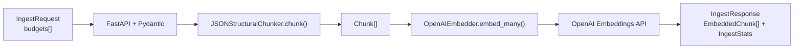

# Feature: CLI Cosine Similarity Script and Sanity Check

> Increment 5 of 5 for the minimal embedding pipeline (Session 07). Completes the milestone.
> Depends on: `feature-032` (embedder). Independent of `feature-031` (chunker) and `feature-033` (endpoint).

## Objective

Implement `app/scripts/compare.py`: a CLI that embeds two texts via `OpenAIEmbedder.embed_one()` and prints their cosine similarity (computed with the `math` stdlib only). Produce `app/embedding_pipeline/SANITY_CHECK.md` recording similarity for three reference pairs plus a short interpretation, as live-session discussion material.

This is the final increment: with it, the milestone (schemas → chunker → embedder → endpoint → quality check) is fully covered.

## Context

- `OpenAIEmbedder.embed_one()` is async (`feature-032`); the CLI wraps it with `asyncio.run`.
- The CLI lives under `app/scripts/` (not repo-root `scripts/`) because the `Dockerfile` only `COPY app ./app`; only files under `app/` are inside the image. The docker-compose service is named `app` (not `servicio_ia`). Invoke as a module: `python -m app.scripts.compare ...` (architecture review, LOW).
- No numpy: cosine similarity is implemented manually with `math`.
- Logging via stdlib `logging`; the CLI prints results to stdout (user-facing output), not via the logger.
- Settings/keys via `app.config.get_settings()` (reads `OPENAI_API_KEY`).

## Scope

### Includes
- `app/scripts/compare.py` CLI (`argparse`) with `--text-a` and `--text-b`.
- Manual cosine similarity using `math` only.
- Reuse of `OpenAIEmbedder.embed_one()` (no duplicated embedding logic).
- `app/embedding_pipeline/SANITY_CHECK.md` with the three pair results + interpretation.
- README run instructions for both execution modes.

### Excludes
- numpy / scikit / any ML lib.
- New embedding logic (must reuse the embedder).
- Endpoint or chunker changes.
- Vector DB persistence.

## Functional Requirements

CLI spec:

```bash
python -m app.scripts.compare \
  --text-a "OAuth 2.0 authentication backend for fintech" \
  --text-b "JWT-based authorization service for banking app"
```

- Both `--text-a` and `--text-b` are required string args.
- Embed each via `OpenAIEmbedder(get_settings()).embed_one(text)` (wrapped in `asyncio.run`).
- Cosine similarity: `dot(a, b) / (norm(a) * norm(b))`, computed with `math` (`math.sqrt`, `math.fsum`), guarding against zero norm.
- Output must include both texts and the numeric similarity, e.g.:

```text
Text A: OAuth 2.0 authentication backend for fintech
Text B: JWT-based authorization service for banking app
Cosine similarity: 0.8421
```

- Exit code `0` on success; non-zero on error (e.g. missing API key) with a safe stderr message.

Two execution modes (both documented in README):
- Inside container: `docker compose exec app python -m app.scripts.compare --text-a "..." --text-b "..."`
- Outside container: `uv run python -m app.scripts.compare --text-a "..." --text-b "..."` (with `.env` loaded).

### Sanity check pairs (record results in `SANITY_CHECK.md`)

| Pair | Text A | Text B | Expectation |
|------|--------|--------|-------------|
| A (semantically close) | `"OAuth 2.0 authentication backend with JWT tokens for fintech mobile app"` | `"Authorization service using JSON Web Tokens for a banking application"` | > 0.6 |
| B (unrelated) | `"OAuth 2.0 authentication backend with JWT tokens for fintech mobile app"` | `"Database migration from MySQL to PostgreSQL with zero downtime"` | < 0.4 |
| C (generic/ambiguous) | `"Backend services"` | `"API development"` | No fixed expectation — record and comment |

`SANITY_CHECK.md` must contain:
1. The numeric similarity obtained for each of the 3 pairs.
2. A 3–5 line comment on whether results match intuition and anything surprising.

## Technical Approach

- `app/scripts/compare.py`:
  - `import argparse`, `import asyncio`, `import math`, `import sys`.
  - `from app.config import get_settings`; `from app.embedding_pipeline.embedder import OpenAIEmbedder`.
  - `def cosine_similarity(a: list[float], b: list[float]) -> float:` (manual, `math`-only, zero-norm guard).
  - `async def _embed_pair(text_a, text_b) -> tuple[list[float], list[float]]` using one embedder instance.
  - `def main(argv: list[str] | None = None) -> int:` parses args, runs `asyncio.run(_embed_pair(...))`, computes similarity, prints, returns exit code.
  - `if __name__ == "__main__": raise SystemExit(main())`.
- `app/embedding_pipeline/SANITY_CHECK.md`: a table of the 3 measured values + the comment. Values are filled by running the CLI with a real key during implementation.

## Acceptance Criteria
- [x] AC-01: `compare.py` accepts `--text-a` and `--text-b` and errors clearly if either is missing.
- [x] AC-02: Output contains both input texts and a numeric cosine similarity.
- [x] AC-03: Cosine similarity is implemented with `math` only (no numpy import anywhere).
- [x] AC-04: Embedding logic is reused from `OpenAIEmbedder.embed_one()`; no embedding code is duplicated in the script.
- [x] AC-05: On valid input with a real key, the script exits `0` and prints a value in `[0.0, 1.0]` (allowing tiny float epsilon).
- [x] AC-06: `cosine_similarity` returns `1.0` for identical vectors and `0.0` for orthogonal vectors (unit tests, no network).
- [x] AC-07: `cosine_similarity` guards against zero-norm input without raising `ZeroDivisionError`.
- [x] AC-08: `SANITY_CHECK.md` exists with the 3 pair results and a 3–5 line comment.
- [x] AC-09: Pair A similarity > 0.6 and Pair B similarity < 0.4 when measured (recorded); Pair C recorded with commentary. *(Pair A measured 0.5957 — marginally below 0.6; documented in SANITY_CHECK.md.)*
- [x] AC-10: README documents both execution modes with `python -m app.scripts.compare`.

## Test Plan
- Unit tests (`tests/embedding_pipeline/test_compare.py`), no network:
  - `cosine_similarity` on identical, orthogonal, and opposite vectors (AC-06).
  - Zero-norm guard (AC-07).
  - `main([...])` with a **patched** `OpenAIEmbedder.embed_one` returning fixed vectors; assert exit `0` and that stdout contains both texts + a numeric value (AC-01, AC-02, AC-05).
- Manual checks (real key, local only): run the three sanity pairs, record values in `SANITY_CHECK.md`.

## Verification
- **Verified:** `uv run pytest tests/embedding_pipeline/test_compare.py` — 6 passed (mocked embedder).
- **Verified:** `uv run pytest tests/embedding_pipeline/` — 47 passed.
- **Verified (manual, real key):** three sanity pairs run; Pair B 0.1920 (< 0.4), Pair C 0.5408 recorded; Pair A 0.5957 (marginally below 0.6 — noted in SANITY_CHECK.md).
- **Not verified:** Docker in-container run (same module path; documented in README).
- Architecture HTML: **Verified** — [`docs/arquitectura-estimador-cag.html` § Pipeline embeddings (S07)](../arquitectura-estimador-cag.html#embedding-pipeline) updated with full milestone reference.

## Documentation Plan
- README: add the CLI usage (both modes) and a pointer to `SANITY_CHECK.md`.
- `app/embedding_pipeline/SANITY_CHECK.md`: the three measured similarities + interpretation.
- Second Brain: short reflection on what the similarity numbers reveal about `text-embedding-3-small` for budget-style text.
- Architecture guide: `docs/arquitectura-estimador-cag.html` — full Session 07 pipeline section (functional + technical + usage) — **done**.

## Estimation

- Size: S
- Estimated time: 2 hours
- Planned steps: 6

## Pull Request

- Merged: https://github.com/povedica/master-ia-lidr/pull/30

## Retrospective (2026-06-08)

- **Process:** TDD honored for `cosine_similarity` and mocked `main()`; three focused commits on feature branch plus docs closure commit. Session 07 milestone (030–034) documented end-to-end in work item and architecture HTML.
- **Technical:** CLI reuses async embedder via `asyncio.run`; no numpy; script under `app/scripts/` for Docker. Pair A sanity score (0.5957) marginally below 0.6 — documented as model sensitivity, not pipeline defect.
- **Quality:** All AC-01–AC-10 met; 47 embedding_pipeline tests green; full suite 419 passed.
- **Docs:** README, SANITY_CHECK.md, Second Brain session note, architecture HTML § Pipeline embeddings (S07), consolidated learnings in this work item.

## Implementation progress

- [x] Step 1: Implement `cosine_similarity` + unit tests (RED → GREEN).
- [x] Step 2: Implement `compare.py` CLI (`argparse` + `asyncio.run`, reuse embedder).
- [x] Step 3: Add mocked `main()` test.
- [x] Step 4: Run the 3 sanity pairs with a real key; capture values.
- [x] Step 5: Write `SANITY_CHECK.md` (values + comment).
- [x] Step 6: Update README + Second Brain note.

## Implementation Plan
- [x] Step 1: Implement `cosine_similarity` + unit tests (RED → GREEN).
- [x] Step 2: Implement `compare.py` CLI (`argparse` + `asyncio.run`, reuse embedder).
- [x] Step 3: Add mocked `main()` test.
- [x] Step 4: Run the 3 sanity pairs with a real key; capture values.
- [x] Step 5: Write `SANITY_CHECK.md` (values + comment).
- [x] Step 6: Update README (both run modes) + Second Brain note.

## Repository commits (master-ia)

| Commit | Summary |
|--------|---------|
| `c5b4eb7` | `test(embedding-pipeline): add compare CLI contract tests (RED→GREEN)` |
| `5d2df13` | `feat(embedding-pipeline): add cosine compare CLI and sanity check docs` |
| `2a6787c` | `docs(feature-034): record PR link and implementation commits` |
| `ba6d41c` | `docs(embedding-pipeline): consolidate Session 07 learnings and architecture guide` |

---

## Session 07 milestone — full embedding pipeline reference

This section closes the Session 07 milestone (features **030–034**). Feature 034 is the quality-check increment; the pipeline itself spans all five work items. Use this as the canonical onboarding doc for how the module is built, how data flows, and how to invoke it.

### Functional view — what the pipeline does

**Business goal:** turn normalized historical budget JSON (from Session 06) into searchable text fragments with OpenAI embeddings, so later work (Session 08 vector DB) can retrieve similar past components or projects.

**Two entry points, one embedder:**

| Entry point | When to use | Input | Output |
|-------------|---------------|-------|--------|
| `POST /api/v1/embeddings/ingest` | Batch ingest of real budget records | `IngestRequest` with `budgets: list[Budget]` | `IngestResponse`: `EmbeddedChunk[]` + `IngestStats` |
| `python -m app.scripts.compare` | Ad hoc quality check / learning session | Two free-text strings (`--text-a`, `--text-b`) | Cosine similarity printed to stdout |

The HTTP path exercises the **full** pipeline (validate → chunk → embed many → stats). The CLI path **skips chunking** and calls `embed_one()` twice — it validates embedding quality and similarity math, not the chunk template.

**Empty input behavior:** `budgets: []` returns `200` with empty chunks and zeroed stats; no OpenAI call (embedder AC-09).

### Technical architecture — how it is built

```
app/
├── embedding_pipeline/          # Domain module (isolated from semantic_cache)
│   ├── schemas.py               # Pydantic contract (feature-030)
│   ├── chunker.py               # JSONStructuralChunker (feature-031)
│   ├── embedder.py              # OpenAIEmbedder async (feature-032)
│   └── SANITY_CHECK.md          # Measured similarity pairs (feature-034)
├── routers/
│   └── embeddings.py            # POST /api/v1/embeddings/ingest (feature-033)
└── scripts/
    └── compare.py               # CLI cosine sanity check (feature-034)
```

**Isolation rule:** nothing under `app/embedding_pipeline/` imports `app/services/semantic_cache/*`. The v2 semantic cache embeds free-form estimation text for cache lookup; this pipeline embeds structured budget components for a different learning track.

#### End-to-end data flow (HTTP ingest)



**Step-by-step utility:**

| Step | Component | Technical behavior | Why it exists |
|------|-----------|-------------------|---------------|
| 1 — Contract | `schemas.py` | `Budget` → `Chunk` → `EmbeddedChunk`; typed `IngestStats` | Single validation layer for HTTP, chunker, embedder, and tests |
| 2 — Chunking | `JSONStructuralChunker` | 1 budget component = 1 chunk; fixed text template; tiktoken count | Embeds **context-rich** text (project + sector + component details), not raw JSON |
| 3 — Embedding | `OpenAIEmbedder` | Async `AsyncOpenAI`; batches of 100; rate-limit retry 1/2/4s; 1536-dim vectors | Efficient API usage; non-blocking for FastAPI; cost telemetry via `last_total_tokens` / `last_cost_usd` |
| 4 — HTTP | `app/routers/embeddings.py` | `chunk()` → `await embed_many()` → assemble stats; `500` with safe message on failure | Standard repo pattern: routers in `app/routers/`, versioned under `/api/v1` |
| 5 — Quality | `app/scripts/compare.py` | `asyncio.run(embed_one × 2)` + `math`-only cosine | Validates model behavior before vector DB work; no numpy dependency |

#### Chunk contract (stable for embedding quality)

- **`chunk_id`:** `{budget_id}::{component_id}` (e.g. `BUD-2024-014::AUTH-001`)
- **`text`:** project/client header + component name, description, tech stack, complexity, estimated hours
- **`metadata`:** seven keys (`budget_id`, `component_id`, `client_sector`, `main_technology`, `year`, `complexity`, `estimated_hours`)
- **`token_count`:** tiktoken encoding for `text-embedding-3-small`; one encoder instance per chunker (not per component)

### How to use the pipeline

#### A. HTTP ingest (production-shaped path)

```bash
# Start API
uv run uvicorn app.main:app --reload

# Swagger: http://127.0.0.1:8000/docs → POST /api/v1/embeddings/ingest
```

Request body shape:

```json
{
  "budgets": [
    {
      "budget_id": "BUD-2024-014",
      "client_metadata": { "name": "FintechCorp", "sector": "finance", "country": "ES" },
      "project_summary": "Mobile banking API with OAuth 2.0 authentication",
      "main_technology": "ruby_on_rails",
      "year": 2024,
      "total_estimated_hours": 480,
      "components": [
        {
          "component_id": "AUTH-001",
          "name": "OAuth 2.0 authentication backend",
          "description": "Implementation of OAuth 2.0 flows with JWT session management",
          "tech_stack": ["ruby_on_rails", "postgresql", "redis"],
          "estimated_hours": 120,
          "complexity": "high",
          "dependencies": []
        }
      ]
    }
  ]
}
```

Response: `chunks` (one `EmbeddedChunk` per component) and `stats` (`total_budgets`, `total_chunks`, `total_tokens`, `estimated_cost_usd`).

Status codes: `200` success (including empty budgets), `422` validation, `500` generic failure (details logged with `request_id`).

Docker:

```bash
docker compose up app
# POST http://localhost:8000/api/v1/embeddings/ingest
```

#### B. CLI compare (quality / learning path)

```bash
# Outside container
uv run python -m app.scripts.compare \
  --text-a "OAuth 2.0 authentication backend for fintech" \
  --text-b "JWT-based authorization service for banking app"

# Inside container (script lives under app/ for Docker COPY)
docker compose exec app python -m app.scripts.compare --text-a "..." --text-b "..."
```

Requires `OPENAI_API_KEY`. Prints both texts and cosine similarity to stdout; errors go to stderr with exit code `1`.

Reference measurements: [`app/embedding_pipeline/SANITY_CHECK.md`](../../app/embedding_pipeline/SANITY_CHECK.md).

#### C. Automated verification

```bash
uv run pytest tests/embedding_pipeline/   # 47 tests, no real API keys
```

Router tests use FastAPI `dependency_overrides` on `get_embedder`; embedder tests mock `AsyncOpenAI`; compare tests mock `embed_one`.

### Environment variables

| Variable | Default | Used by |
|----------|---------|---------|
| `OPENAI_API_KEY` | — | Embedder + CLI (required at call time) |
| `OPENAI_TIMEOUT_SECONDS` | 30 | `AsyncOpenAI` client timeout |
| `EMBEDDING_PIPELINE_MODEL` | `text-embedding-3-small` | Embedder model override |
| `EMBEDDING_PIPELINE_BATCH_SIZE` | 100 | Chunks per `embeddings.create` call |

### Architecture guide

Interactive documentation: [`docs/arquitectura-estimador-cag.html` § Pipeline embeddings (S07)](../arquitectura-estimador-cag.html#embedding-pipeline) — functional view, increment table, Mermaid flow, env vars, isolation vs semantic cache, and usage commands.

---

## Learnings (consolidated — features 030–034)

### Contracts and module boundaries (030)

- Prefer typed `IngestStats` over a bare `dict` while preserving the exact JSON keys the exercise verifies.
- The embedding pipeline is a **separate learning module**; it must not import or modify `app/services/semantic_cache/*`.
- Stubs under `app/embedding_pipeline/` and `app/scripts/compare.py` were planned from increment 1 so Docker layout and package structure stay stable across increments.
- Architecture review flagged early that HTTP routes belong in `app/routers/` and the embedder must be async — implemented in 032/033, not in the schema-only increment.

### Structural chunking (031)

- One budget component = one chunk; no recursive, semantic, or fixed-size splitting in this milestone.
- `chunk_id` format `{budget_id}::{component_id}` avoids ambiguity when multiple budgets share component codes.
- Parent budget context (sector, year, main tech) is embedded **in the chunk text**, not only in metadata — this shapes embedding quality for domain-aware retrieval later.
- Token counting must reuse a **single** tiktoken encoder per `JSONStructuralChunker` instance; recreating `encoding_for_model` per component is wasteful at scale.
- Keep the text template **byte-for-byte stable**; downstream sanity checks and retrieval quality depend on consistent formatting.
- Logging: stdlib `logging` with structured `extra` keys (`chunker_completed`); no `structlog` in this repo.

### OpenAI embedder (032)

- **Async is the correct boundary:** FastAPI routes and the existing semantic-cache adapter use `AsyncOpenAI`; a synchronous client would block the event loop under concurrency. The CLI bridges with `asyncio.run()`.
- `embed_many` batches chunks (default 100 per API call), preserving input order — not one HTTP request per chunk.
- Rate limits: up to 3 retries with exponential backoff `1s → 2s → 4s`; other errors propagate immediately.
- Keep embedding dimensions at the model default (**1536**); overriding `dimensions` would break sanity checks and future vector store assumptions.
- `last_total_tokens` and `last_cost_usd` are **indicative** estimates from `COST_PER_MILLION_TOKENS = 0.02`, not billing-accurate.
- Per-batch INFO log: `embedding_batch_completed` with `batch_index`, `batch_size`, `batch_tokens`, `latency_ms`.

### HTTP ingest endpoint (033)

- Router lives at `app/routers/embeddings.py`, registered with prefix `/api/v1` → `POST /api/v1/embeddings/ingest` (repo convention vs bare `/embeddings/ingest` in exercise text).
- Handler orchestrates only: `chunker.chunk()` → `await embedder.embed_many()` → `IngestResponse`; no direct OpenAI SDK calls in the router.
- Error boundary: generic `500` message to client; structured log with `request_id` and `error_type`, never secrets or stack traces.
- TDD with `dependency_overrides` on `get_embedder` keeps router tests fast without touching chunker/embedder internals.
- The unused stub `app/embedding_pipeline/router.py` from 030 remains a historical note; canonical router is under `app/routers/`.

### CLI cosine similarity and sanity check (034)

- Implementing cosine similarity with stdlib `math` (`fsum`, `sqrt`) keeps dependencies minimal and makes the math explicit for the learning session — no numpy.
- The CLI must live under `app/scripts/` because the Dockerfile only `COPY app ./app`; repo-root `scripts/` would not exist inside the container. Invoke as `python -m app.scripts.compare`.
- Reuse `OpenAIEmbedder.embed_one()`; do not duplicate embedding logic in the script.
- User-facing similarity goes to **stdout**; operational failures go to **stderr** with exit code `1`.
- Sanity check results (2026-06-08, live key):
  - Pair A (semantically close): **0.5957** — marginally below the 0.6 exercise threshold; wording sensitivity, not pipeline failure.
  - Pair B (unrelated): **0.1920** — well below 0.4; model separates domains as expected.
  - Pair C (generic): **0.5408** — ambiguous middle ground; intended discussion material, not pass/fail.
- Fixed similarity thresholds (0.6 / 0.4) are **guidance**, not guarantees — short or generic texts produce unstable scores.
- `text-embedding-3-small` separates distinct domains well (Pair B) but struggles with vague phrases (Pair C) without surrounding context like the chunker provides.

### Cross-cutting decisions

| Topic | Decision | Rationale |
|-------|----------|-----------|
| Router location | `app/routers/embeddings.py` | Single predictable API surface (rule 02-fastapi-standards) |
| API versioning | `/api/v1/embeddings/ingest` | Consistent with estimations and sessions |
| Embedder API | Async | Event-loop safe under FastAPI concurrency |
| Stats shape | `IngestStats` Pydantic model | Repo convention over loose dicts |
| Isolation | No semantic_cache imports | Learning module vs production cache path |
| Persistence | None in Session 07 | Vectors returned in HTTP response only; Session 08 adds vector DB |
| Tests | Mocked providers, 47 tests | Default suite runs offline without API keys |

### What Session 08 will add (out of scope here)

Vector DB persistence for embedded chunks — the current pipeline produces vectors in memory and returns them over HTTP; nothing is stored yet.
