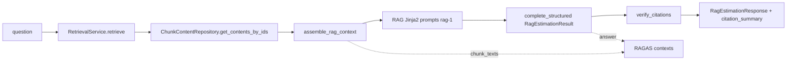

# Feature: RAG Estimation Line-Level Citations and RAGAS Quality Baseline

## Objective

Extend the RAG-based estimation flow so that **each estimation line item** carries **verifiable, chunk-level citations** against the retrieval context actually passed to the generator, with **post-generation citation auditing** (grounded / dangling / insufficient lines) and an **offline RAGAS evaluation harness** over the Session 10 golden queries to produce a **generation-quality baseline** (faithfulness, answer relevancy, context precision, context recall).

This feature also delivers the **retrieval → generation wiring** that `feature-050` explicitly deferred: today `RetrievalService.retrieve()` exists and is measurable (A–D modes), but nothing consumes its output to generate a grounded estimation. This work item is that wiring **plus** line-level citation and quality evaluation.

The new capability ships as a **separate, additive surface** (`POST /api/v1/estimate/rag`) so the existing CAG v2 path (`/api/v2/estimate`), its guardrails, semantic cache, and ACB orchestration remain untouched.

## Context

### Current codebase (verified baseline)

| Area | What exists today (file:symbol) | Gap for this feature |
| --- | --- | --- |
| Retrieval | `app/embedding_pipeline/retrieval_service.py:RetrievalService.retrieve()` → `RetrievalResponse` with `RetrievalResultRow` (`chunk_id: int`, `document_id: int`, `budget_id: str\|None`, scores, `matched_terms`, `source_strategies`, `metadata`) | **No `content` field** on the row; the chunk text is computed internally (`_content_and_metadata`) only for rerank and discarded. Wiring to generation does not exist. |
| Chunk persistence | `app/models/chunk.py:Chunk` (`id`, `document_id`, `content: Text`, `metadata_`, `embedding`) | — |
| Chunk read pattern | `app/embedding_pipeline/retrieval_debug_repository.py:RetrievalDebugRepository.get_chunk_inspection()` already reads `content` + `document_id` + `metadata` by `chunk_id` via SQLAlchemy 2.0 async | Reuse this pattern for a focused content-by-ids repository. |
| Structured generation (low level) | `app/services/structured_llm_client.py:complete_structured(...)` — generic over `response_model: type[TModel]`, returns `(parsed, usage, finish)`; wraps Instructor + LiteLLM; already emits observability + persistence | Reuse **directly** with a new `response_model`. |
| Structured generation (high level) | `app/services/llm_service.py:EstimationService.estimate_structured()` hardcodes `response_model=DomainEstimationResult` and resolves the provider route via private `_first_litellm_route()` + `provider.litellm_route()` | Must **not** be reused for RAG output; provider resolution must be extracted to a shared helper. |
| Output schema | `app/schemas/estimation_result.py:EstimationResult` / `EstimationLineItem` (`extra="forbid"`, `align_totals_to_line_items` validator, line field is `name`, not `component`) | A new RAG schema is required; extending this one breaks the validator, the cache, guardrails, and ACB. |
| HTTP transport | `app/schemas/estimation_response.py:EstimationResponse` (v2) | RAG needs its own response model; do not contaminate `EstimationResponse`. |
| Guarded pipeline | `app/routers/estimations_v2.py:_execute_v2_estimate` + `LLMPipeline` (input/output guardrails, semantic cache fixed at `output_schema_version="1"`, ACB) | RAG endpoint will **not** route through `LLMPipeline`. |
| Retrieval endpoint pattern | `app/routers/retrieval.py:retrieve_chunks` — injects `AsyncSession`, `OpenAIEmbedder`, `Reranker`, vector/lexical repos via `Depends` | Reuse the exact DI pattern for the RAG endpoint. |
| Retrieval golden set | `evaluation/retrieval/golden_set.json` — 5 Spanish queries with `relevant_budget_ids` | No answer-level `ground_truth` for generation/RAGAS. |
| Retrieval eval (logic vs runner split) | `app/embedding_pipeline/retrieval_eval.py` (importable logic, `GoldenQuery`, `load_golden_set`, preflight, renderers) + `app/scripts/retrieval_eval.py` (thin runner) | Mirror this split for generation eval. |
| Observability | `app/services/observability/bootstrap.py:get_observability()` (`start_span`, `start_trace`, `start_generation`); used in `estimations_v2.py` and `structured_llm_client.py` | Reuse `start_span` in the RAG service. |
| Logging | stdlib `logging` with `extra={}` everywhere (e.g. `retrieval_service.py:retrieval_completed`, `retrieval.py:retrieval_failed`); single `logging.basicConfig` in `app/main.py`. **No `structlog`.** | Use stdlib structured logging; do **not** add `structlog`. |
| Settings | `app/config.py:Settings` (`retrieval_recall_k=50`, `retrieval_top_k_final=5`, `retrieval_default_mode`, `structured_output_max_attempts`, `estimation_output_persist_enabled`) | Add only RAG-specific + RAGAS settings; reuse retrieval recall/top-k defaults. |
| Eval deps | `deepeval` already in dev group; `ragas` absent | Add `ragas` to dev group only. |

### Key decisions resolved (from architecture review)

These were ambiguous in the first draft and are now **fixed** decisions:

1. **chunk_id is `int`** (PostgreSQL `chunks.id` BigInteger). The exercise prose uses UUID examples; we use integers end-to-end (schema, prompt, verification).
2. **Chunk text source:** retrieval rows do not carry `content`. We **re-fetch by `chunk_id`** through a new focused repository (no change to `RetrievalResultRow` / feature-050 contract). One extra read-only DB round-trip per estimation, acceptable for this corpus size.
3. **Schema:** new `RagEstimationResult` (separate model), **not** `schema_version=2` on `EstimationResult`.
4. **Surface:** new endpoint `POST /api/v1/estimate/rag` with its own `RagEstimationResponse`; **not** routed through `LLMPipeline` (no semantic cache, no ACB, no v2 output guardrails).
5. **Generation call:** `RagEstimationService` calls `complete_structured()` directly with `response_model=RagEstimationResult`; provider route resolution is extracted to a shared helper (no private-method reuse).
6. **Logging:** stdlib `logging` + `extra={}` (no new dependency). The exercise's "structured logging" requirement is met by the existing `extra={}` convention.
7. **Eval logic placement:** importable module `app/embedding_pipeline/generation_eval.py` + thin runner `app/scripts/ragas_generation_eval.py`, mirroring retrieval eval.

### Layering invariant

Dependency direction must stay **`app/services` → `app/embedding_pipeline`** (never the reverse). `RagEstimationService`, `rag_context_assembler`, and `verify_citations` live in `app/services` and may import from `app/embedding_pipeline`. The chunk-content repository lives in `app/embedding_pipeline` (DB access to the `chunks` table, next to `retrieval_debug_repository.py`) and must not import from `app/services`.

## Scope

### Includes

- New `RagEstimationResult` / `SourceReference` / `RagEstimationLineItem` Pydantic v2 models with integrity validators.
- New `ChunkContentRepository` (read chunk `content` + `document_id` + `budget_id` + `metadata` by `chunk_id`).
- `rag_context_assembler` producing a single `AssembledContext` (`prompt_block`, `chunk_ids: set[int]`, `chunk_texts: list[str]`).
- RAG Jinja2 prompts (English) under `app/prompts/estimation/rag/` forcing per-line attribution, literal evidence, and `grounded=false` on insufficiency.
- `verify_citations()` → `CitationReport` (pure domain), with stdlib structured logging correlated by `request_id`.
- `RagEstimationService` orchestrating retrieve → re-fetch content → assemble → `complete_structured` → verify, with injected dependencies.
- New endpoint `POST /api/v1/estimate/rag` returning `RagEstimationResponse` (estimation + citation summary).
- Shared provider-route helper extracted from `EstimationService` (small refactor, behavior preserved).
- Generation golden set `evaluation/generation/golden_set.json` (5 queries aligned to retrieval ids, each with `ground_truth`).
- Importable generation-eval logic + thin RAGAS runner; metrics + mean table + qualitative note.
- New settings (`RAG_ESTIMATION_RETRIEVAL_MODE`, `RAGAS_*`) and `.env.example` placeholders.
- Unit/integration tests (mocked LLM + fakes); RAGAS run marked `slow`.
- README + Second Brain (Session 11) documentation.

### Excludes

- Changing retrieval fusion, rerank, filters, modes, or retrieval golden-set labels (`relevant_budget_ids`).
- Adding `content` to `RetrievalResultRow` or otherwise altering the feature-050 retrieval contract.
- Routing RAG through `LLMPipeline` / semantic cache / ACB.
- Semantic input guardrails (prompt-injection, domain) on the RAG endpoint → see FR-11 (explicit follow-up).
- Fuzzy/literal evidence-substring verification (Phase 2, out of scope; see Learnings).
- Frontend (Rails / React) changes beyond optionally consuming the new additive fields.
- CI gating on RAGAS scores; expanding beyond 5 golden queries.
- Real API keys or committed eval artifacts containing secrets.

## Functional Requirements

### FR-01 — `SourceReference` model

`app/schemas/rag_estimation_result.py`, Pydantic v2, `ConfigDict(extra="forbid")`:

| Field | Type | Rules |
| --- | --- | --- |
| `chunk_id` | `int` | Required, `>= 1`. References a chunk from the retrieved set. |
| `document_id` | `int` | Required, `>= 1`. Parent document id. |
| `budget_id` | `str \| None` | Optional human-auditable budget label from chunk metadata. |
| `evidence` | `str` | Required, `min_length=1`, must be non-whitespace. Literal span copied from chunk content. |

No null `chunk_id` / `document_id`.

### FR-02 — `RagEstimationLineItem` model

| Field | Type | Rules |
| --- | --- | --- |
| `component` | `str` | `min_length=1, max_length=200`. Module/component name (e.g. `authentication`, `payments`). |
| `hours` | `float` | `>= 0`. Must equal `0` when `grounded=false`. |
| `rationale` | `str` | `min_length=1, max_length=2000`. Justification tied to evidence, or insufficiency explanation. |
| `grounded` | `bool` | Required. `True` only when supported by retrieved chunks. |
| `sources` | `list[SourceReference]` | Non-empty iff `grounded=true`; empty iff `grounded=false`. |

**Integrity validators** (Pydantic `@model_validator(mode="after")`):

- `grounded=true` ⇒ `len(sources) >= 1`, else `ValueError`.
- `grounded=false` ⇒ `sources == []` **and** `hours == 0`, else `ValueError`.

Schema-level validation guarantees structural integrity; `verify_citations` (FR-05) adds **context-membership** checks the schema cannot know about.

### FR-03 — `RagEstimationResult` (root) model

| Field | Type | Rules |
| --- | --- | --- |
| `schema_version` | `str` | Default `"rag-1"` (distinct namespace from CAG `"1"`). |
| `summary` | `str` | `min_length=20, max_length=2000`. |
| `line_items` | `list[RagEstimationLineItem]` | May be empty (full-insufficiency case). |
| `total_hours` | `float` | `>= 0`. Recomputed server-side as the sum of `line_items[].hours` (mirror `align_totals_to_line_items` intent). |
| `currency` | `str` | Default `"EUR"`. |
| `insufficient_context` | `bool` | `True` when the model could not ground the estimate globally (FR-10). |

`total_hours` is recomputed via a `@model_validator(mode="before")` to prevent LLM roll-up drift, consistent with the existing pattern. Cost is intentionally **out of scope** for the RAG line (hours-only), to keep the citation contract focused.

### FR-04 — Chunk content repository

`app/embedding_pipeline/chunk_content_repository.py`:

```python
@dataclass(frozen=True)
class ChunkContent:
    chunk_id: int
    document_id: int
    budget_id: str | None
    content: str
    metadata: dict[str, Any]


class ChunkContentRepository:
    async def get_contents_by_ids(
        self,
        session: AsyncSession,
        chunk_ids: Sequence[int],
    ) -> dict[int, ChunkContent]:
        """Return content keyed by chunk_id; missing ids are simply absent."""
```

- Single `SELECT ... WHERE chunks.id = ANY(:ids)` (SQLAlchemy 2.0 async), mirroring `RetrievalDebugRepository`.
- `budget_id` extracted from `metadata->budget_id` (reuse the existing `_budget_id` helper convention).
- Read-only; no writes. No import from `app/services`.

### FR-05 — Context assembler

`app/services/rag_context_assembler.py`:

```python
@dataclass(frozen=True)
class AssembledContext:
    prompt_block: str          # serialized [CHUNK START]...[CHUNK END] blocks
    chunk_ids: set[int]        # for verify_citations
    chunk_texts: list[str]     # for RAGAS contexts, retrieval order


def assemble_rag_context(
    rows: Sequence[RetrievalResultRow],
    contents: Mapping[int, ChunkContent],
) -> AssembledContext:
    ...
```

Block format (deterministic, one block per retrieved row, retrieval order preserved):

```text
[CHUNK START]
chunk_id: 42
document_id: 7
budget_id: BUD-2024-014
content:
<full chunk content>
[CHUNK END]
```

- Rows whose `chunk_id` is missing from `contents` are skipped with a WARNING log (should not happen; defensive).
- `chunk_ids` contains exactly the ids embedded in `prompt_block`.
- Never logged at INFO (content can be large); log counts only.

### FR-06 — Generation prompt (English)

New templates under `app/prompts/estimation/rag/v1/` (system + user partials), following the existing Jinja2 prompt structure (`PromptRenderer`). The system prompt must instruct:

1. **Per-line attribution** — every `line_items[]` entry cites one or more `chunk_id` values **present in the context block**.
2. **Literal evidence** — `evidence` copied verbatim from chunk content, not paraphrased.
3. **Insufficient data** — when no supporting chunk exists for a component, emit `grounded=false`, `hours=0`, empty `sources`, and a rationale explaining the missing evidence.
4. **No fabricated ids** — citing a `chunk_id` not in the context block is forbidden.
5. **Strict JSON** — output must validate against `RagEstimationResult` (schema injected via Instructor/`model_json_schema()`, same mechanism as v2).

The user prompt embeds `AssembledContext.prompt_block` and the business question. Prompts are versioned (`rag-1`).

### FR-07 — Citation verification (`verify_citations`)

`app/services/citation_verification.py`, **pure domain** (no FastAPI, no DB):

```python
class CitationLineStatus(StrEnum):
    GROUNDED_OK = "grounded_ok"
    DANGLING_CITATION = "dangling_citation"
    INSUFFICIENT_DATA = "insufficient_data"
    INTEGRITY_VIOLATION = "integrity_violation"


def verify_citations(
    estimate: RagEstimationResult,
    retrieved_chunk_ids: set[int],
) -> CitationReport:
    """Flag any line whose cited chunk_id was never in the retrieved context."""
```

Per-line classification (exactly one status):

| Status | Condition |
| --- | --- |
| `grounded_ok` | `grounded=true`, non-empty `sources`, **all** cited `chunk_id ∈ retrieved_chunk_ids`. |
| `dangling_citation` | `grounded=true` and **any** cited `chunk_id ∉ retrieved_chunk_ids`. |
| `insufficient_data` | `grounded=false`, empty `sources`, `hours == 0`. |
| `integrity_violation` | Any other inconsistency reaching this layer (e.g. `grounded=true` with empty sources if schema bypassed). |

`CitationReport` (Pydantic) fields:

```python
class CitationLineReport(BaseModel):
    index: int
    component: str
    status: CitationLineStatus
    invalid_chunk_ids: list[int] = []   # populated for dangling

class CitationReport(BaseModel):
    request_id: str
    lines: list[CitationLineReport]
    counts: dict[CitationLineStatus, int]
    has_dangling: bool
    has_integrity_violation: bool
```

Note: `missing_sources` from the first draft is folded into `integrity_violation`, since FR-02 schema validation already rejects grounded-without-sources before this layer.

### FR-08 — Structured logging (stdlib)

In `RagEstimationService` (or `citation_verification` caller), emit:

```python
logger.info(
    "citation_verification_completed",
    extra={
        "request_id": request_id,
        "grounded_ok": report.counts.get(CitationLineStatus.GROUNDED_OK, 0),
        "dangling": report.counts.get(CitationLineStatus.DANGLING_CITATION, 0),
        "insufficient": report.counts.get(CitationLineStatus.INSUFFICIENT_DATA, 0),
        "integrity_violations": report.counts.get(CitationLineStatus.INTEGRITY_VIOLATION, 0),
    },
)
```

Per dangling line, log at WARNING with `request_id`, `component`, `invalid_chunk_ids` (ints only). **Never** log `evidence` text, full chunk content, or prompts at WARNING+. Consistent with `retrieval_service.py` / `retrieval.py` logging style. No `structlog` dependency.

### FR-09 — RAG estimation service

`app/services/rag_estimation_service.py`:

```python
class RagEstimationService:
    def __init__(
        self,
        settings: Settings,
        retrieval_service: RetrievalService,
        content_repository: ChunkContentRepository,
        resolve_route: ProviderRouteResolver,  # shared helper, see FR-12
    ) -> None: ...

    async def estimate(
        self,
        question: str,
        *,
        request_id: str,
        session: AsyncSession,
        embedder: OpenAIEmbedder,
        reranker: Reranker,
        mode: RetrievalMode,
        recall_k: int,
        top_k_final: int,
    ) -> RagEstimationOutcome: ...
```

Flow (wrapped in `get_observability().start_span("rag_estimation.pipeline")`):

1. `retrieval_service.retrieve(...)` → `RetrievalResponse`.
2. `content_repository.get_contents_by_ids(session, [r.chunk_id for r in rows])`.
3. `assemble_rag_context(rows, contents)` → `AssembledContext`.
4. Render RAG prompts (`rag-1`) with the question + `prompt_block`.
5. `complete_structured(response_model=RagEstimationResult, ...)` using the resolved provider route.
6. `verify_citations(result, assembled.chunk_ids)` → `CitationReport`; log per FR-08.
7. Return `RagEstimationOutcome(result, report, assembled.chunk_texts, model, provider, usage, finish_reason)`.

`RagEstimationOutcome` exposes `chunk_texts` so the RAGAS runner can reuse the exact `contexts` without recomputation. The service is instantiable **outside FastAPI** (dependencies injected), so the RAGAS runner can call it directly.

### FR-10 — Global insufficient context

When retrieval returns zero rows (or content map is empty), the service must not invent lines:

- Skip the LLM call (or pass empty context) and return `RagEstimationResult(insufficient_context=true, line_items=[], total_hours=0, summary="...")`.
- `CitationReport` has empty `lines`; logged with `insufficient=0` and a dedicated `rag_insufficient_context` info log.

When the LLM returns lines under a globally-insufficient context, prefer all `grounded=false` lines; document the chosen behavior in the implementation note.

### FR-11 — HTTP endpoint (additive, backward compatible)

`app/routers/rag_estimations.py` (registered under `/api/v1`):

- `POST /api/v1/estimate/rag`, request body `RagEstimateRequest { question: str (min_length 1), mode?: "A".."D", top_k_final?, recall_k? }`.
- Dependencies via `Depends`, reusing `app/routers/retrieval.py` providers: `get_db_session`, `get_settings`, `get_embedder`, `get_reranker`, vector/lexical repos (passed into `RetrievalService.retrieve`), plus a `get_rag_estimation_service` provider. Router orchestrates only (rule 02/03).
- Mode/recall/top-k defaults: `mode = request.mode or settings.rag_estimation_retrieval_mode`; `recall_k = request.recall_k or settings.retrieval_recall_k`; `top_k_final = request.top_k_final or settings.retrieval_top_k_final`.
- Response `RagEstimationResponse`:

```python
class CitationSummaryView(BaseModel):
    grounded_ok: int
    dangling: int
    insufficient: int
    integrity_violations: int
    has_dangling: bool

class RagEstimationResponse(BaseModel):
    result: RagEstimationResult
    citation_summary: CitationSummaryView
    request_id: str
    model: str | None = None
    provider: str | None = None
    latency_ms: int | None = None
    usage: UsageView | None = None
```

- Error mapping: empty/invalid input → 422; provider failure (`StructuredCompletionError`) → 503 with safe message; unexpected → 500. No secrets or stack traces in responses (rule 06).
- **Explicitly NOT inherited (documented limitations):** semantic input guardrails (prompt-injection/domain), semantic cache, ACB. Basic non-empty input validation only. Hardening the RAG endpoint with input guardrails is a named follow-up, not part of this work item.

### FR-12 — Shared provider-route resolver (small refactor)

Extract provider resolution so RAG does not call `EstimationService._first_litellm_route()` (private):

- New `app/services/provider_routing.py` with `resolve_first_litellm_route(providers) -> ProviderRoute | None` returning `(litellm_model, api_key, timeout, name, model)`.
- `EstimationService.estimate_structured` refactored to use it (behavior preserved; covered by existing tests).
- `RagEstimationService` uses the same helper.

This is a behavior-preserving refactor (rule 08): baseline = existing structured tests green before and after.

### FR-13 — Generation golden set

`evaluation/generation/golden_set.json` (separate from retrieval golden set):

```json
{
  "queries": [
    {
      "id": "q1-oauth-stripe",
      "question": "Plataforma e-commerce con integración Stripe, OAuth2 y catálogo de productos",
      "ground_truth": "Estimación de referencia experta: ... (horas por componente y racional)"
    }
  ]
}
```

Rules:

- Reuse the **same 5 ids and question texts** as `evaluation/retrieval/golden_set.json` (q1..q5).
- `ground_truth` is human-authored (Spanish prose acceptable), stable across runs.
- Loaded/validated by an importable loader in `app/embedding_pipeline/generation_eval.py` (mirror `GoldenQuery`/`load_golden_set`): reject missing `ground_truth`, empty list, duplicate ids.

### FR-14 — Generation eval logic (importable) + RAGAS runner

**Importable module** `app/embedding_pipeline/generation_eval.py`:

- `GenerationGoldenQuery`, `load_generation_golden_set(path)`.
- `RagasSample` dataclass (`question`, `answer`, `contexts: list[str]`, `ground_truth`).
- `build_ragas_dataset(samples) -> <ragas dataset>` (HuggingFace `Dataset` / RAGAS `EvaluationDataset`, pinned during impl).
- `summarize_generation_metrics(per_query) -> GenerationMetrics` (per-query rows + mean).
- `render_generation_comparison_markdown(metrics)` and `render_quality_note(metrics)`.
- Metric math + dataset shaping are unit-testable without live calls (mock/stub the RAGAS evaluate boundary).

**Thin runner** `app/scripts/ragas_generation_eval.py` (mirror `app/scripts/retrieval_eval.py`):

1. `Settings()`, load generation golden set.
2. Build `RagEstimationService` with real deps (`reset_session_factory`/`get_session_factory` pattern).
3. Preflight (exit code 2 on failure): `OPENAI_API_KEY` present; Alembic at head + populated corpus (reuse retrieval preflight helpers); `ragas` importable.
4. For each query: run `RagEstimationService.estimate(...)` → build `RagasSample` (`answer` = `result.model_dump_json()` or compact text; `contexts` = `outcome.chunk_texts`; `ground_truth` from golden set).
5. Configure RAGAS: embeddings `text-embedding-3-small`, judge `settings.ragas_judge_model`.
6. Compute `faithfulness`, `answer_relevancy`, `context_precision`, `context_recall`.
7. Write `evaluation/generation/results/<timestamp>/{metrics.json,comparison.md,quality_note.md}`.

Runner and any test invoking real RAGAS are marked `@pytest.mark.slow` (deselected by default).

### FR-15 — Metrics table + quality note

- `comparison.md`: one row per query (q1..q5) with `faithfulness`, `answer_relevancy`, `context_precision`, `context_recall`, plus a final `mean` row.
- `quality_note.md`: 2–3 sentences identifying the weakest queries/metrics (e.g. low faithfulness from poorly grounded citations; low context_recall suggesting retrieval coverage gaps).

## Technical Approach

### Module layout (final)

```text
app/
├── schemas/
│   ├── rag_estimation_result.py     # SourceReference, RagEstimationLineItem, RagEstimationResult
│   ├── rag_estimation_response.py   # RagEstimateRequest, RagEstimationResponse, CitationSummaryView
│   └── citation_report.py           # CitationLineStatus, CitationLineReport, CitationReport
├── services/
│   ├── provider_routing.py          # resolve_first_litellm_route (shared, FR-12)
│   ├── rag_context_assembler.py     # assemble_rag_context -> AssembledContext
│   ├── citation_verification.py     # verify_citations -> CitationReport (pure domain)
│   └── rag_estimation_service.py    # RagEstimationService + RagEstimationOutcome
├── embedding_pipeline/
│   ├── chunk_content_repository.py  # ChunkContent, ChunkContentRepository
│   └── generation_eval.py           # golden loader, ragas dataset builder, renderers
├── prompts/estimation/rag/v1/       # system + user partials (English)
├── routers/
│   └── rag_estimations.py           # POST /api/v1/estimate/rag (+ DI providers)
└── scripts/
    └── ragas_generation_eval.py     # thin runner

evaluation/generation/
├── golden_set.json                  # 5 queries + ground_truth
└── results/<timestamp>/             # metrics.json, comparison.md, quality_note.md (gitignored unless secret-free)
```

Register the router in `app/main.py` (or the central router include) under `/api/v1`.

### Data flow



### Settings (add to `app/config.py` + `.env.example`)

```text
# RAG estimation (production path)
RAG_ESTIMATION_RETRIEVAL_MODE=B          # default retrieval mode for grounded estimation

# RAGAS offline eval (dev/slow only)
RAGAS_JUDGE_MODEL=gpt-4o-mini
RAGAS_EMBEDDING_MODEL=text-embedding-3-small
```

Reuse existing `retrieval_recall_k` / `retrieval_top_k_final` (do not duplicate). Output dir defaults in code to `evaluation/generation/results/<timestamp>/`. Placeholders only; no real secrets.

### Dependencies

- Add `ragas` to the `dev` dependency group via `uv add --dev ragas` (pin compatible version; verify it pulls a `datasets`-compatible stack).
- **No** `structlog` (decision FR-08).

### Testing strategy

| Layer | Focus | Module / command | Credentials |
| --- | --- | --- | --- |
| Unit | Schema integrity (`grounded` ↔ `sources` ↔ `hours`) | `tests/test_rag_estimation_schema.py` | none |
| Unit | `verify_citations` four statuses + mixed lines | `tests/test_citation_verification.py` | none |
| Unit | `assemble_rag_context` (id set == ids in block; skip-missing warning) | `tests/test_rag_context_assembler.py` | none |
| Unit | `ChunkContentRepository` SQL build (statement-level / fake session) | `tests/embedding_pipeline/test_chunk_content_repository.py` | none |
| Unit | Generation golden loader (missing ground_truth, dup ids) | `tests/embedding_pipeline/test_generation_golden_set.py` | none |
| Unit | RAGAS dataset builder + metric summary (mock evaluate) | `tests/embedding_pipeline/test_generation_eval.py` | none |
| Unit | `provider_routing.resolve_first_litellm_route` | `tests/test_provider_routing.py` | none |
| Integration | RAG endpoint with fake retrieval + fake `complete_structured`; happy path + injected dangling chunk_id | `tests/test_rag_estimation_endpoint.py` | none (mock LLM) |
| Slow | Full RAGAS run on populated DB | `uv run python app/scripts/ragas_generation_eval.py` | `OPENAI_API_KEY` + DB |

All default-suite tests mock `complete_structured` and retrieval (rules 03/05). Arrange-Act-Assert. Default `uv run pytest` must stay green with no API keys and no live DB.

## Acceptance Criteria

- [x] **AC-01:** `RagEstimationLineItem` rejects `grounded=true` with empty `sources`, and `grounded=false` with non-zero `hours` or non-empty `sources` (unit-tested).
- [x] **AC-02:** `SourceReference` rejects null/`<1` `chunk_id`/`document_id` and whitespace-only `evidence`.
- [x] **AC-03:** `ChunkContentRepository.get_contents_by_ids` returns `content` + `document_id` + `budget_id` keyed by `chunk_id` for a set of ids in one query.
- [x] **AC-04:** `assemble_rag_context` emits one `[CHUNK START]...[CHUNK END]` block per retrieved chunk with `chunk_id` and `document_id`, and `chunk_ids` equals exactly the ids embedded in `prompt_block`.
- [x] **AC-05:** RAG generation prompt (English) instructs per-line attribution, literal `evidence`, and `grounded=false`/`hours=0` on insufficiency.
- [x] **AC-06:** `verify_citations` classifies a line citing a non-retrieved `chunk_id` as `dangling_citation` (unit-tested with synthetic ids).
- [x] **AC-07:** `verify_citations` classifies `grounded=false`/empty-sources/`hours=0` lines as `insufficient_data`.
- [x] **AC-08:** Citation verification logs `citation_verification_completed` (stdlib, `request_id` + counts) and WARNING per dangling line with `invalid_chunk_ids` (ints only); no evidence/content/prompt text logged.
- [x] **AC-09:** `POST /api/v1/estimate/rag` returns `RagEstimationResponse` with per-line `sources`/`grounded` and a `citation_summary`; existing v2/v1 endpoints unchanged.
- [x] **AC-10:** `RagEstimationService` is instantiable and runnable outside FastAPI (used by the RAGAS runner) with injected dependencies.
- [x] **AC-11:** `evaluation/generation/golden_set.json` has 5 entries with ids/questions aligned to the retrieval golden set, each with non-empty `ground_truth`; loader rejects missing `ground_truth` and duplicate ids.
- [x] **AC-12:** RAGAS runner produces `comparison.md` with 5 query rows + a `mean` row for faithfulness, answer_relevancy, context_precision, context_recall. *(renderers + runner implemented; live artifact run not verified in agent session)*
- [x] **AC-13:** `quality_note.md` contains 2–3 sentences interpreting the weakest queries/metrics. *(renderer implemented; live artifact run not verified in agent session)*
- [x] **AC-14:** `provider_routing.resolve_first_litellm_route` is shared by `EstimationService` and `RagEstimationService`; existing structured-output tests stay green (no behavior change).
- [x] **AC-15:** Default `uv run pytest` passes with no OpenAI calls and no live DB; RAGAS run + tests are `slow` and deselected by default. *(654 passed; 1 pre-existing env-sensitive config test may fail when `RETRIEVAL_RERANK_ENABLED=true` is set in the shell)*
- [x] **AC-16:** README documents the RAG estimate endpoint + RAGAS baseline commands; `.env.example` lists `RAG_ESTIMATION_RETRIEVAL_MODE`, `RAGAS_JUDGE_MODEL`, `RAGAS_EMBEDDING_MODEL` (placeholders only).
- [x] **AC-17:** Global insufficient-context path (zero retrieved rows) returns `insufficient_context=true` with empty `line_items` and no fabricated hours.

## Test Plan

### Unit tests

- Schema: all valid/invalid `grounded`/`sources`/`hours` combinations; `total_hours` recompute.
- `verify_citations`: each status; an estimate mixing `grounded_ok` + `dangling_citation`; empty estimate.
- Assembler: id-set equality; block format snapshot; missing-content row skipped + warning.
- Content repository: statement construction / fake-session round-trip for a set of ids; missing id absent from map.
- Golden loader: rejects missing `ground_truth`, empty list, duplicate ids.
- Generation eval: dataset shaping from `RagasSample`; mean computation; markdown table shape (mock RAGAS evaluate).
- Provider routing: first live LiteLLM route selected; `None` when no live provider.

### Integration tests

- RAG endpoint with fake `RetrievalService` (known chunks), fake `ChunkContentRepository`, and fake `complete_structured` returning grounded lines → 200, `citation_summary.dangling == 0`.
- Same, but fake LLM cites an absent `chunk_id` → 200 with `citation_summary.has_dangling == true` and WARNING logged.
- Empty retrieval → `insufficient_context=true`, no LLM call.
- Provider failure path → 503 with safe message.

### Manual checks

1. Populate local DB (same corpus as feature-051); `alembic current` at head.
2. `POST /api/v1/estimate/rag` for q1; inspect JSON for per-line `sources` + `grounded` + `citation_summary`.
3. `uv run python app/scripts/ragas_generation_eval.py` with a valid `OPENAI_API_KEY`.
4. Open `evaluation/generation/results/<timestamp>/comparison.md`; confirm 5 rows + mean; read `quality_note.md`.

## Verification

### Automated

- **Verified:** `uv run pytest` — **654 passed**, 11 skipped, 12 deselected (2026-06-29). One pre-existing failure: `tests/test_config.py::test_retrieval_settings_defaults_are_backward_compatible` when shell env sets `RETRIEVAL_RERANK_ENABLED=true` (unrelated to feature-052).
- **Verified:** targeted feature suite — `uv run pytest tests/test_citation_verification.py tests/test_rag_estimation_schema.py tests/test_rag_estimation_endpoint.py tests/test_provider_routing.py tests/test_rag_estimation_service.py tests/embedding_pipeline/test_generation_golden_set.py tests/embedding_pipeline/test_generation_eval.py -q` — **33 passed**.

### Manual

- **Not verified:** RAGAS baseline run on populated local DB (`DATABASE_URL` unset in agent verification environment).
- **Not verified:** live `POST /api/v1/estimate/rag` against populated Postgres corpus.

### Not verified yet (at spec time)

- Live RAGAS scores on the production corpus.
- Rails consumer parsing of the new additive fields.
- Statistical significance of the 5-query baseline (directional only).
- RAG endpoint behavior under semantic input-guardrail attacks (explicit follow-up, FR-11).

## Documentation Plan

- `README.md` — new subsection "Grounded RAG estimation + RAGAS baseline": endpoint usage, runner command, env vars.
- `.env.example` — `RAG_ESTIMATION_RETRIEVAL_MODE`, `RAGAS_JUDGE_MODEL`, `RAGAS_EMBEDDING_MODEL` (placeholders).
- `docs/technical/README.md` — cross-link to the citation model, the chunk-content repository, and the eval artifacts path; note RAG endpoint does not use cache/ACB/guardrails.
- Second Brain Session 11 note — baseline mean metrics + 2–3 sentence interpretation; note on chunk_id-int vs UUID and the Instructor-vs-Responses decision.

## Implementation Plan (baby steps, commit per step)

- [x] **Step 1:** `provider_routing.resolve_first_litellm_route` + refactor `EstimationService` to use it; unit test; existing structured tests green (FR-12, AC-14).
- [x] **Step 2:** `rag_estimation_result.py` (`SourceReference`, `RagEstimationLineItem`, `RagEstimationResult`) + integrity validators + unit tests (FR-01–03, AC-01/02).
- [x] **Step 3:** `citation_report.py` + `verify_citations` (pure domain) + unit tests for all statuses (FR-07, AC-06/07).
- [x] **Step 4:** `chunk_content_repository.py` + unit test (FR-04, AC-03).
- [x] **Step 5:** `rag_context_assembler.py` (`AssembledContext`) + unit test (FR-05, AC-04).
- [x] **Step 6:** RAG Jinja2 prompts `rag/v1` (English) + render wiring (FR-06, AC-05).
- [x] **Step 7:** `RagEstimationService` (retrieve → content → assemble → complete_structured → verify) + stdlib logging + observability span; unit/integration with fakes (FR-08/09/10, AC-08/10/17).
- [x] **Step 8:** `rag_estimations.py` endpoint + DI providers + `rag_estimation_response.py`; register router; integration tests (happy + dangling + insufficient + 503) (FR-11, AC-09).
- [x] **Step 9:** Settings (`RAG_ESTIMATION_RETRIEVAL_MODE`, `RAGAS_*`) + `.env.example`.
- [x] **Step 10:** `evaluation/generation/golden_set.json` (5 ground_truths) + importable loader + unit test (FR-13, AC-11).
- [x] **Step 11:** Add `ragas` dev dep; `generation_eval.py` (dataset builder, metric summary, renderers) + unit tests with mocked evaluate (FR-14/15, AC-12/13).
- [x] **Step 12:** `app/scripts/ragas_generation_eval.py` thin runner + preflight (FR-14).
- [x] **Step 13:** README + docs + Second Brain (AC-16). Manual RAGAS baseline run deferred (no local DB in verification env).
- [x] **Step 14:** Full fast pytest sweep; verification evidence recorded below.

## Learnings

- **chunk_id type:** production ids are **integers** (`chunks.id`); the exercise's UUID examples are illustrative. Mixing types silently breaks verification — ints end-to-end.
- **Retrieval rows carry no content:** `RetrievalResultRow` was designed for ranking/debug, not generation. Re-fetch by id (FR-04) instead of widening the feature-050 contract.
- **Two golden sets, two purposes:** retrieval golden set labels budgets (`relevant_budget_ids` → precision@5); generation golden set needs answer-level `ground_truth` (→ faithfulness/recall). Keep them separate.
- **Instructor, not Responses API:** the repo's structured path is `complete_structured` (Instructor + LiteLLM). Reuse it with a new `response_model`; do not fork a parallel OpenAI Responses client.
- **Separate schema/endpoint avoids blast radius:** `EstimationResult` is coupled to the totals validator, semantic cache (`schema_version="1"`), output guardrails, and ACB. A separate `RagEstimationResult` + endpoint keeps the CAG v2 contract stable.
- **structlog not needed:** stdlib `logging` + `extra={}` already provides structured logs everywhere; adding structlog for one call-site would create dual logging config (rules 00/12).
- **Eval logic vs runner split:** mirror `retrieval_eval.py` (logic) + `scripts/retrieval_eval.py` (runner) so golden loader and dataset builder are unit-testable without live calls.
- **RAGAS is slow + token-heavy:** 4 metrics × 5 queries × judge calls. Must be `@pytest.mark.slow`; never block default CI.
- **Evidence literal check is Phase 2:** verifying `evidence` is a substring of chunk content is brittle (whitespace/normalization). Phase 1 verifies `chunk_id` membership only; substring verification is out of scope.
- **feature-050 deferred wiring:** estimation↔retrieval wiring was an explicit follow-up; this feature delivers it as a new service, not a router tweak.

## Estimation

- Size: **L**
- Estimated time: **8–12 hours** (14 baby-step commits; Steps 10 and 13 need human-authored ground truths + manual RAGAS run)
- Planned steps: **14**

## Implementation progress

- [x] Step 1: `provider_routing` + refactor `EstimationService` (FR-12, AC-14)
- [x] Step 2: `RagEstimationResult` schema + unit tests (FR-01–03, AC-01/02)
- [x] Step 3: `citation_report` + `verify_citations` (FR-07, AC-06/07)
- [x] Step 4: `ChunkContentRepository` (FR-04, AC-03)
- [x] Step 5: `rag_context_assembler` (FR-05, AC-04)
- [x] Step 6: RAG Jinja2 prompts `rag/v1` (FR-06, AC-05)
- [x] Step 7: `RagEstimationService` + logging + observability (FR-08/09/10, AC-08/10/17)
- [x] Step 8: `POST /api/v1/estimate/rag` + integration tests (FR-11, AC-09)
- [x] Step 9: Settings + `.env.example`
- [x] Step 10: Generation golden set + loader (FR-13, AC-11)
- [x] Step 11: `generation_eval.py` + RAGAS dataset/metrics (FR-14/15, AC-12/13)
- [x] Step 12: `ragas_generation_eval.py` runner (FR-14)
- [x] Step 13: README/docs/Second Brain (AC-16); manual RAGAS baseline deferred
- [x] Step 14: Full fast pytest sweep + verification evidence

## Repository commits (master-ia)

| Commit | Summary |
| --- | --- |
| 70aa71b | `docs(feature-052): add RAG line citations and RAGAS eval work item` |
| d1a3bea | `refactor(services): extract resolve_first_litellm_route for shared provider resolution` |
| 64c5c4e | `feat(schemas): add RagEstimationResult with line-level citation models` |
| a3d46a4 | `feat(services): add citation verification for RAG line items` |
| 6c2cb3a | `feat(embedding): add ChunkContentRepository for RAG generation` |
| a636509 | `feat(services): add assemble_rag_context for RAG prompt blocks` |
| 6f5e373 | `feat(prompts): add RAG estimation Jinja2 prompts with citation rules` |
| 07643a6 | `feat(services): add RagEstimationService retrieve-generate-verify flow` |
| 3f4986f | `feat(api): add POST /api/v1/estimate/rag grounded estimation endpoint` |
| e10d2c5 | `feat(config): add RAG estimation and RAGAS eval settings` |
| 11f3f9c | `feat(eval): add generation golden set and loader for RAGAS baseline` |
| 88915d8 | `feat(eval): add generation_eval RAGAS helpers and dev dependencies` |
| c873f08 | `feat(scripts): add ragas_generation_eval offline baseline runner` |

## Handoff from feature-052

**Shipped interfaces**

- `POST /api/v1/estimate/rag` → `RagEstimationResponse` (`result`, `citation_summary`, `request_id`, optional `model`/`provider`/`usage`/`latency_ms`).
- Domain schema `RagEstimationResult` (`schema_version=rag-1`) with `RagEstimationLineItem.grounded` + `sources[]`.
- `RagEstimationService.estimate(...)` reusable from FastAPI and `app/scripts/ragas_generation_eval.py`.
- Citation audit via `verify_citations(estimate, retrieved_chunk_ids)` → `CitationReport`.
- Offline eval: `load_generation_golden_set`, `run_ragas_evaluation`, `app/scripts/ragas_generation_eval.py`.

**Changed contracts**

- Additive only; v1/v2 estimation endpoints unchanged.
- New settings: `RAG_ESTIMATION_RETRIEVAL_MODE`, `RAGAS_JUDGE_MODEL`, `RAGAS_EMBEDDING_MODEL`.
- Dev deps: `ragas`, pinned `langchain-community==0.3.27` for import compatibility.

**Verification evidence**

- 654 pytest passes (fast suite); 33 targeted feature tests pass.
- Not verified: live RAGAS run, live RAG endpoint against populated DB.

**Residual risks**

- No semantic input guardrails on RAG endpoint (FR-11 follow-up).
- Evidence substring verification deferred to Phase 2.
- RAGAS baseline directional only (5 queries).

**Recommended first checks for next implementer**

1. `uv run pytest tests/test_rag_estimation_endpoint.py -q`
2. Local curl to `/api/v1/estimate/rag` with populated `DATABASE_URL`.
3. `uv run python app/scripts/ragas_generation_eval.py` with OpenAI key + DB.

## Pull Request

- **WIP draft:** https://github.com/povedica/master-ia-lidr/pull/47 (label: `wip`)
