# Feature: Adaptive Estimation Engine with Multi-Level Granularity

## Validation Summary

- Ready: ready with risks
- Risks: `llm_service.py` could become too large; mode routing could get mixed with provider fallback; output validation could become too strict for markdown; settings could grow too fast.
- Missing: real calibration data for thresholds and confidence scoring. This should not block the first implementation.
- Suggested defaults:
  - Keep `POST /api/v1/estimate` as the only endpoint in v1.
  - Keep the request body as `{ "transcription": "..." }` in v1.
  - Expose `mode` in the response first; keep detailed assessment fields internal until they prove useful.
  - Use deterministic service-level assessment for v1, not a separate classifier LLM call.
  - Treat low-quality input as an estimation with explicit uncertainty, not as a hard HTTP error.
- Recommended next command: `requirement-design`

## Objective

Add an adaptive estimation layer to `estimador-cag` so the service can select the right estimation depth for each request, produce a more proportional output, and make uncertainty explicit when the input is weak or ambiguous.

The feature must improve output quality without breaking the current FastAPI boundary, provider abstraction, or provider fallback chain.

## Context

Current behavior is single-mode:

- `POST /api/v1/estimate` accepts only `transcription`.
- `app/services/llm_service.py` applies the domain guardrail, builds one prompt shape, and runs the ordered provider chain.
- The provider layer already supports ordered fallback and static degraded mode.
- The API response already includes operational metadata such as `provider`, `model`, `request_id`, `latency_ms`, `prompt_version`, and `examples_version`.

This means the repo already has the right baseline for an adaptive engine, but the new feature must stay proportional to the current architecture:

- mode selection is a business decision, not a router concern;
- provider fallback is an operational concern and must remain independent from mode routing;
- markdown output is the current product format, so validation should be lightweight in the first version.

## Scope

### Includes

- Add an internal input assessment step after the domain guardrail and before prompt construction.
- Classify requests by detail, completeness, and ambiguity using deterministic rules.
- Route each request into one of four modes:
  - `basic`
  - `standard`
  - `professional`
  - `expert_review`
- Use dedicated prompt instructions per mode.
- Allow limited per-mode model configuration where it materially matters.
- Validate the returned markdown against mode-specific required sections.
- Prevent overconfident outputs on poor input by forcing explicit uncertainty and missing-information sections when needed.
- Return the selected `mode` in the API response.
- Preserve the existing provider fallback chain and degraded/static fallback behavior.
- Add a business guardrail that can block high-cost report modes when input quality is insufficient.

### Excludes

- No new endpoint for assessment-only or classify-then-estimate flows.
- No second LLM call for assessment in the first version.
- No full parser for markdown tables or strict JSON schema output in the first version.
- No complete matrix of environment variables for every provider and every mode.
- No persistence, analytics dashboard, or metrics backend in this work item.
- No user-facing manual mode override in the first implementation slice.

## Functional Requirements

- **FR-1**: The service must assess input quality after the domain guardrail and before calling a provider.
- **FR-2**: The assessment must consider at least `detail`, `completeness`, and `ambiguity`.
- **FR-3**: The service must map the assessment to one of four modes: `basic`, `standard`, `professional`, `expert_review`.
- **FR-4**: The selected mode must change the prompt instructions and expected output structure.
- **FR-5**: Low-detail or ambiguous requests must not produce a falsely high-confidence estimate; they must include explicit assumptions, uncertainty, and missing information.
- **FR-6**: The provider chain must remain reusable; mode routing must not replace or duplicate provider fallback.
- **FR-7**: If a provider returns a structurally invalid markdown response for the selected mode, the service may treat it as an invalid provider response and continue to the next provider.
- **FR-8**: The HTTP response must expose `mode` while keeping the rest of the current response contract stable.
- **FR-9**: The first implementation must remain deterministic, testable, and compatible with `uv run pytest` without real provider keys.
- **FR-10**: Mode escalation must depend on context quality (clarity, constraints, architecture signals), not only on input length.
- **FR-11**: The engine must produce a machine-readable assessment summary including at least `detail_level`, `recommended_mode`, and `reason`.
- **FR-12**: When input quality is insufficient for high-trust reports, the service must return mode eligibility guardrails (`allowed_modes`, `blocked_modes`, `reason`).

## Technical Approach

### Design Summary

Implement the adaptive logic in `app/services/`, not in the router and not in the schema layer. The smallest proportional design is a new pure helper module that evaluates the transcription, selects the mode, provides prompt instructions for that mode, and validates the returned markdown structure at a lightweight level.

`EstimationService` should remain the orchestrator:

1. validate empty input;
2. apply domain guardrail;
3. assess the request and select the mode;
4. build a mode-aware system prompt;
5. call the provider chain;
6. validate returned markdown;
7. return the estimate plus selected mode and existing metadata.

### Recommended Mode Matrix

| Mode | Primary usage | Expected input | Model tier | Output style | Relative cost |
|------|----------------|----------------|------------|--------------|---------------|
| `basic` | Very early idea | One short paragraph | cheap/fast | quick MVP estimate, core assumptions, total range | low |
| `standard` | Reasonable functional analysis | Description plus functional context | mid-tier | area breakdown, tasks, risks, sprint outline | medium |
| `professional` | Presales / client proposal | requirements, constraints, integrations | stronger model | defendable report with scope, exclusions, dependencies, effort ranges | high |
| `expert_review` | Serious offer / economic decision | full brief or detailed document | premium + stronger validation | scenarios, phases, risks, assumptions, gaps, recommendations | high+ |

Key rule: do not escalate only by token/word count. Escalate by context quality and decision risk.

### Input Assessment (pre-router contract)

Before estimation, run `input_assessment` to classify:

- detail level
- ambiguity
- functional complexity
- technical complexity
- estimation risk
- recommended mode

Suggested output contract:

```json
{
  "detail_level": "low | medium | high | expert",
  "recommended_mode": "basic | standard | professional | expert_review",
  "reason": "The input includes authentication, mobile platforms and social features, but lacks roles, backend constraints, integrations and non-functional requirements."
}
```

Suggested effort range contract (mode-independent):

```json
{
  "base_effort_hours": 165,
  "estimated_range": {
    "min": 140,
    "realistic": 180,
    "max": 230
  },
  "confidence": "medium"
}
```

Messaging principle: never imply false precision. Preferred wording:
"More detailed input enables better scope control, clearer assumptions, lower uncertainty and a more defensible estimation range."

### Business Guardrail for premium modes

If input quality is weak, block premium modes and return explicit eligibility:

```json
{
  "allowed_modes": ["basic", "standard"],
  "blocked_modes": ["professional", "expert_review"],
  "reason": "Input detail is insufficient."
}
```

Example warning text:
"The requested Professional report cannot be generated with high confidence because the input lacks: user roles, backend scope, integrations, data model, design maturity and non-functional requirements."

### Target Files

- `app/services/estimation_engine.py`
  - pure assessment helpers
  - mode selection
  - prompt profile definitions
  - lightweight output validation
- `app/services/llm_service.py`
  - integrate adaptive assessment and mode-aware prompt construction
  - carry `mode` in `EstimationResult`
  - keep provider fallback behavior unchanged
- `app/services/providers/base.py`
  - optional per-request provider config for model override if needed
- `app/services/providers/openai_provider.py`
- `app/services/providers/anthropic_provider.py`
  - optional support for request-level model override
- `app/schemas/estimations.py`
  - add `mode` to `EstimateResponse`
- `app/routers/estimations.py`
  - return `mode` without moving business logic into the HTTP layer
- `app/config.py`
  - add only the minimum mode-specific settings needed for v1
- `tests/test_estimation_engine.py`
  - new focused tests for assessment, routing, prompt profiles, and validation
- `tests/test_llm_service.py`
  - integration tests for adaptive flow and invalid-output fallback
- `tests/test_api.py`
  - response contract tests including `mode`
- `tests/test_config.py`
  - configuration coverage for any new mode-specific settings

### Data Flow

```mermaid
flowchart LR
    Req[POST /api/v1/estimate] --> Schema[EstimateRequest]
    Schema --> Service[EstimationService.estimate]
    Service --> Guard[check_estimation_domain]
    Guard -->|accepted| Assess[input_assessment]
    Assess --> Eligibility[mode_eligibility_guardrail]
    Eligibility --> Route[mode_router]
    Route --> Prompt[level-specific prompt]
    Prompt --> Chain[provider chain]
    Chain --> Validate[validate_mode_output]
    Validate -->|valid| Result[EstimateResponse + mode]
    Validate -->|invalid| Chain
    Guard -->|rejected| Http422[422 out_of_domain]
```



### API Direction for v1

Keep the existing endpoint and extend the response conservatively.

Request in v1:

```json
{
  "transcription": "The client needs an admin panel with SSO and CSV imports."
}
```

Potential request contract extension (v2-compatible):

```json
{
  "transcription": "The client needs an admin panel with SSO and CSV imports.",
  "mode": "standard",
  "constraints": {
    "budget": null,
    "deadline": null
  }
}
```

Contract notes:

- `transcription` is required.
- `mode` is optional and represents a preferred override (the service may ignore or downgrade it when guardrails require it).
- `constraints` is optional.
- Inside `constraints`, `budget` and `deadline` are optional.
- If `mode` is omitted, the adaptive engine selects it from assessment.

Response in v1:

```json
{
  "estimation": "## Estimation: ...",
  "mode": "standard",
  "model": "gpt-4o-mini",
  "provider": "openai",
  "request_id": "est_abc123def456",
  "timestamp": "2026-04-29T10:00:00Z",
  "latency_ms": 1800,
  "prompt_version": "v4",
  "examples_version": "static-v1"
}
```

Potential response contract extension (v2-compatible):

```json
{
  "estimation": "## Estimation: ...",
  "mode_used": "standard",
  "assessment": {
    "detail_level": "medium",
    "confidence": "medium"
  },
  "model": "gpt-4o-mini",
  "provider": "openai",
  "request_id": "est_abc123def456",
  "timestamp": "2026-04-29T10:00:00Z",
  "latency_ms": 1800,
  "prompt_version": "v4",
  "examples_version": "static-v1"
}
```

Contract notes:

- `mode_used` is the effective mode after guardrails and routing.
- `assessment` is optional in early versions; if present, keep it small and stable.
- Initial `assessment` fields:
  - `detail_level`: `low | medium | high | expert`
  - `confidence`: `low | medium | high`
- Existing operational metadata remains unchanged.

Detailed assessment fields such as `detail`, `ambiguity`, `missing_information`, or `confidence` may be logged internally first and exposed later only if they are stable and useful for clients.

### Mode Profiles

- `basic`
  - objective: fast and useful low-cost answer
  - expected input: very early idea
  - output: product interpretation, MVP scope, key assumptions, total effort range, major risks
  - should avoid overly granular task decomposition
- `standard`
  - objective: default reasonable functional estimate
  - expected input: description + functional context
  - output: MVP scope, assumptions, area breakdown, task table, buffer, sprint-level plan, risks
- `professional`
  - objective: presales proposal or serious internal assessment
  - expected input: requirements, constraints, integrations
  - output: included scope, out of scope, assumptions, modules, architecture notes, task breakdown, optimistic/realistic/conservative ranges, dependencies, risks, delivery plan, business notes
- `expert_review`
  - objective: high-stakes review from rich documentation
  - expected input: complete briefing or extensive context
  - output: gap analysis, open questions, detailed WBS, phases, required roles, technical/product risks, optional cost scenarios, MVP vs post-MVP recommendation, confidence by block

### Output Validation

Validation must stay lightweight in v1. It should check for required sections per mode, not for full markdown correctness.

Recommended minimum validation:

- `basic`: assumptions + estimate/range + risks
- `standard`: assumptions + task breakdown + effort summary
- `professional`: assumptions + task breakdown + ranges + dependencies
- `expert_review`: assumptions + missing information or uncertainty + recommendation

If a live provider returns an invalid structure, the service should treat that as an invalid provider response and continue the normal fallback chain.

### Configuration Defaults

Do not add a full per-mode settings matrix in the first version.

Suggested minimal settings evolution:

- Keep `OPENAI_MODEL` and `ANTHROPIC_MODEL` as the default models for most modes.
- Add optional expert-only overrides if needed later, for example:
  - `OPENAI_MODEL_EXPERT_REVIEW=`
  - `ANTHROPIC_MODEL_EXPERT_REVIEW=`

If those overrides are not set, the service should reuse the existing configured models.

### Target Mode Configuration

The intended adaptive configuration for the feature is:

```yaml
modes:
  basic:
    model: gpt-4o-mini
    max_tokens: 500

  standard:
    model: gpt-4o-mini
    max_tokens: 1000

  professional:
    model: gpt-4o
    max_tokens: 2000

  expert_review:
    model: gpt-4o
    max_tokens: 3000
```

This table expresses the target behavior of the engine, even if the first implementation keeps the runtime configuration simpler.

Implementation guidance:

- `basic` and `standard` should default to a low-cost model.
- `professional` and `expert_review` may use a stronger model because they require more structure and reasoning depth.
- `max_tokens` is part of the mode profile, not part of router logic.
- The provider layer should receive these values as request-level execution parameters, not as hardcoded branches in the router.

For the first implementation slice, the repo may represent this configuration in code instead of in environment variables, as long as:

- the mode profile is centralized in one service-level module;
- the values are easy to test and adjust;
- future settings extraction remains straightforward if operational tuning becomes necessary.

## Acceptance Criteria

- [ ] A short but valid estimation request is routed to `basic`.
- [ ] A normal project request is routed to `standard`.
- [ ] A richer, more complete request is routed to `professional`.
- [ ] An ambiguous or incomplete request is routed to `expert_review` and explicitly includes uncertainty or missing information.
- [ ] The API response includes `mode` while preserving the current metadata contract.
- [ ] The provider fallback chain still works when a provider fails operationally.
- [ ] Structurally invalid outputs can fall through to the next provider.
- [ ] The feature can be tested without real OpenAI or Anthropic keys.
- [ ] `.env.example`, `README.md`, and `docs/technical/README.md` are updated if new settings or response fields are implemented.

## Test Plan

### Unit tests

- `tests/test_estimation_engine.py`
  - classify short, normal, rich, and ambiguous inputs
  - verify mode routing
  - verify prompt profile selection
  - verify lightweight output validation per mode

### Service tests

- `tests/test_llm_service.py`
  - selected mode is propagated in the result
  - ambiguous requests route to `expert_review`
  - invalid markdown output triggers fallback to the next provider
  - domain guardrail and operational fallback behavior remain intact

### API tests

- `tests/test_api.py`
  - successful response includes `mode`
  - current response fields remain stable
  - `422 out_of_domain` remains unchanged
  - `503` behavior for provider/config errors remains unchanged

### Manual checks

Run locally:

```bash
uv run uvicorn app.main:app --reload
```

Then verify at least these cases:

- short request -> `basic`
- typical request -> `standard`
- detailed request -> `professional`
- ambiguous request -> `expert_review`

Validation command:

```bash
uv run pytest
```

## Baby Steps

1. Create `app/services/estimation_engine.py` with pure assessment and mode-selection logic.
2. Add prompt profiles and lightweight required-section validation.
3. Extend `EstimationResult` and `EstimateResponse` to carry `mode`.
4. Integrate the adaptive engine into `EstimationService` without changing provider-chain semantics.
5. Add focused unit tests for routing and validation.
6. Extend service and API tests for `mode` and invalid-output fallback.
7. Add minimal configuration only if a per-mode model override is truly needed.
8. Update docs and examples after the implementation is stable.

## Risks / Trade-offs

- Heuristic assessment is cheaper and more testable than an LLM classifier, but some boundary cases will be misclassified.
- Lightweight markdown validation is safer for the first version than a strict parser, but it cannot guarantee perfect structural quality.
- Keeping detailed assessment internal reduces API churn, but clients will not see the reason behind every mode choice at first.
- Reusing the same endpoint preserves simplicity, but the feature must be documented clearly so `mode` does not get confused with provider fallback or degraded mode.
- Introducing a model-based pre-classifier can improve quality decisions but adds one extra model call and cost overhead; this should be opt-in and benchmarked before default rollout.

## Documentation Plan

If implemented, update:

- `.env.example`
- `README.md`
- `docs/technical/README.md`
- API collection examples if response fields change

This file is the canonical requirement and design source for the adaptive estimation feature.

## 11. Observability

Track at least:

- Mode distribution
- Cost per mode
- Estimation variance
- Retry rates
- Invalid output rate

Implementation note:

- In the first slice, start with structured logs and deterministic counters in service-level events.
- If a metrics backend is introduced later, map the same dimensions without changing business behavior.

## 12. Future Improvements

- Add a cheap model-based `input_assessment` classifier before mode routing (hybrid with deterministic fallback).
- Learning loop from real project outcomes
- Calibration against historical data
- Fine-tuned estimation model
- User feedback integration
- Dynamic prompt optimization

## 13. Definition of Done

- [ ] Input assessment working
- [ ] Mode routing implemented
- [ ] All 4 modes operational
- [ ] Prompt system configurable
- [ ] Output validator active
- [ ] Guardrails enforced
- [ ] API returns structured response
- [ ] Logging and metrics enabled

## Verification Checklist

Before considering the exercise complete, verify:

- [ ] The project starts without errors using `uv run uvicorn app.main:app --reload`
- [ ] API keys are loaded from `.env` and never appear in source code
- [ ] `GET /health` responds with HTTP 200
- [ ] `POST /api/v1/estimate` receives a transcription and returns an estimation
- [ ] The generated estimation references or is inspired by injected context examples
- [ ] Swagger documentation is accessible at `/docs`
- [ ] `.env` is included in `.gitignore`

## Repository commits (master-ia)

| Short hash | Message | Scope / summary |
|------------|---------|-----------------|
| `16b8b99` | `feat(estimador-cag): add adaptive estimation mode engine` | Added deterministic assessment/routing module, integrated mode-aware prompt and lightweight output validation into the service flow, and exposed `mode` in API response schemas. |
| `da2c890` | `test(estimador-cag): cover adaptive mode routing and fallback validation` | Added unit tests for mode routing and extended service/API tests to cover mode propagation and structural-invalid-output fallback behavior. |
| `b36f2dd` | `docs(estimador-cag): document adaptive mode response and progress` | Updated README and technical docs with the adaptive mode contract and recorded implementation progress in the canonical work-item document. |
| `33ec63a` | `feat(estimador-cag): external mode prompts and fix static fallback 503` | Moved per-mode instructions to external `*.txt` files (now under `app/context/prompts/`), surfaced input assessment metadata in API types, skipped output validation for `static_fallback` to restore 200 degraded responses without API keys, and bumped `PROMPT_VERSION` to `v2`. |
| `d6e425d` | `docs(estimador-cag): sync prompts layout and prompt_version v2` | Updated README and technical baseline to document prompt file layout and align JSON examples with `prompt_version` v2. |
| `89d7343` | `refactor(estimador-cag): colocate mode prompts under app/context` | Moved mode prompt `*.txt` files from `app/prompts/` to `app/context/prompts/` and switched loading to `app.context.prompt_loader` so prompts live alongside other static CAG context. |
| `d1a4f1c` | `feat(estimador-cag): full per-mode system prompts and prompt_version v3` | Each `prompts/<mode>.txt` now holds the full system instructions for that mode; `build_system_prompt` only loads the file and appends the reference examples block. Aligned tests and docs with `PROMPT_VERSION` v3. |
| `bc9b4a1` | `docs(estimador-cag): document adaptive mode purpose matrix; align prompt tests` | README now leads with a decision-context table (basic/standard/professional/expert_review); tests assert against the expanded prompt wording. |
| `b4f2c02` | `feat(estimador-cag): expand adaptive mode prompt templates` | Replaced short mode blurbs with structured objectives, behaviors, constraints, and STRICT markdown outlines in all four `app/context/prompts/*.txt` files. |
| `8486b8e` | `chore(estimador-cag): bump PROMPT_VERSION to v4 after prompt rewrite` | Raised `PROMPT_VERSION` to `v4` and synced README, technical docs, work-item JSON examples, and API test expectations. |
| `8dd4e9a` | `feat(estimador-cag): improve adaptive outputs and fallback contract` | Added forced mode override parsing, richer mode-specific budget guidance in prompts/fallback output, DEV_MODE-aware response contract updates, refreshed API collection samples, and expanded tests/docs for the new behavior. |
| `fa40242` | `docs(cursor): add save-response command for local markdown exports` | Added a local `/save-response` command guide and updated `.gitignore` so generated `output-responses/` markdown files stay out of version control by default. |
| `ac9b64a` | `chore(repo): ignore local estimation stats NDJSON directory` | Extended root `.gitignore` with `output-stats/` so optional NDJSON usage logs from `ESTIMATION_STATS_LOG_ENABLED` stay local, mirroring the existing `output-responses/` policy. |
| `7605950` | `feat(estimador-cag): structural scoring, mode output validation, and stats` | Added `evaluation`, `estimation_output_validation`, and `estimation_stats_logger` services; router-level `evaluate` flag with `score` / `structure_evaluation` / `output_validation`; stats settings; provider `finish_reason` and usage fields; refreshed prompts and few-shot examples; tests and technical docs including `output-validation-and-input-score.md`. |
| `146266b` | `chore(estimador-cag): add Docker image, compose, and provider ping scripts` | Added production-style `Dockerfile`, `.dockerignore`, base and dev `docker-compose` overrides with `docker/entrypoint-dev.sh`, plus optional `dev-tools` OpenAI and Anthropic connectivity ping scripts. |
