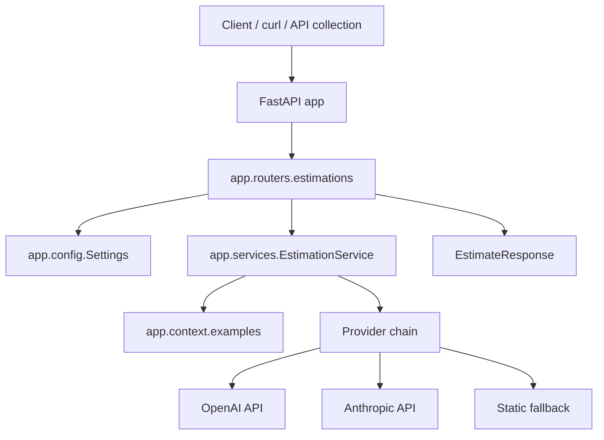
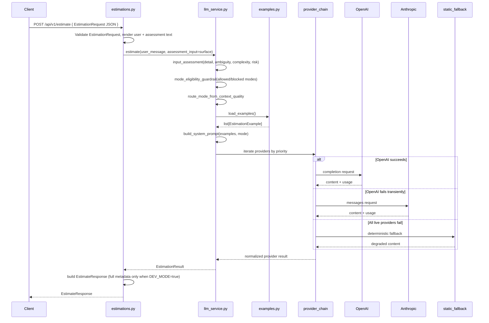

# Estimador CAG — Technical documentation

This document is the living technical baseline for the `estimador-cag` project. It extends the subproject `README.md` with architecture, stack, configuration, runtime flow, logging, testing, and evolution guidelines.

**Language:** all content under `docs/technical/` is written in **English** (prose, headings, and tables). Code paths, commands, and identifiers stay as in the repository.

The goal is documentation that supports development, debugging, and growth without losing the simplicity of the first version.

## Table of contents

- [1. Overview](#1-overview)
- [2. Technical stack](#2-technical-stack)
- [3. Libraries and frameworks](#3-libraries-and-frameworks)
- [4. Local setup](#4-local-setup)
- [5. Environment variables](#5-environment-variables)
- [6. Scripts and commands](#6-scripts-and-commands)
- [7. Directory layout](#7-directory-layout)
- [8. Technical architecture](#8-technical-architecture)
- [9. Estimation request flow](#9-estimation-request-flow)
- [10. CAG design](#10-cag-design)
- [11. API contract](#11-api-contract)
  - [11.1 Streaming estimation (SSE)](#111-streaming-estimation-sse)
- [12. Response metadata](#12-response-metadata)
- [13. Logging](#13-logging)
- [14. Error handling](#14-error-handling)
- [15. Testing and validation](#15-testing-and-validation)
- [16. API collection](#16-api-collection)
- [17. Documentation and sync](#17-documentation-and-sync)
- [18. Security and secrets](#18-security-and-secrets)
- [19. Evolution guide](#19-evolution-guide)
- [20. Troubleshooting](#20-troubleshooting)

## 1. Overview

`estimador-cag` is a FastAPI service that accepts **structured project context** (`EstimationRequest`) and returns a structured software estimate.

The project uses **Context-Augmented Generation (CAG)** in a deliberately small form:

- Few-shot reference text lives under `app/context/examples/<basic|standard|professional|expert_review>/` as `*.txt` files; `app/context/examples.py` loads the pool for the active mode and returns a **random subset** (2–4 examples) per request, falling back to `standard` when a mode folder has no samples. Tests seed RNG where non-determinism would break assertions.
- The app builds a `system prompt` with instructions and prior examples.
- The router renders a deterministic Markdown **user message** from the structured payload and sends it as the `user` message.
- A deterministic assessment classifies the request into one mode (`basic`, `standard`, `professional`, `expert_review`).
- A provider chain (`openai,anthropic` by default) returns an estimate with assumptions, a task/hours table, and delivery notes.

The baseline does not include authentication, a frontend, or production deployment. **Optional** filesystem persistence of successful `200` responses exists behind `ESTIMATION_OUTPUT_PERSIST_ENABLED` (see §5 and §14). It is an AI Engineering baseline meant for learning and safe iteration.

## 2. Technical stack

| Area | Current choice | Rationale |
|------|----------------|-----------|
| Language | Python `>=3.11,<3.12` | Controlled compatibility and modern typing. |
| Package manager | `uv` | Reproducible environment, fast installs, lockfile. |
| HTTP framework | FastAPI | Typed API, automatic OpenAPI, Pydantic integration. |
| ASGI server | `uvicorn[standard]` | Local runtime for FastAPI. |
| Configuration | `pydantic-settings` | Typed settings from environment and `.env`. |
| LLM providers | OpenAI + Anthropic + static fallback | Ordered chain with graceful fallback and explicit degraded mode. |
| Default model | `gpt-4o-mini` | Low cost for exercises and manual checks. |
| Tests | `pytest`, `pytest-asyncio`, `httpx` | Fast, deterministic suite without real provider calls. |
| Manual API client | OpenCollection/Bruno collection under `api-collection/` | Versioned manual checks alongside the code. |

## 3. Libraries and frameworks

Runtime dependencies declared in `pyproject.toml`:

- `fastapi[standard]`: web framework, validation, OpenAPI docs.
- `uvicorn[standard]`: local ASGI server.
- `pydantic-settings`: typed configuration from the environment.
- `openai`: official SDK for OpenAI.
- `anthropic`: official SDK for Anthropic.
- `python-dotenv`: load `.env` in local development.

Development dependencies:

- `pytest`: test runner.
- `pytest-asyncio`: async test support.
- `httpx`: HTTP client used by FastAPI `TestClient` and tests.

Important rule: tests mock provider SDK clients. The default suite must not depend on real provider API keys.

## 4. Local setup

Requirements:

- Python 3.11.
- `uv` on the host.
- At least one provider key (`OPENAI_API_KEY` or `ANTHROPIC_API_KEY`) if you want live model estimates.

From the repository root:

```bash
cd proyectos/estimador-cag
uv sync --group dev
cp .env.example .env
```

Then edit `.env` locally:

```text
OPENAI_API_KEY=...
# and/or
ANTHROPIC_API_KEY=...
```

Never commit `.env`.

Run the API locally:

```bash
uv run uvicorn app.main:app --reload
```

Useful URLs:

- `GET http://127.0.0.1:8000/`
- `GET http://127.0.0.1:8000/health`
- `POST http://127.0.0.1:8000/api/v1/estimate`
- `POST http://127.0.0.1:8000/api/v1/estimate/stream` (SSE, see §11.1)
- `http://127.0.0.1:8000/docs`

**Progressive UI (FastAPI + Streamlit, two processes):** start the API in one terminal (`uv run uvicorn app.main:app --reload`), then run the demo UI in another (`uv run streamlit run app/streamlit_app.py`). The UI streams from `POST /api/v1/estimate/stream` by default at `http://127.0.0.1:8000`. Override the base URL with the **FastAPI base URL** field in the app or set optional environment variable `ESTIMATOR_API_BASE_URL` for the default field value. No extra LLM env vars are required for streaming; uses the same provider settings as the non-streaming endpoint.

## 5. Environment variables

Variables documented in `.env.example`:

| Variable | Required | Default | Purpose |
|----------|----------|---------|---------|
| `LLM_PROVIDERS` | Yes | `openai,anthropic` | Ordered provider chain used for fallback. |
| `STATIC_FALLBACK_ENABLED` | No | `true` | Appends deterministic local fallback provider at chain end. |
| `LLM_AUTH_FALLBACK` | No | `false` | If `true`, provider auth/config errors may continue to the next provider. |
| `LLM_DOMAIN_GUARDRAIL_ENABLED` | No | `true` | Enables service-level rejection for out-of-domain prompts before provider calls. |
| `OPENAI_API_KEY` | Yes for OpenAI live calls | empty | OpenAI credential. Must not appear in logs, tests, or documentation. |
| `OPENAI_MODEL` | No | `gpt-4o-mini` | Model used by the service. |
| `OPENAI_TIMEOUT_SECONDS` | No | `30` | OpenAI client timeout. |
| `ANTHROPIC_API_KEY` | Yes for Anthropic live calls | empty | Anthropic credential for fallback or primary usage. |
| `ANTHROPIC_MODEL` | No | `claude-3-5-haiku-latest` | Anthropic model used by the service. |
| `ANTHROPIC_TIMEOUT_SECONDS` | No | `30` | Anthropic client timeout. |
| `ANTHROPIC_MAX_TOKENS` | No | `2048` | Max output tokens for Anthropic generations. |
| `APP_ENV` | No | `local` | Logical runtime environment. Logged at startup. |
| `DEV_MODE` | No | `false` | When `true`, responses include routing metadata, `prompt_version`, `examples_version`, timing, optional `usage`, and approximate `estimated_cost_usd` when usage is available. |
| `FORCED_ESTIMATION_MODE` | No | empty | When set to `basic`, `standard`, `professional`, or `expert_review`, skips adaptive routing and fixes the output mode. |
| `ESTIMATION_OUTPUT_PERSIST_ENABLED` | No | `false` | When `true`, successful `200` responses persist the `estimation` string to `output-responses/response-YYYYmmdd-hhmmss.md` (UTC). Persistence failure returns `503`. |
| `LOG_LEVEL` | No | `INFO` | Base logging level. |

Loading is centralized in `app/config.py` via `Settings`, with `.env` as a local source and `extra="ignore"` so unknown variables do not break startup.

## 6. Scripts and commands

Main subproject commands:

```bash
cd proyectos/estimador-cag
uv sync --group dev
uv run uvicorn app.main:app --reload
uv run pytest
```

Health check:

```bash
curl http://127.0.0.1:8000/health
```

Sample estimate request:

```bash
curl -s -X POST http://127.0.0.1:8000/api/v1/estimate \
  -H "Content-Type: application/json" \
  -d '{"project_summary":"B2B portal for partners to submit requests and track SLA status.","project_type":"web_saas","target_audience":"b2b_smb","project_description":"The client needs a REST API for orders with idempotent POST. The service must validate inventory and expose admin reporting. xxxxxxxxxxxxxxxxxxxxxxxxxxxxxxxxxxxxxxxx","deliverables":["REST API with idempotent POST for orders","Admin reporting dashboard","Inventory validation rules"],"delivery_urgency":"standard","data_sensitivity":"internal_business","detail_level":"medium","output_format":"phases_table"}'
```

Documentation mirror sync from the repository root:

```bash
bash scripts/sync-estimador-cag-docs.sh
```

That script mirrors canonical notes from `second-brain-master-ia/proyectos/estimador-cag/` into `proyectos/estimador-cag/docs/`.

## 7. Directory layout

Current subproject layout:

```text
proyectos/estimador-cag/
├── app/
│   ├── __init__.py
│   ├── main.py
│   ├── config.py
│   ├── context/
│   │   ├── __init__.py
│   │   ├── examples.py
│   │   ├── examples/
│   │   │   ├── basic/
│   │   │   ├── expert_review/
│   │   │   ├── professional/
│   │   │   └── standard/
│   │   │       └── *.txt
│   │   ├── prompt_loader.py
│   │   └── prompts/
│   │       ├── basic.txt
│   │       ├── standard.txt
│   │       ├── professional.txt
│   │       └── expert_review.txt
│   ├── routers/
│   │   ├── __init__.py
│   │   └── estimations.py
│   └── services/
│       ├── __init__.py
│       ├── domain_guardrails.py
│       ├── estimation_engine.py
│       ├── llm_service.py
│       └── response_output_writer.py
├── api-collection/
│   └── Estimador CAG/
├── docs/
│   ├── README.md
│   ├── sesiones/
│   ├── work-items/
│   └── technical/
├── tests/
│   ├── conftest.py
│   ├── test_api.py
│   ├── test_config.py
│   ├── test_estimation_engine.py
│   ├── test_examples.py
│   ├── test_prompt_loader.py
│   ├── test_llm_service.py
│   └── test_response_output_writer.py
├── output-responses/
├── .env.example
├── .gitignore
├── pyproject.toml
├── README.md
└── uv.lock
```

Responsibilities:

| Path | Responsibility |
|------|------------------|
| `app/main.py` | FastAPI composition root: logging setup, lifespan, routers, base endpoints. |
| `app/config.py` | Typed settings from the environment. |
| `app/routers/estimations.py` | HTTP boundary: Pydantic schemas, validation, response metadata, HTTP errors. |
| `app/services/domain_guardrails.py` | Deterministic domain filter to reject non-estimation prompts before provider calls. |
| `app/services/llm_service.py` | CAG logic, prompt construction, provider-chain orchestration, fallback policy. |
| `app/context/prompts/` | Mode-specific prompt fragments (`*.txt`) loaded at runtime by `prompt_loader.py`. |
| `app/services/providers/` | Provider implementations (`openai`, `anthropic`, `static_fallback`) and chain registry. |
| `app/context/examples.py` | Loads few-shot pool from `app/context/examples/<mode>/` (fallback `standard`) and returns a random subset per request. |
| `app/services/response_output_writer.py` | Optional persistence of successful `estimation` text to `output-responses/`. |
| `tests/` | Unit and API tests with a mocked provider. |
| `api-collection/` | Manual endpoint collection and local environment. |
| `docs/` | Versioned mirror of Second Brain notes, sessions, work items, and technical docs. |

## 8. Technical architecture

The architecture is small and layered. Each layer has a clear boundary:



Current principles:

- `app/main.py` does not contain business logic.
- The router orchestrates HTTP, validation, and metadata.
- SDK-specific behavior is isolated in `app/services/providers/`.
- CAG examples live outside the router and service so they can be versioned and tested.
- Configuration is injected with `Depends(get_settings)` at the HTTP boundary.

## 9. Estimation request flow



Mode assessment reference contract:

```json
{
  "detail_level": "low | medium | high | expert",
  "recommended_mode": "basic | standard | professional | expert_review",
  "reason": "The input includes authentication and mobile features, but lacks roles, backend constraints, integrations and non-functional requirements."
}
```

Recommended effort range shape:

```json
{
  "base_effort_hours": 165,
  "estimated_range": {
    "min": 140,
    "realistic": 180,
    "max": 230
  },
  "confidence": "medium"
}
```

Business guardrail response when context quality is insufficient:

```json
{
  "allowed_modes": ["basic", "standard"],
  "blocked_modes": ["professional", "expert_review"],
  "reason": "Input detail is insufficient."
}
```

Precision guidance:
"More detailed input enables better scope control, clearer assumptions, lower uncertainty and a more defensible estimation range."

Traceability fields (included in the HTTP response only when `DEV_MODE=true`):

- `request_id`: per-request identifier.
- `timestamp`: UTC response time.
- `latency_ms`: total duration measured in the router.
- `prompt_version`: prompt template version.
- `examples_version`: few-shot pool / sampling contract version.

## 10. CAG design

In this project, CAG means the model receives **team-maintained context** (files under `app/context/examples/` plus prompt files), not data retrieved from a vector database.

Message pattern:

```text
[system]    Instructions + reference estimation examples
[user]      Composed project brief (from structured request)
[assistant] Generated estimate
```

`build_system_prompt()` includes:

- Full system instructions for the active mode, loaded from `app/context/prompts/<mode>.txt` (editable without changing Python code).
- A trailing section `## Reference estimation examples` with few-shot examples from `load_examples()` (sampled from the on-disk pool).

Versioning:

- `PROMPT_VERSION` in `app/services/llm_service.py` (currently `v7-guided-input`; bump when system prompt composition or guided user-message pipeline materially changes behavior).
- `EXAMPLES_VERSION` in `app/services/llm_service.py` (bump when per-mode folders, files, glob pattern, fallback rules, or sampling rules change).
- `USER_MESSAGE_TEMPLATE_VERSION` (`guided-form-v1`) in `app/services/estimation_request_render.py` (bump when the Markdown mapping from `EstimationRequest` changes).

## 11. API contract

### `GET /`

Minimal index for humans and browsers:

```json
{
  "service": "Estimador CAG",
  "docs": "/docs",
  "health": "/health",
  "estimate": "POST /api/v1/estimate",
  "estimate_stream": "POST /api/v1/estimate/stream"
}
```

### `GET /health`

Liveness probe:

```json
{
  "status": "ok"
}
```

### `POST /api/v1/estimate`

Request (structured `EstimationRequest`; see `/docs` for the full schema and enums):

```json
{
  "project_summary": "B2B portal for partners to submit requests and track SLA status.",
  "project_type": "web_saas",
  "target_audience": "b2b_smb",
  "project_description": "The client needs a responsive web application for authenticated partners to submit structured tickets, follow approval workflows, and view status dashboards. Integrations with existing CRM are out of scope for the first milestone. xxxxxxxxxxxxxxxxxxxxxxxxxxxxxxxxxxxxxxxx",
  "deliverables": [
    "Partner authentication with SSO and role-based access control",
    "Configurable ticket intake forms and commenting threads",
    "Operations dashboards with CSV export and saved filters"
  ],
  "delivery_urgency": "standard",
  "data_sensitivity": "internal_business",
  "detail_level": "medium",
  "output_format": "phases_table"
}
```

Validation (high level):

- Required fields include `project_summary`, `project_type`, `target_audience`, `project_description`, `deliverables` (3–8 non-empty lines), `delivery_urgency`, `data_sensitivity`, `detail_level`, and `output_format` (see `app/schemas/estimation_request.py` for caps, conditional `target_date`, and attachment rules).
- The **domain guardrail** and **adaptive mode** heuristics run on a **narrow assessment surface** (summary + description + scope lines), not the full Markdown template, so keyword metrics stay aligned with user intent (see **Guided form assessment surface** under §11).
- The composed user message sent to the model is built server-side from the same payload (versioned template `guided-form-v1` in `app/services/estimation_request_render.py`).

#### Guided form assessment surface

`POST /api/v1/estimate` and `/estimate/stream` validate an `EstimationRequest` (`app/schemas/estimation_request.py`). The router builds:

- **`user_message`**: `render_estimation_user_message(request)` — full Markdown for the LLM `user` role (Spanish section titles to reduce accidental keyword matches in the adaptive engine).
- **`assessment_surface`**: `render_estimation_assessment_surface(request)` — summary, long description, deliverables, and optional out-of-scope lines only.

`EstimationService._prepare_call` runs `check_estimation_domain` and `assess_and_select_mode` on **`assessment_surface`** when provided (non-empty after trim); otherwise it falls back to the full user message. **Two-phase** preprocessing still sends the **full** `user_message` into the phase-1 extraction call.

**Attachments:** JSON body uses **base64** per file (`filename`, `content_type`, `content_base64`). Allowed types: `text/plain`, `text/markdown`, `application/pdf` (PDFs are referenced in the template without OCR). Limits: max **3** files, **256 KiB** decoded per file, **512 KiB** total decoded (see `app/schemas/estimation_request.py`).

Response with `DEV_MODE=false` (live provider):

```json
{
  "estimation": "## Estimation: ..."
}
```

Out-of-domain rejection response:

```json
{
  "detail": {
    "code": "out_of_domain",
    "message": "Only software/project estimation requests are supported."
  }
}
```

Degraded response when static fallback is used and `DEV_MODE=false`:

```json
{
  "estimation": "## Estimation: Temporary degraded mode ...",
  "degraded": true
}
```

Response with `DEV_MODE=true`:

```json
{
  "estimation": "## Estimation: ...",
  "mode": "standard",
  "model": "gpt-4o-mini",
  "provider": "openai",
  "request_id": "est_abc123def456",
  "timestamp": "2026-04-27T10:00:00Z",
  "latency_ms": 1800,
  "prompt_version": "v7-guided-input",
  "examples_version": "file-mode-v4-estimator-layout",
  "usage": {
    "prompt_tokens": 920,
    "completion_tokens": 410,
    "total_tokens": 1330,
    "estimated_cost_usd": 0.000384
  }
}
```

### 11.1 Streaming estimation (SSE)

`POST /api/v1/estimate/stream` returns a **Server-Sent Events** stream for progressive consumption (Streamlit demo, proxies, or `curl -N`).

**Request body:** same structured **`EstimationRequest`** as `POST /api/v1/estimate` (including optional `evaluate` and `preprocessing`). The field `evaluate` is accepted for contract parity with the JSON endpoint; the stream carries **markdown text only** via `chunk` events—structural scoring and validation are not emitted on the wire (use `POST /api/v1/estimate` when you need `score` / `structure_evaluation` in one response).

**Response:** `Content-Type: text/event-stream` with headers:

| Header | Value |
|--------|--------|
| `Cache-Control` | `no-cache` |
| `Connection` | `keep-alive` |
| `X-Accel-Buffering` | `no` (disables buffering on common reverse proxies) |

**Event framing** (each event is a block of lines ending with a blank line):

| `event` | `data` JSON | When |
|---------|----------------|------|
| `chunk` | `{"content":"<partial text>"}` | Partial model output (one event per upstream delta when the live provider supports streaming; static fallback emits a single chunk). |
| `done` | `{"status":"completed"}` and, when **`DEV_MODE=true`**, optional `model`, `provider`, and `usage` (same token fields as `POST /api/v1/estimate` when counts exist; `two_phase` preprocessing tokens are merged into `usage` like the JSON path). | Successful end of generation. |
| `error` | `{"message":"<safe description>"}` | Domain guardrail, configuration/provider failure, or stream error; clients should stop reading after this. |

When **`DEV_MODE=true`**, OpenAI streaming requests include LiteLLM **`stream_options.include_usage`** so the completion leg can surface token counts on the final `done` payload when the upstream returns them. Other providers may omit `usage` until they expose an equivalent signal.

Example `curl` (reads until the connection closes):

```bash
curl -sN -X POST http://127.0.0.1:8000/api/v1/estimate/stream \
  -H "Content-Type: application/json" \
  -d '{"project_summary":"B2B portal for partners to submit requests and track SLA status.","project_type":"web_saas","target_audience":"b2b_smb","project_description":"The client needs a REST API for orders with idempotent POST. The service must validate inventory and expose admin reporting. xxxxxxxxxxxxxxxxxxxxxxxxxxxxxxxxxxxxxxxx","deliverables":["REST API with idempotent POST for orders","Admin reporting dashboard","Inventory validation rules"],"delivery_urgency":"standard","data_sensitivity":"internal_business","detail_level":"medium","output_format":"phases_table"}'
```

## 12. Response metadata

When `DEV_MODE=false`, the response body is **`estimation` only**, except when static fallback is used, in which case **`degraded: true`** is also included.

When `DEV_MODE=true`, the following are included in addition to `estimation`:

- `request_id`: correlates a response with logs or incident reports.
- `timestamp`: UTC time when the response was produced.
- `latency_ms`: end-to-end request duration from the router.
- `prompt_version`: prompt instruction version.
- `examples_version`: few-shot context version.
- `provider`: provider that produced the response (`openai`, `anthropic`, `static_fallback`).
- `model`: model identifier reported by the provider implementation.
- `mode`: adaptive estimation mode selected by service-level deterministic routing.
- `assessment` / `mode_eligibility`: routing diagnostics when present.
- `degraded`: only present when static fallback is used.
- `usage` (when the provider returns token counts): `prompt_tokens`, `completion_tokens`, `total_tokens`, and optional `estimated_cost_usd` (local approximation from known model pricing).

Cost is not a billing source of truth. It supports learning, tuning, and cost awareness.

## 13. Logging

Base logging is configured in `app/main.py`:

```text
%(levelname)s %(name)s %(message)s
```

The level comes from `LOG_LEVEL`, defaulting to `INFO`.

Current events:

| Event | Level | Source | Safe context |
|-------|-------|--------|----------------|
| `chain_built` | `INFO` | `app.main` | `providers`, `static_fallback_enabled` |
| `app_startup` | `INFO` | `app.main` | `app_env`, `providers` |
| `provider_attempted` | `INFO` | `app.services.llm_service` | `provider`, `model`, `attempt_index` |
| `provider_failed` | `WARNING` / `ERROR` | `app.services.llm_service` | `provider`, `model`, `error_type`, `attempt_index` |
| `provider_succeeded` | `INFO` | `app.services.llm_service` | `provider`, `model` |
| `chain_degraded` | `WARNING` | `app.services.llm_service` | `static_fallback_used` |
| `chain_exhausted` | `WARNING` | `app.services.llm_service` | `providers_tried` |
| `provider_skipped` | `INFO` | `app.services.providers` | `provider`, `reason` |
| `provider_unknown` | `WARNING` | `app.services.providers` | `provider` |
| `estimation_output_persisted` | `INFO` | `app.routers.estimations` | `path` (output file, no secrets) |
| `estimation_output_persist_failed` | `WARNING` | `app.routers.estimations` | Minimal context; no stack trace to clients |

Rules:

- Do not log `OPENAI_API_KEY`.
- Do not log full prompts by default.
- Do not log full user briefs or attachment bodies when they may contain sensitive information.
- Use stable keys in `extra` for search and correlation.

## 14. Error handling

Input errors:

- FastAPI/Pydantic returns `422` for invalid requests.
- `EstimationRequest` rejects invalid field combinations (see Pydantic `422` detail); domain guardrail rejects off-topic **assessment** text before providers run.

Service errors:

| Case | Outcome |
|------|---------|
| Out-of-domain request (non software/project estimation) | `422 Unprocessable Entity` with `detail.code = "out_of_domain"`; provider chain is not called. |
| Provider timeout / rate limit / unavailable | Next provider in chain is attempted. |
| Provider empty/invalid response | Next provider in chain is attempted. |
| Provider auth/config error | Returns `503` by default (unless `LLM_AUTH_FALLBACK=true`). |
| All providers fail and static fallback enabled | `200` with `provider="static_fallback"` and `degraded=true`. |
| All providers fail and static fallback disabled | `503 Service Unavailable`. |
| Unknown provider name in `LLM_PROVIDERS` | Skipped with `provider_unknown` warning. |
| Output persistence enabled but filesystem write fails | `503` with a safe message; see `estimation_output_persist_failed` log. |

The router maps:

- `DomainGuardrailError` to `422 Unprocessable Entity`
- `EstimationError` to `503 Service Unavailable`

This avoids leaking stack traces or internal details to API clients.

## 15. Testing and validation

Main command:

```bash
cd proyectos/estimador-cag
uv run pytest
```

Current coverage:

- `tests/test_config.py`: settings and environment overrides.
- `tests/test_llm_service.py`: prompt construction, empty-input handling, timeout, mocked success path.
- `tests/test_examples.py`: example pool loading and sampling behavior.
- `tests/test_estimation_engine.py`: adaptive routing and guardrails.
- `tests/test_prompt_loader.py`: mode prompt file loading.
- `tests/test_response_output_writer.py`: output path and UTF-8 write behavior.
- `tests/test_api.py`: root, health, response shape, `DEV_MODE`, validation, `503` mapping, optional output persistence, SSE stream headers and `done` / `error` framing for `POST /api/v1/estimate/stream`.

Testing rules:

- Do not use real API keys in tests.
- Mock provider SDK clients.
- Test project-owned logic: prompts, minimal parsing, metadata, errors, settings.
- Keep tests fast and deterministic.

Minimal manual validation:

```bash
uv run uvicorn app.main:app --reload
curl http://127.0.0.1:8000/health
curl -s -X POST http://127.0.0.1:8000/api/v1/estimate \
  -H "Content-Type: application/json" \
  -d '{"project_summary":"Marketing site with HubSpot form and blog for launch.","project_type":"web_marketing_site","target_audience":"b2b_smb","project_description":"The client needs a landing page with HubSpot integration, lead capture, and a simple blog. Timeline is six weeks. Design exists in Figma. xxxxxxxxxxxxxxxxxxxxxxxxxxxxxxxxxxxxxxxx","deliverables":["Responsive landing from Figma","HubSpot form and CRM sync","Blog with editor and basic SEO"],"delivery_urgency":"standard","data_sensitivity":"internal_business","detail_level":"medium","output_format":"phases_table"}'
```

## 16. API collection

The folder `api-collection/Estimador CAG/` holds a versioned collection for manual testing.

Current pieces:

- `opencollection.yml`: collection metadata.
- `environments/local.yml`: sets `baseUrl=http://127.0.0.1:8000`.
- `Health.yml`: health request.
- `Read Root.yml`: root index request.
- `estimations/Create Estimate.yml`: `POST /api/v1/estimate`.
- `estimations/*.yml`: sample request bodies (size/category naming may vary by fixture set).

The collection helps validate contracts without relying only on `curl`.

## 17. Documentation and sync

Canonical source:

```text
second-brain-master-ia/proyectos/estimador-cag/
```

Versioned mirror:

```text
proyectos/estimador-cag/docs/
```

After editing notes in the Second Brain, sync from the repository root:

```bash
bash scripts/sync-estimador-cag-docs.sh
```

The script uses `rsync --delete`, so `docs/` is a true mirror. Files removed in the vault disappear from the git copy.

## 18. Security and secrets

Project rules:

- `.env` is local and must not be committed.
- `.env.example` contains placeholders or non-sensitive defaults only.
- API keys are read from environment variables.
- Logs must not include credentials or full user payloads.
- Tests must not require real keys.
- Do not document real tokens in Second Brain notes that sync into the repository.

## 19. Evolution guide

As the project grows, keep these boundaries:

- New endpoints: add routers under `app/routers/`.
- Business logic or providers: keep in `app/services/`.
- Reusable prompt context: place under `app/context/`.
- New variables: update `app/config.py`, `.env.example`, `README.md`, and this technical doc.
- API contract changes: update tests, API collection, expected OpenAPI, and docs.
- Prompt or context changes: bump `PROMPT_VERSION` or `EXAMPLES_VERSION`.

Possible next technical steps:

- Add a structured schema for estimates if programmatic consumption is needed.
- Extend persistence beyond optional markdown files (for example metadata sidecars or a database) if stronger auditability is required.
- Add retries/backoff once the current fallback baseline is stable.
- Add tracing or request logging if local observability is insufficient.
- Add CI when the project has a stable remote or PR workflow.

## 20. Troubleshooting

### `No provider could be configured from LLM_PROVIDERS...`

The app fails fast at startup when no provider can be built and static fallback is disabled.

Check:

```bash
cd proyectos/estimador-cag
cp .env.example .env
```

Then add at least one real provider key only in `.env`.

### `503 Service Unavailable` with authentication/configuration message

By default, auth/configuration errors do not fallback silently. Check API keys and model names, or set `LLM_AUTH_FALLBACK=true` if you explicitly want auth fallback behavior.

### `422 Unprocessable Entity`

The body failed Pydantic validation (missing required fields, invalid enums, list size limits, conditional `target_date`, or attachment rules). Inspect the `422` response `detail` from FastAPI.

### `503 Service Unavailable`

The service could not produce an estimate. Typical causes: missing credentials, timeout, rate limit, provider error, or empty model response.

### `/favicon.ico` returns `404`

Expected. There is no favicon asset; some browsers request it automatically.

### Changes under `second-brain-master-ia` do not appear in `docs/`

Run from the repository root:

```bash
bash scripts/sync-estimador-cag-docs.sh
```
