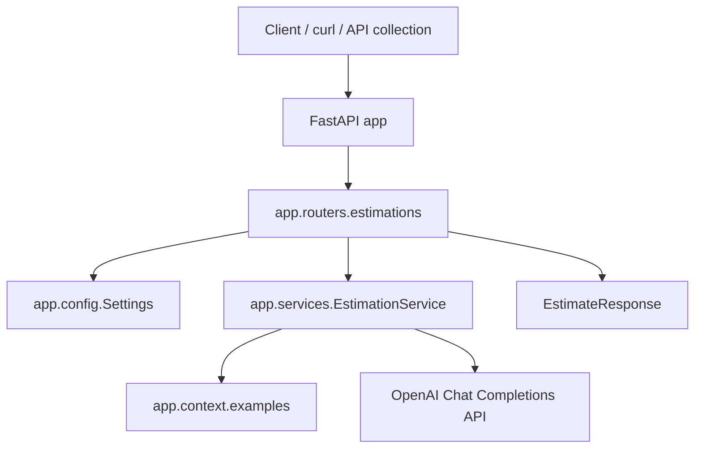
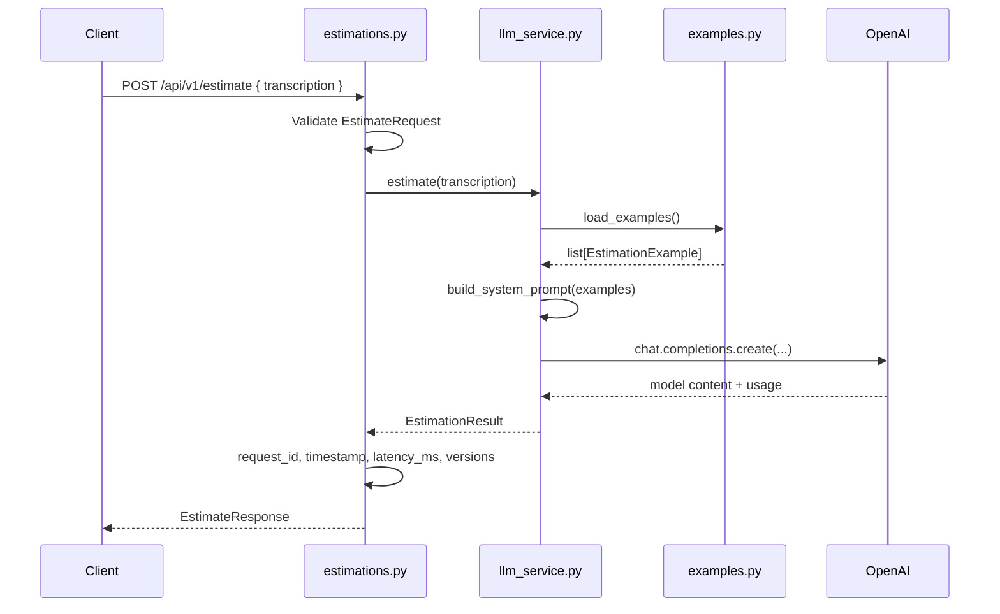

# Documentación técnica del Estimador CAG

Esta nota es la base técnica viva del proyecto `estimador-cag`. Extiende el `README.md` del subproyecto con más contexto de arquitectura, stack, configuración, flujo de ejecución, logging, pruebas y criterios de evolución.

El objetivo es mantener una documentación útil para desarrollar, depurar y hacer crecer el proyecto sin perder la simplicidad inicial.

## Tabla de contenidos

- [1. Visión general](#1-visión-general)
- [2. Stack técnico](#2-stack-técnico)
- [3. Librerías y frameworks](#3-librerías-y-frameworks)
- [4. Setup local](#4-setup-local)
- [5. Variables de entorno](#5-variables-de-entorno)
- [6. Scripts y comandos](#6-scripts-y-comandos)
- [7. Estructura de directorios](#7-estructura-de-directorios)
- [8. Arquitectura técnica](#8-arquitectura-técnica)
- [9. Flujo de una estimación](#9-flujo-de-una-estimación)
- [10. Diseño CAG](#10-diseño-cag)
- [11. Contrato API](#11-contrato-api)
- [12. Metadatos de respuesta](#12-metadatos-de-respuesta)
- [13. Logging](#13-logging)
- [14. Manejo de errores](#14-manejo-de-errores)
- [15. Testing y validación](#15-testing-y-validación)
- [16. Colección API](#16-colección-api)
- [17. Documentación y sincronización](#17-documentación-y-sincronización)
- [18. Seguridad y secretos](#18-seguridad-y-secretos)
- [19. Guía de evolución](#19-guía-de-evolución)
- [20. Troubleshooting](#20-troubleshooting)

## 1. Visión general

`estimador-cag` es un servicio FastAPI que recibe la transcripción de una reunión con cliente y devuelve una estimación software estructurada.

El proyecto usa **Context-Augmented Generation (CAG)** en una forma deliberadamente pequeña:

- El contexto estático vive en `app/context/examples.py`.
- El sistema construye un `system prompt` con instrucciones y ejemplos previos.
- La transcripción viva se envía como mensaje `user`.
- OpenAI genera una estimación con supuestos, tabla de tareas/horas y notas de entrega.

La primera versión no incluye persistencia, autenticación, frontend ni despliegue productivo. Es una base de AI Engineering pensada para aprender y crecer con límites técnicos claros.

## 2. Stack técnico

| Área | Elección actual | Motivo |
|------|-----------------|--------|
| Lenguaje | Python `>=3.11,<3.12` | Compatibilidad controlada y features modernas de typing. |
| Package manager | `uv` | Entorno reproducible, instalación rápida y lockfile. |
| Framework HTTP | FastAPI | API typed, OpenAPI automático, integración natural con Pydantic. |
| Servidor ASGI | `uvicorn[standard]` | Runtime local para FastAPI. |
| Configuración | `pydantic-settings` | Settings tipados desde variables de entorno y `.env`. |
| LLM provider | OpenAI | Primer proveedor implementado. |
| Modelo por defecto | `gpt-4o-mini` | Coste bajo para ejercicios y pruebas manuales. |
| Tests | `pytest`, `pytest-asyncio`, `httpx` | Suite rápida y determinista sin llamadas reales al proveedor. |
| Cliente API manual | Colección OpenCollection/Bruno en `api-collection/` | Pruebas manuales versionadas junto al proyecto. |

## 3. Librerías y frameworks

Dependencias runtime declaradas en `pyproject.toml`:

- `fastapi[standard]`: framework web, validación y documentación OpenAPI.
- `uvicorn[standard]`: servidor ASGI local.
- `pydantic-settings`: carga tipada de configuración desde entorno.
- `openai`: SDK oficial para llamar a OpenAI.
- `python-dotenv`: soporte para cargar `.env` en desarrollo local.

Dependencias de desarrollo:

- `pytest`: runner de tests.
- `pytest-asyncio`: soporte para tests async.
- `httpx`: cliente HTTP usado por FastAPI/TestClient y pruebas.

Regla importante: los tests mockean OpenAI. La suite por defecto no debe depender de una `OPENAI_API_KEY` real.

## 4. Setup local

Requisitos:

- Python 3.11.
- `uv` instalado en el host.
- Una clave OpenAI solo si se quiere ejecutar una estimación real.

Desde la raíz del repositorio:

```bash
cd proyectos/estimador-cag
uv sync --group dev
cp .env.example .env
```

Después edita `.env` localmente:

```text
OPENAI_API_KEY=...
```

No se debe commitear `.env`.

Arranque local:

```bash
uv run uvicorn app.main:app --reload
```

URLs útiles:

- `GET http://127.0.0.1:8000/`
- `GET http://127.0.0.1:8000/health`
- `POST http://127.0.0.1:8000/api/v1/estimate`
- `http://127.0.0.1:8000/docs`

## 5. Variables de entorno

Variables documentadas en `.env.example`:

| Variable | Requerida | Default | Uso |
|----------|-----------|---------|-----|
| `LLM_PROVIDER` | Sí | `openai` | Selección de proveedor. Actualmente solo `openai` está soportado. |
| `OPENAI_API_KEY` | Sí para llamadas reales | vacío | Credencial OpenAI. Nunca debe aparecer en logs, tests o documentación. |
| `OPENAI_MODEL` | No | `gpt-4o-mini` | Modelo usado por el servicio. |
| `OPENAI_TIMEOUT_SECONDS` | No | `30` | Timeout del cliente OpenAI. |
| `APP_ENV` | No | `local` | Entorno lógico de ejecución. Se registra en startup. |
| `DEV_MODE` | No | `false` | Si es `true`, la API incluye `usage` y coste estimado. |
| `LOG_LEVEL` | No | `INFO` | Nivel base de logging. |
| `ANTHROPIC_API_KEY` | No | vacío | Reservada para posible proveedor futuro. No usada todavía. |
| `ANTHROPIC_MODEL` | No | vacío | Reservada para posible proveedor futuro. No usada todavía. |

La carga se centraliza en `app/config.py` mediante `Settings`, con `.env` como fuente local y `extra="ignore"` para tolerar variables adicionales.

## 6. Scripts y comandos

Comandos principales del subproyecto:

```bash
cd proyectos/estimador-cag
uv sync --group dev
uv run uvicorn app.main:app --reload
uv run pytest
```

Comando de health check:

```bash
curl http://127.0.0.1:8000/health
```

Ejemplo de estimación:

```bash
curl -s -X POST http://127.0.0.1:8000/api/v1/estimate \
  -H "Content-Type: application/json" \
  -d '{"transcription":"The client needs a REST API for orders with idempotent POST."}'
```

Script de sincronización documental desde la raíz del repo:

```bash
bash scripts/sync-estimador-cag-docs.sh
```

Ese script replica las notas canónicas de `second-brain-master-ia/proyectos/estimador-cag/` hacia `proyectos/estimador-cag/docs/`.

## 7. Estructura de directorios

Estructura actual del subproyecto:

```text
proyectos/estimador-cag/
├── app/
│   ├── __init__.py
│   ├── main.py
│   ├── config.py
│   ├── context/
│   │   ├── __init__.py
│   │   └── examples.py
│   ├── routers/
│   │   ├── __init__.py
│   │   └── estimations.py
│   └── services/
│       ├── __init__.py
│       └── llm_service.py
├── api-collection/
│   └── Estimador CAG/
├── docs/
│   ├── README.md
│   ├── sesiones/
│   ├── work-items/
│   └── technical/
├── tests/
│   ├── conftest.py
│   ├── test_api.py
│   ├── test_config.py
│   └── test_llm_service.py
├── .env.example
├── .gitignore
├── pyproject.toml
├── README.md
└── uv.lock
```

Responsabilidades:

| Ruta | Responsabilidad |
|------|-----------------|
| `app/main.py` | Composition root de FastAPI: configuración de logging, lifespan, routers y endpoints base. |
| `app/config.py` | Settings tipados desde entorno. |
| `app/routers/estimations.py` | Frontera HTTP: schemas Pydantic, validación, metadatos de respuesta y errores HTTP. |
| `app/services/llm_service.py` | Lógica CAG, construcción de prompt, cliente OpenAI y mapeo de errores del proveedor. |
| `app/context/examples.py` | Ejemplos estáticos usados como contexto few-shot. |
| `tests/` | Tests unitarios y de API con proveedor mockeado. |
| `api-collection/` | Colección manual de endpoints y entorno local. |
| `docs/` | Réplica versionada de notas técnicas, sesiones y work-items del Second Brain. |

## 8. Arquitectura técnica

La arquitectura es pequeña y por capas. Cada capa tiene una frontera clara:



Principios actuales:

- `app/main.py` no contiene lógica de negocio.
- El router orquesta HTTP, validación y metadatos.
- El servicio es la única capa que conoce el SDK de OpenAI.
- Los ejemplos CAG están fuera del router y del servicio para poder versionarlos y testearlos.
- La configuración se inyecta con `Depends(get_settings)` en la frontera HTTP.

## 9. Flujo de una estimación



Puntos de trazabilidad:

- `request_id`: identificador por petición.
- `timestamp`: hora UTC de respuesta.
- `latency_ms`: duración total medida en el router.
- `prompt_version`: versión del prompt.
- `examples_version`: versión del contexto estático.

## 10. Diseño CAG

CAG en este proyecto significa que el modelo recibe contexto estático mantenido por el equipo, no recuperado dinámicamente de una base vectorial.

Patrón de mensajes:

```text
[system]    Instructions + reference estimation examples
[user]      Meeting transcription
[assistant] Generated estimate
```

El prompt se construye en `build_system_prompt()` con:

- Rol del modelo: estimador experto de software.
- Instrucción de imitar estructura, nivel de detalle y pragmatismo de los ejemplos.
- Formato esperado: supuestos, tabla de tareas/horas y notas de entrega.
- Ejemplos definidos en `EXAMPLES`.

Versionado:

- `PROMPT_VERSION = "v1"` vive en `app/services/llm_service.py`.
- `EXAMPLES_VERSION = "static-v1"` vive en `app/services/llm_service.py`.
- Cambios de instrucciones o formato deben subir `PROMPT_VERSION`.
- Cambios de ejemplos que alteren comportamiento esperado deben subir `EXAMPLES_VERSION`.

## 11. Contrato API

### `GET /`

Devuelve un índice mínimo para humanos y navegadores:

```json
{
  "service": "Estimador CAG",
  "docs": "/docs",
  "health": "/health",
  "estimate": "POST /api/v1/estimate"
}
```

### `GET /health`

Liveness probe:

```json
{
  "status": "ok"
}
```

### `POST /api/v1/estimate`

Request:

```json
{
  "transcription": "The client needs a REST API for orders with idempotent POST."
}
```

Validación:

- `transcription` es obligatorio.
- Debe tener al menos un carácter.
- Tras `strip()`, no puede estar vacío.

Response con `DEV_MODE=false`:

```json
{
  "estimation": "## Estimation: ...",
  "model": "gpt-4o-mini",
  "provider": "openai",
  "request_id": "est_abc123def456",
  "timestamp": "2026-04-27T10:00:00Z",
  "latency_ms": 1800,
  "prompt_version": "v1",
  "examples_version": "static-v1"
}
```

Response con `DEV_MODE=true`:

```json
{
  "estimation": "## Estimation: ...",
  "model": "gpt-4o-mini",
  "provider": "openai",
  "request_id": "est_abc123def456",
  "timestamp": "2026-04-27T10:00:00Z",
  "latency_ms": 1800,
  "prompt_version": "v1",
  "examples_version": "static-v1",
  "usage": {
    "prompt_tokens": 920,
    "completion_tokens": 410,
    "total_tokens": 1330,
    "estimated_cost_usd": 0.000384
  }
}
```

## 12. Metadatos de respuesta

Metadatos operativos, siempre presentes:

- `request_id`: ayuda a correlacionar una respuesta con logs o reportes.
- `timestamp`: momento UTC de generación de la respuesta.
- `latency_ms`: duración end-to-end de la petición desde el router.
- `prompt_version`: versión de instrucciones del prompt.
- `examples_version`: versión del contexto few-shot.

Metadatos de desarrollo, solo con `DEV_MODE=true`:

- `usage.prompt_tokens`: tokens de entrada reportados por el proveedor.
- `usage.completion_tokens`: tokens de salida reportados por el proveedor.
- `usage.total_tokens`: total reportado por el proveedor.
- `usage.estimated_cost_usd`: aproximación local basada en precios conocidos del modelo.

El coste no es fuente de facturación. Sirve para aprendizaje, tuning y sensibilidad de coste.

## 13. Logging

La configuración base se inicializa en `app/main.py`:

```text
%(levelname)s %(name)s %(message)s
```

El nivel se toma de `LOG_LEVEL`, con fallback a `INFO`.

Eventos actuales:

| Evento | Nivel | Origen | Contexto seguro |
|--------|-------|--------|-----------------|
| `app_startup` | `INFO` | `app.main` | `app_env`, `provider` |
| `llm_request_failed` | `WARNING` o `ERROR` | `app.services.llm_service` | `provider`, `model`, `error_type` |
| `llm_empty_response` | `WARNING` | `app.services.llm_service` | `provider`, `model` |

Reglas:

- No loggear `OPENAI_API_KEY`.
- No loggear prompts completos por defecto.
- No loggear transcripciones completas si pueden contener información sensible.
- Usar claves estables en `extra` para facilitar búsqueda y correlación.

## 14. Manejo de errores

Errores de entrada:

- FastAPI/Pydantic devuelve `422` para request inválido.
- `EstimateRequest` rechaza `transcription` vacía tras trim.

Errores del servicio:

| Caso | Conversión |
|------|------------|
| `LLM_PROVIDER` distinto de `openai` | `EstimationError("Only the OpenAI provider is supported in this version.")` |
| Falta `OPENAI_API_KEY` | `EstimationError("OpenAI API key is not configured.")` |
| Timeout OpenAI | Mensaje seguro de timeout. |
| Rate limit OpenAI | Mensaje seguro para reintentar luego. |
| Error de autenticación | Mensaje seguro para revisar credenciales. |
| `APIError` genérico | Mensaje seguro de error del proveedor. |
| Respuesta vacía | `EstimationError("The model returned an empty response.")` |
| Error inesperado | Se registra con `logger.exception` y se devuelve mensaje seguro. |

El router convierte `EstimationError` en:

```text
503 Service Unavailable
```

Esto evita filtrar stack traces o detalles internos al cliente.

## 15. Testing y validación

Comando principal:

```bash
cd proyectos/estimador-cag
uv run pytest
```

Cobertura actual:

- `tests/test_config.py`: settings y overrides de entorno.
- `tests/test_llm_service.py`: construcción de prompt, validación de transcripción, timeout, contenido vacío y respuesta mockeada.
- `tests/test_api.py`: root, health, shape de respuesta, `DEV_MODE`, validación y mapeo de errores a `503`.

Reglas de testing:

- No usar API keys reales en tests.
- Mockear el cliente OpenAI.
- Probar lógica propia: prompts, parsing mínimo, metadatos, errores y settings.
- Mantener tests rápidos y deterministas.

Validación manual mínima:

```bash
uv run uvicorn app.main:app --reload
curl http://127.0.0.1:8000/health
curl -s -X POST http://127.0.0.1:8000/api/v1/estimate \
  -H "Content-Type: application/json" \
  -d '{"transcription":"The client needs a landing page with HubSpot integration."}'
```

## 16. Colección API

La carpeta `api-collection/Estimador CAG/` contiene una colección versionada para pruebas manuales.

Piezas actuales:

- `opencollection.yml`: metadatos de la colección.
- `environments/local.yml`: define `baseUrl=http://127.0.0.1:8000`.
- `Health.yml`: request de health.
- `Read Root.yml`: request de índice.
- `estimations/Create Estimate.yml`: request `POST /api/v1/estimate`.

La colección es útil para revisar contratos manualmente sin depender solo de `curl`.

## 17. Documentación y sincronización

Fuente canónica:

```text
second-brain-master-ia/proyectos/estimador-cag/
```

Réplica versionada:

```text
proyectos/estimador-cag/docs/
```

Tras editar notas en el Second Brain, sincronizar desde la raíz del repo:

```bash
bash scripts/sync-estimador-cag-docs.sh
```

El script usa `rsync --delete`, por lo que la carpeta `docs/` debe tratarse como réplica. Si se borra una nota en el Second Brain, desaparece también de la copia versionada.

## 18. Seguridad y secretos

Reglas del proyecto:

- `.env` es local y no se commitea.
- `.env.example` solo contiene placeholders o valores no sensibles.
- Las API keys se leen desde variables de entorno.
- Los logs no deben incluir credenciales ni transcripciones completas.
- Los tests no requieren claves reales.
- No documentar tokens reales en notas del Second Brain porque se sincronizan al repo.

## 19. Guía de evolución

Cuando el proyecto crezca, mantener estas fronteras:

- Nuevos endpoints: crear routers en `app/routers/`.
- Lógica de negocio o proveedores: mantenerla en `app/services/`.
- Contexto reusable para prompts: ubicarlo en `app/context/`.
- Nuevas variables: actualizar `app/config.py`, `.env.example`, `README.md` y esta documentación.
- Cambios de contrato API: actualizar tests, colección API, OpenAPI esperado y docs.
- Cambios de prompt/contexto: subir `PROMPT_VERSION` o `EXAMPLES_VERSION`.

Posibles siguientes pasos técnicos:

- Añadir schema estructurado para estimaciones si se necesita consumo programático.
- Persistir estimaciones y metadatos si aparece necesidad de auditoría.
- Añadir proveedor Anthropic detrás de la misma frontera de servicio.
- Incorporar tracing o request logging si la observabilidad local se queda corta.
- Añadir CI cuando el proyecto tenga una rama remota o flujo de PRs estable.

## 20. Troubleshooting

### `OpenAI API key is not configured.`

Falta `OPENAI_API_KEY` en `.env` o en el entorno del proceso.

Revisar:

```bash
cd proyectos/estimador-cag
cp .env.example .env
```

Después añadir la clave real solo en `.env`.

### `Only the OpenAI provider is supported in this version.`

`LLM_PROVIDER` tiene un valor distinto de `openai`. En esta versión no hay otro proveedor implementado.

### `422 Unprocessable Entity`

El body no contiene `transcription` o contiene una cadena vacía tras `strip()`.

### `503 Service Unavailable`

El servicio no pudo producir una estimación. Puede deberse a falta de credenciales, timeout, rate limit, error del proveedor o respuesta vacía.

### `/favicon.ico` devuelve `404`

Es esperado. El proyecto no incluye favicon; algunos navegadores lo solicitan automáticamente.

### Los cambios en `second-brain-master-ia` no aparecen en `docs/`

Ejecutar desde la raíz del repo:

```bash
bash scripts/sync-estimador-cag-docs.sh
```
