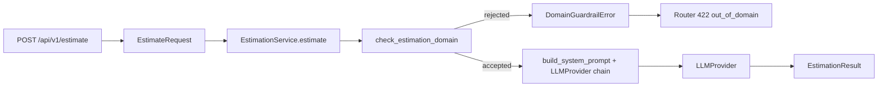

# Feature: Estimation Domain Guardrails

## Objective

Ensure `estimador-cag` only responds to software or project estimation requests and rejects out-of-domain prompts before they reach the provider chain.

The immediate goal is to stop responses like general knowledge answers (`"What is the distance from Earth to the Sun?"`) from being returned as if they were valid estimation outputs.

## Context

Current behavior accepts any non-empty `transcription` and sends it into the CAG flow:

- `app/schemas/estimations.py` only rejects blank strings.
- `app/services/llm_service.py` builds the estimation prompt and calls the provider chain for any text input.
- Static examples in `app/context/examples.py` are clearly about software estimations, but the system prompt does not currently enforce a strict domain boundary.

Example bug to prevent:

```json
{
  "transcription": "Qué distancia hay desde la tierra al sol?"
}
```

This currently returns a normal factual answer from the model instead of rejecting the request as outside the purpose of the API.

## Scope

### Includes

- Add a domain guardrail so the system only accepts requests that look like software/project estimation inputs.
- Reject out-of-domain requests before provider calls.
- Add a prompt-level backup instruction so the model is also told to stay in-domain.
- Return a clear API error for out-of-domain inputs.
- Add focused tests for accepted/rejected cases.
- Document the domain restriction in the feature doc and mirrored docs if implemented.

### Excludes

- No general classifier service or separate moderation model.
- No advanced user-configurable domain rule sets (threshold tuning, keyword lists) in settings.
- No multilingual intent detection beyond simple heuristics.
- No semantic retrieval, embeddings, or heavy NLP pipeline.
- No attempt to support other assistant use cases beyond estimations.

## Functional Requirements

- **FR-1**: The API must accept software/project estimation requests and continue returning normal estimation responses.
- **FR-2**: The API must reject clearly out-of-domain requests such as general knowledge questions, trivia, astronomy facts, weather, or unrelated Q&A.
- **FR-3**: Out-of-domain requests must be rejected before any OpenAI/Anthropic/static provider call is attempted.
- **FR-4**: The API must return a safe, explicit rejection response for out-of-domain requests with an application-stable code like `out_of_domain`.
- **FR-5**: The system prompt must explicitly state that the assistant is only allowed to produce software/project estimations and must refuse anything else.
- **FR-6**: The first implementation must stay small and deterministic: a lightweight guardrail helper with simple scoring or keyword heuristics is preferred over model-based classification.

## Technical Approach

### Recommended design

Use two guardrails with different responsibilities:

1. **Primary guardrail: service-level pre-check**
   - Add a pure helper in `app/services/`, for example `domain_guardrails.py`.
   - Input: raw transcription text.
   - Output: accepted / rejected decision (plus optional reason/code).
   - This is the main boundary because it is cheap, deterministic, and testable.

2. **Secondary guardrail: prompt instruction**
   - Extend `build_system_prompt()` so the model is explicitly instructed to only answer estimation requests.
   - This is a backup defense for ambiguous cases that pass the heuristic.

### Target files

- `app/services/domain_guardrails.py`
  - Pure helper for domain classification.
- `app/services/llm_service.py`
  - Call the helper before building/sending provider requests.
  - Raise a domain-specific application error when rejected.
- `app/routers/estimations.py`
  - Map domain rejection to `422 Unprocessable Entity`.
- `tests/test_domain_guardrails.py`
  - Unit tests for accepted/rejected examples.
- `tests/test_llm_service.py`
  - Verify rejected requests do not call providers.
- `tests/test_api.py`
  - Verify HTTP `422` and error payload.

### Boundary decisions

- Keep the guardrail in `services/`, not in the router:
  - the router should stay focused on HTTP;
  - the service owns business/domain rules.
- Keep provider clients untouched:
  - this is not a provider concern;
  - the request should be blocked before the provider chain.

### Response shape recommendation

For out-of-domain requests, return:

```json
{
  "detail": {
    "code": "out_of_domain",
    "message": "Only software/project estimation requests are supported."
  }
}
```

Recommended status code: `422`.

Why:

- it is a valid request body structurally, but invalid for the business purpose of the endpoint;
- it keeps `503` reserved for provider/runtime failures.

## Technical Design

This section turns the recommended approach into an implementation-level blueprint, proportional to the current repo. It does not introduce new layers, dependencies, or settings.

### Design Summary

Block out-of-domain requests **before** invoking the provider chain by introducing a deterministic guardrail in the service layer, plus a backup instruction in the system prompt. The router only translates a service-level domain error into a typed `422` response. Nothing changes in `providers/`, `config.py`, `.env.example`, or `main.py`.

### Data Flow



Differences from the current flow:

- The guardrail runs **before** `build_system_prompt()` and **before** `for provider in self._providers`.
- The error is raised in `services/`, not in `routers/`. The router only maps it to HTTP.

### API Contract for Out-of-Domain Rejection

- HTTP `422 Unprocessable Entity`.
- Response payload uses FastAPI's `HTTPException` `detail` shape:

```json
{
  "detail": {
    "code": "out_of_domain",
    "message": "Only software/project estimation requests are supported."
  }
}
```

- `code` is a stable identifier suitable for client checks and tests.
- `message` may evolve without breaking consumers.
- `503` stays reserved for provider chain or runtime failures.

### Domain Helper

New file: `app/services/domain_guardrails.py`. Pure, deterministic, no network, no LLM.

Recommended shape:

```python
@dataclass(frozen=True)
class DomainCheckResult:
    accepted: bool
    reason: str | None = None  # internal use only, e.g. "no_domain_signal"


def check_estimation_domain(text: str) -> DomainCheckResult: ...
```

Heuristic guidance (small and tunable):

- Normalize: lowercase + strip punctuation.
- Maintain a small bilingual list of signals (10–15 terms total):
  - Software/project: `api`, `frontend`, `backend`, `dashboard`, `landing page`, `mobile app`, `MVP`, `integration`, `database`, `auth`, `admin panel`, `feature`, `bug`, `migration`, `funcionalidad`, `proyecto`, `aplicación`, `web`, `panel`, `integración`.
  - Scope/estimation: `estimate`, `hours`, `timeline`, `scope`, `tasks`, `delivery`, `estimar`, `horas`, `plazos`, `tareas`, `entrega`, `presupuesto`.
- Accept if at least one software/project signal is present, or the text is long enough and clearly framed around delivery/scope.
- Reject when:
  - the input is short (e.g. `< ~120` chars) and contains zero domain signals;
  - the input matches a typical general-knowledge question pattern (`qué`, `quién`, `por qué`, `what is`, `who is`, etc.) with no domain signals.

The thresholds and keyword list are intentionally simple and live in this single file so they are easy to tune later.

### Service Integration

Changes inside `app/services/llm_service.py`:

```python
class DomainGuardrailError(Exception):
    """Raised when input is outside the estimation domain."""

    code = "out_of_domain"
```

At the start of `EstimationService.estimate()`:

```python
text = transcription.strip()
if not text:
    raise EstimationError("Transcription must not be empty.")

decision = check_estimation_domain(text)
if not decision.accepted:
    logger.info("guardrail_rejected", extra={"reason": decision.reason})
    raise DomainGuardrailError(
        "Only software/project estimation requests are supported."
    )
```

Inside `build_system_prompt()`, append a single sentence to the system instructions:

```
You must only produce estimates for software or project work. If the user message is not such a request, refuse politely and do not produce an estimate.
```

This is defense in depth, not a replacement for the pre-check.

### Router Integration

In `app/routers/estimations.py`, add a specific branch before the existing `EstimationError` handler:

```python
except DomainGuardrailError as exc:
    raise HTTPException(
        status_code=status.HTTP_422_UNPROCESSABLE_ENTITY,
        detail={
            "code": exc.code,
            "message": str(exc),
        },
    ) from exc
except EstimationError as exc:
    ...
```

`EstimateResponse` does not change. Out-of-domain rejection is a different response shape via `HTTPException.detail`.

### Test Plan (granular)

Unit tests in `tests/test_domain_guardrails.py`:

- `test_accepts_clear_software_request` — `"Client needs a landing page with HubSpot integration and admin panel."`
- `test_accepts_spanish_software_request` — `"Necesitamos estimar el desarrollo de un panel de admin con login."`
- `test_rejects_general_knowledge_question` — `"Qué distancia hay desde la tierra al sol?"`
- `test_rejects_short_unrelated_message` — `"Hola, qué tal?"`

Service tests extending `tests/test_llm_service.py`:

- `test_estimate_rejects_out_of_domain_without_calling_provider` — uses a stub provider with a call counter, asserts `DomainGuardrailError` and `provider.calls == 0`.

API tests extending `tests/test_api.py`:

- `test_estimate_returns_422_for_out_of_domain` — body `{"transcription":"Qué distancia hay desde la tierra al sol?"}`, asserts `status_code == 422` and `detail.code == "out_of_domain"`.
- `test_estimate_returns_200_for_valid_software_request` — sanity check with mocked service.

### Implementation Order

1. `domain_guardrails.py` with `check_estimation_domain` and unit tests.
2. `DomainGuardrailError` and integration in `EstimationService.estimate()`. Test that providers are not called.
3. Add the system prompt reinforcement in `build_system_prompt()`. No dedicated test.
4. Map the error to `422` in the router. Add API test.
5. Documentation: short notes in `README.md` and `docs/technical/README.md`.
6. Manual checks (`curl`) and final validation pass.

Each step must keep `uv run pytest` green before moving on.

### Alternatives Rejected

- **Validate in `EstimateRequest` field validator (Pydantic)**: rejected because it mixes HTTP/schema concerns with domain logic, and makes service-level testing harder.
- **Pre-classify with another LLM call**: rejected for cost, latency, complexity, and added test fragility. Not justified for the current scope.
- **Return `200` with a refusal text in `estimation`**: rejected because it conflates business rejection with a successful response.
- **Add complex settings to tune guardrail internals (thresholds/keyword lists)**: rejected as premature configuration for now.

## Acceptance Criteria

- [x] A request like `"Client needs a dashboard with CSV import and SSO login"` is accepted and proceeds normally.
- [x] A request like `"Qué distancia hay desde la tierra al sol?"` is rejected.
- [x] Out-of-domain requests return `422`.
- [x] Out-of-domain requests do not trigger provider calls.
- [x] The prompt includes an explicit “estimations only” instruction.
- [x] Tests cover accepted, rejected, and API-level error behavior.

## Test Plan

### Unit tests

- Test that the guardrail accepts clear software estimation requests.
- Test that the guardrail rejects clear out-of-domain questions.
- Test that `EstimationService` raises a domain-specific error before provider calls.

### Integration/API tests

- Test `POST /api/v1/estimate` returns `422` for out-of-domain input.
- Test response includes `detail.code == "out_of_domain"`.
- Test normal estimation requests still return `200`.

### Manual checks

Run locally:

```bash
cd proyectos/estimador-cag
uv run uvicorn app.main:app --reload
```

Allowed request:

```bash
curl -X POST http://127.0.0.1:8000/api/v1/estimate \
  -H "Content-Type: application/json" \
  -d '{"transcription":"Client needs a landing page with HubSpot integration, admin panel, and analytics dashboard."}'
```

Rejected request:

```bash
curl -X POST http://127.0.0.1:8000/api/v1/estimate \
  -H "Content-Type: application/json" \
  -d '{"transcription":"Que distancia hay desde la tierra al sol?"}'
```

## Baby Steps

1. Create a small `domain_guardrails.py` helper with 4-8 positive domain signals and a small rejection heuristic.
2. Add a domain-specific error type in the service layer.
3. Call the guardrail in `EstimationService.estimate()` before provider execution.
4. Add a prompt guardrail sentence in `build_system_prompt()`.
5. Map the domain error to `422` in the router.
6. Add focused tests:
   - helper unit tests
   - service no-provider-call test
   - API `422` test
7. Run `uv run pytest`.
8. Manually verify one accepted and one rejected request.

## Risks / Trade-offs

- A simple heuristic may reject some borderline valid requests.
- A simple heuristic may also allow some unrelated requests that use software-like words.
- This trade-off is acceptable for the first pass because it is cheaper, deterministic, and easy to tune later.
- If false positives/negatives become common, the next step should be to refine scoring rules, not jump directly to a model-based classifier.

## Documentation Plan

- If implemented, update:
  - [x] `README.md`
  - [x] `docs/technical/README.md`
- Keep this file as the canonical requirement/design source for the guardrails feature.

## Implementation Status

Implemented end-to-end in the service and API layers:

- Added deterministic helper: `app/services/domain_guardrails.py`.
- Added service-level rejection path with `DomainGuardrailError` in `app/services/llm_service.py`.
- Added environment toggle `LLM_DOMAIN_GUARDRAIL_ENABLED` to enable/disable service-level guardrail checks.
- Added prompt backup instruction in `build_system_prompt()`.
- Added API mapping to `422` + `detail.code = "out_of_domain"` in `app/routers/estimations.py`.
- Added/updated tests:
  - `tests/test_domain_guardrails.py`
  - `tests/test_llm_service.py`
  - `tests/test_api.py`
- Updated user-facing and technical docs:
  - `README.md`
  - `docs/technical/README.md`

## Verification Evidence

Automated validation executed from `proyectos/estimador-cag`:

```bash
uv sync --group dev
uv run pytest
```

Result: `41 passed`, `0 failed`.

## Repository commits (master-ia)

| Short hash | Message | Scope / summary |
|------------|---------|-----------------|
| `2304a75` | `feat(estimador-cag): enforce estimation-domain guardrails in service and API` | Added deterministic domain checks in the service layer and mapped out-of-domain rejections to a stable `422` API contract. |
| `dac9898` | `test(estimador-cag): cover domain rejection behavior across layers` | Added unit, service, and API tests for acceptance/rejection cases and verified providers are not called when requests are out-of-domain. |

